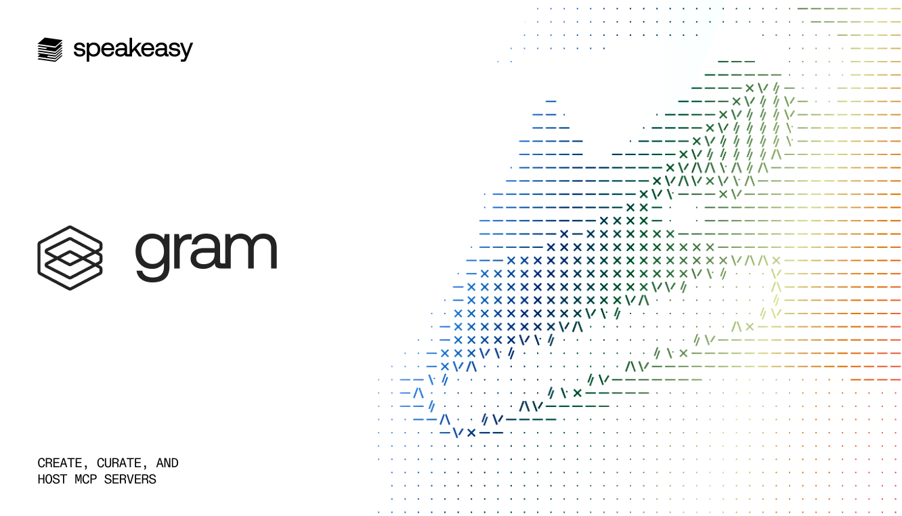

<h3 align="center">Gram</h3>

    The platform to create, curate and host MCP servers.
     
    <a href="https://www.speakeasy.com/product/gram"><strong>Learn more »</strong></a>
     
     
    <a href="https://speakeasy.com/">
     
  </a>
    <a href="#Documentation"><strong>Documentation</strong></a> ·
    <a href="#Techstack"><strong>Tech Stack</strong></a> ·
    <a href="#Contributing"><strong>Contributing</strong></a> ·
    <a href="https://app.getgram.ai/"><strong>Login</strong></a> ·

# Introduction

Gram is a platform for creating, curating, and hosting MCP servers. Create agent tools from your API that just work. Curate and scope toolsets for every use case. Host and secure MCP servers with ease.

With Gram you can:  
└ Host one or more remote MCP servers at `mcp.{your-company}.com`.  
└ Power agentic workflows or chat in your product by exposing context from your internal APIs to LLMs.    
└ Manage and secure MCP servers for your entire organization through a unified control plane.  

## Features

└ Minimal, lightweight, and open source.  
└ Multiple APIs: Mix and match any number of APIs into toolsets.  
└ Custom tool builder: Create higher-order tools by chaining existing endpoints.  
└ OAuth support out-of-the-box: DCR, BYO Authorisation, and standard flows.  
└ First class support for OpenAPI `3.0.X` and `3.1.X`.  
└ Follows the [MCP](https://modelcontextprotocol.io/docs/getting-started/intro) specification.

## Contributing

Contributions are welcome! Please open an issue or discussion for questions or suggestions before starting significant work!
Here's how you can develop on the stack and contribute to the project.

### Development

Run `./zero` until it succeeds. This script is what you will use to run the dashboard and services for local development. It will also handle installing dependencies and running pending database migrations before starting everything up.

The main dependencies for this project are Mise and Docker. The `./zero` script will guide you to install these if they are not found.

### Coding guidelines

All AI coding guidelines are written out in [CLAUDE.md](./CLAUDE.md). Please make sure you read the [contributing guidelines](./CONTRIBUTING.md) before submitting changes to this project.

### Putting up pull requests

Please have a good title and description for your PR. Go nuts with streams of commits but invest in a reviewable PR with good context.  

## Techstack

└ [TypeScript](https://www.typescriptlang.org/) – dashboard language.  
└ [Golang](https://go.dev/) - backend language  
└ [Goa](https://github.com/goadesign/goa) - design-first API framework.  
└ [Temporal](https://temporal.io/) - workflow engine.  
└ [Speakeasy](https://www.speakeasy.com/) - Generated SDKs. Spec hosted [here](http://app.getgram.ai/openapi.yaml).

## Documentation

Documentation for Gram is also open source and can be found [here](https://docs.getgram.ai/).
