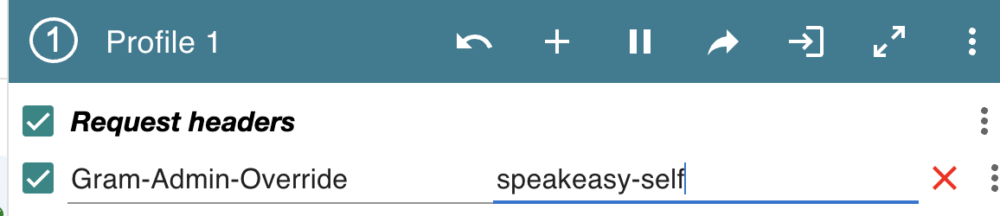

# Gram

Gram is the tool platform for AI agents.

## Development

Run `./zero` until it succeeds.

## Coding guidelines

All coding guidelines are written out as Cursor rules in [.cursor/rules](.cursor/rules). Please make sure you read these before contributing to this project.

Everything under the `# Coding assistant guidelines` headers is intended for AI agents. Everything else is intended for all audiences.

## Putting up pull requests

You must have a good title and description for your PR. Please do not be lazy about this or write it off as trivial. Go nuts with streams of commits but invest the 5 minutes to present a reviewable PR with good context. This is a non-negotiable.

## Admin Override

Speakeasy admins have access to all organizations. By default they will be sent to the `speakeasy-team` organization when logging in.

There are valid reasons that you may want to authenticate as a different organization for example:
- A customer organization
- `speakeasy-self` where speakeasy managed integrations are published from

To do so simply use the `Gram-Admin-Override` to authenticate with that organization slug (only admins can do this)

1. Install https://chromewebstore.google.com/detail/modheader-modify-http-hea/idgpnmonknjnojddfkpgkljpfnnfcklj?hl=en
2. Add your override header in the extension ex: `Gram-Admin-Override: speakeasy-self`
3. Logout and log back in to Gram.

