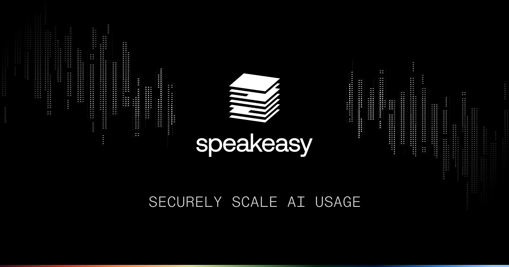

<p align="center">
  <a href="https://www.speakeasy.com/product/gram" target="_blank">
    
  </a>
</p>

<h3 align="center">Gram — Speakeasy's AI Control Plane</h3>

<p align="center">
  <strong>Securely scale AI usage. Bring every MCP server behind one gateway.</strong>
  <br />
  <a href="https://www.speakeasy.com/product/gram"><strong>Learn more »</strong></a>
</p>

<p align="center">
  <a href="https://speakeasy.com/"></a>
</p>

<p align="center">
  <a href="https://www.getgram.ai/docs/introduction"><strong>Documentation</strong></a> ·
  <a href="#tech-stack"><strong>Tech Stack</strong></a> ·
  <a href="./CONTRIBUTING.md"><strong>Contributing</strong></a> ·
  <a href="https://app.getgram.ai/"><strong>Login</strong></a>
</p>

<hr />

# Introduction

[Gram](https://app.getgram.ai) is an MCP gateway and AI control plane. Connect your APIs, MCP servers, and TypeScript functions to any AI agent — then secure, govern, and observe every tool call from one place. Turn OpenAPI documents or custom TypeScript functions into tools, group them into toolsets, and serve each toolset as a hosted, secure MCP server.

To get started on the hosted platform you can [Sign up](https://app.getgram.ai/), or check out the [Quickstart guide](https://www.getgram.ai/docs/introduction).

## Secure

One identity surface for every MCP. Scope access by team and role with SSO and RBAC at the gateway, enforce runtime guardrails, and keep credentials out of users' DMs. OAuth 2.1, DCR, and PKCE out of the box.

## Connect

Every AI agent, every MCP server. Universal client support for Claude, Cursor, ChatGPT, Copilot, and any MCP client. Import existing MCP servers, generate new ones from your OpenAPI specs, or build tools with TypeScript functions — all with versioned rollouts.

## Observe

Every tool call, every agent, every team. Real-time logs, distributed tracing, cost and usage by team, and anomaly detection.

## Features

- Minimal, lightweight, and open source.
- High-level TypeScript framework that makes working with MCP easy.
- Custom tool builder to create higher-order tools by chaining lower-level tools.
- SSO and role-based access control to govern who can reach which tools.
- OAuth out of the box: OAuth 2.1, DCR, PKCE, BYO authorization, and standard flows.
- First-class support for OpenAPI `3.0.X` and `3.1.X`.
- Follows the [MCP](https://modelcontextprotocol.io/docs/getting-started/intro) specification.

## Gram Functions

Create agentic tools from simple TypeScript code using the [Gram Functions Framework](https://www.getgram.ai/docs/gram-functions/introduction). Refer to the [Getting Started](https://www.getgram.ai/docs/getting-started/typescript) guide to learn more.

The fastest way to get started is with the `npm create @gram-ai/function@latest` command, which creates a complete TypeScript project with a working Gram function. Deployable and runnable locally as a MCP server.

```bash
# Install the CLI and follow the prompts
npm create @gram-ai/function@latest

# Once created, move into your newly created function directory
cd my_function

# Build and Deploy
npm run build
npm run push
```

A default function is created for you.

```typescript
import { Gram } from "@gram-ai/functions";
import * as z from "zod/mini";

const gram = new Gram().tool({
  name: "add",
  description: "Add two numbers together",
  inputSchema: { a: z.number(), b: z.number() },
  async execute(ctx, input) {
    return ctx.json({ sum: input.a + input.b });
  },
});

export default gram;
```

In addition you get a:

- A `server.ts` is created so you can run the tool locally as a MCP server with MCP inspector with `pnpm run dev`
- A `README` and `CONTRIBUTING` guide for next steps on building out your custom tool.

### Common use cases include:

- Host one or more remote MCP servers at a custom domain like `mcp.{your-company}.com`.
- Power your in-application chat by exposing context from your internal or 3rd-party APIs through tools.
- Add data to your AI workflows in Zapier, n8n, and other workflow platforms.
- Manage and secure MCP servers for your entire organization through a unified control plane.

Check out the `examples` folder in this repo for working examples. Or open a pull request if you have one to share!

## Gram CLI

The CLI allows for programmatic access to Gram, enabling you to manage the process of pushing sources (either OpenAPI documents or Gram Functions) for your MCP servers. Get started with documentation [here](https://www.getgram.ai/docs/command-line).

```bash
curl -fsSL https://go.getgram.ai/cli.sh | bash
```

And then:

```bash
gram auth
```

## Support

- Slack: [Join our slack](https://join.slack.com/t/speakeasy-dev/shared_invite/zt-3hudfoj4y-9EPqMmHIFhNiTtannqiV3Q) for support and discussions
- In-App: When using the [application](https://app.getgram.ai/) you can engage with the core maintainers of the product.
- GitHub: Contribute or report issues [on this repository](https://github.com/speakeasy-api/gram/issues/new).
- Documentation for Gram is also open source. View it [here](https://www.getgram.ai/docs/introduction) and contribute [here](https://github.com/speakeasy-api/developer-docs/tree/main/docs/gram).

## Contributing

Contributions are welcome! Please open an issue or discussion for questions or suggestions before starting significant work.

See [CONTRIBUTING.md](./CONTRIBUTING.md) for development setup and detailed contribution guidelines.

## Tech Stack

- [TypeScript](https://www.typescriptlang.org/) — dashboard language.
- [Golang](https://go.dev/) — backend language.
- [Goa](https://github.com/goadesign/goa) — design-first API framework.
- [Temporal](https://temporal.io/) — workflow engine.
- [Polar](https://polar.sh/) — usage-based billing.
- [OpenRouter](https://openrouter.ai/) — LLM gateway.
- [Speakeasy](https://www.speakeasy.com/) — generated SDKs. Spec hosted [here](https://app.getgram.ai/openapi.yaml).
