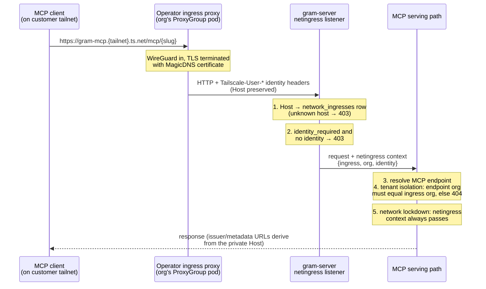

# Private Network Ingress for Gram-Hosted MCP Servers

**Status:** Revised 2026-08-24 — built on the Tailscale Kubernetes operator per architectural review. The full product RFC lives in the internal RFCs database (Notion); Phase 0 spike results are in the appendix.
**Scope:** Ingress only — who can reach a Gram-hosted MCP server. Egress (Gram reaching customer-private upstreams) stays with the existing tunnel feature.

## What and why

Security-sensitive customers run zero-trust overlay networks (Tailscale most commonly) and want their Gram-hosted MCP servers off the public internet. Today our only network control is the custom-domain IP allowlist — coarse, IPv4-only, and the server stays publicly reachable. Private Network Ingress serves an org's MCP endpoints **directly on the customer's tailnet**, with a `private_network_only` mode that 403s the platform host and custom domain entirely. Every request arrives with a network-attested user identity. Enterprise-gated behind the `network_ingress` product feature.

Two decisions shape the design:

1. **The data plane is the Tailscale Kubernetes operator** (v1.96+), not a custom gateway. The operator's multi-tailnet support gives us per-customer tailnet credentials, node lifecycle, durable node state, HA, MagicDNS + automatic TLS, and identity headers — all off our books.
2. **Private ingress is just another router provider.** Custom domains are already provisioned through a `CustomDomainProvisioner` seam; it gains a second provider: `nginx-ingress` (today's path, unchanged) vs `tailscale-ingress`.

## How it works

### Provisioning (control plane)

An org admin configures the ingress from the custom-domain page. The management API writes a `network_ingresses` row; a reconcile workflow (same signal-coalesced Temporal shape as custom domains) drives the provisioner, which applies four Kubernetes resources. The operator does the rest.

```mermaid
flowchart LR
    A[Dashboard card] --> B["networkIngress API\n(network_ingresses row)"]
    B --> C["Reconcile workflow\n(Temporal)"]
    C --> D["tailscale-ingress\nprovisioner"]
    D --> E["Secret\n(customer OAuth client)"]
    D --> F["Tailnet CR"]
    D --> G["ProxyGroup\n(replicas = HA)"]
    D --> H["Ingress\nclass: tailscale"]
    F -.credentials.-> E
    G -.spec.tailnet.-> F
    H -.proxy-group.-> G
    I[Tailscale k8s operator] ==>|"joins customer tailnet,\nMagicDNS + TLS cert,\nruns proxy pods"| G
```

The customer's side of setup: create an OAuth client (scopes `Devices Core`, `Auth Keys`, `Services` write) tagged `tag:k8s-operator`, and add `tagOwners` for `tag:k8s-operator` and `tag:k8s` to their ACLs. The dashboard Sheet walks through it with copy-paste snippets.

### Request flow (data plane)



Numbered steps, in words:

1. **Attribution by Host.** The netingress listener resolves the request's Host against `network_ingresses.dns_name` — the same pattern `customdomains.Middleware` uses for custom-domain hosts.
2. **Identity.** The operator's proxy (running `tailscale serve`) injects `Tailscale-User-*` headers. The middleware normalizes them into the request context; if the org set `identity_required` and none are present, 403. Identity is advisory in MVP (logs/audit), never authz-bearing.
3. **Endpoint resolution** proceeds exactly as for custom domains (the middleware synthesizes the org's custom-domain context when one exists, so endpoints resolve in the same namespace).
4. **Tenant isolation** — the load-bearing invariant: the resolved endpoint's org must equal the ingress's org, including on the legacy platform-namespace fallback path. Dedicated test.
5. **Lockdown.** `enforceCustomDomainLockdown` generalizes to a matrix (below).

**Trust boundary.** The operator's Ingress backend targets a dedicated gram-server listener port, pinned to the ProxyGroup pods by a NetworkPolicy. Host attribution and identity headers are only trusted on that port; every other listener strips inbound `Tailscale-*` headers unconditionally, so the public path cannot forge them. No forward token, no SSRF changes — traffic only ever flows inward.

### Lockdown matrix

| Request arrives via              | IP allowlist | `private_network_only` | Result                               |
| -------------------------------- | ------------ | ---------------------- | ------------------------------------ |
| Platform host                    | not set      | off                    | allow                                |
| Platform host                    | set          | off                    | 403 — today's behavior               |
| Custom domain                    | any          | off                    | allow (nginx enforced the allowlist) |
| Platform or custom domain        | any          | **on**                 | **403**                              |
| Private network (netingress ctx) | any          | any                    | allow                                |

The install-page / well-known platform-host bypass stays (dashboard-cookie sessions need it); `private_network_only` governs the MCP data plane only.

### The router provider seam

`CustomDomainProvisioner` (`server/internal/k8s/provisioner.go:44` — `Kind/Apply/Get/Delete`) already abstracts provisioning; its factory currently ignores the kind (`client.go:83-88`) — that switch is where `tailscale-ingress` plugs in, writing operator CRs through the existing dynamic client (no `tailscale.com` Go imports; the depguard confinement stands). Three single-kind assumptions get generalized alongside: the infra health check (hardcodes cert-manager), orphan-resource listing, and the deletion-time resource-name checkpoint. Provisioned resource names are persisted on the row at provision time — never re-derived from a tombstone (the custom-domain lesson). The IP allowlist stays an nginx-only capability; on a tailnet, the customer's ACLs are the allowlist.

## Data model

`network_ingresses` (one active row per org, mirroring `custom_domains`): `provider` discriminator, `hostname`, `tags`, flags (`enabled`, `private_network_only`, `identity_required`), encrypted OAuth client columns, provisioned-resource-name columns, health columns (`status`, `network_name`, `dns_name`, `last_error`, `last_seen_at`, `connected_since` — fed from operator status conditions).

Relative to the pre-revision migration: **drop `network_node_state`** (operator Secrets hold node state) and **drop the auth-key credential mode** (the `Tailnet` CR requires an OAuth client).

## API, UX, security notes

- The `networkIngress` Goa service (get/create/update/rotateCredentials/delete) survives the revision with OAuth-only credential payloads. Feature gating, `org:admin` RBAC, audit subject, and both admin surfaces are unchanged.
- Dashboard: a "Private network access" card on the custom-domain page — setup Sheet, status badge, private base URL, the two toggles (private-network-only with a strong confirm; require identity), rotation, delete.
- Credentials are AES-256-GCM in Postgres, synced to a Secret in the operator namespace; rotation updates both. `ProxyGroupPolicy` + namespace RBAC fence the blast radius.
- The operator is a new cluster-privileged dependency: pin its version, review its RBAC, upgrade it like other cluster infra.

## Plan

- **Phase 0b — operator validation spike** (gating; ~2-3 days, kind cluster + two test tailnets): two orgs on two tailnets from one cluster; the exact identity-header and Host contract; cert issuance and Let's Encrypt limits (50 hostnames/week/tailnet); ProxyGroup failover. Output: go/no-go memo + the middleware contract.
- **Phase 1 — MVP**: amend the pending migration and management-API PRs (open, comments posted); the `tailscale-ingress` provisioner + kind-aware factory + reconcile/delete/health workflows; the netingress listener + middleware + lockdown + tenant-isolation test; dashboard card; operator install + fencing.
- **Phase 2 — GA**: health lifecycle on operator status conditions + `checkHealth` RPC + delete teardown validation; rotation UX and ACL-breakage surfacing; identity → audit logs; metrics/runbook/docs; ProxyGroup HA/scale validation.

## Open questions

1. (Spike) Does a plain Ingress annotated onto a non-default-tailnet ProxyGroup serve correctly? Docs are thin on this edge.
2. (Spike) Exact identity-header set, and whether the serve proxy strips inbound forgeries itself.
3. Shared namespace + tight RBAC vs per-org namespaces for the provisioned resources. Leaning shared for MVP.
4. `Tailnet` CR is cluster-scoped — naming/quota policy and operator scale envelope at hundreds of orgs.
5. Should `private_network_only` also suppress the platform-host install-page bypass? MVP: keep it, document it.
6. Local-dev story: kind + operator + a dev tailnet; how much runs in CI.

## Key files

| Area                                             | Path                                                                                                  |
| ------------------------------------------------ | ----------------------------------------------------------------------------------------------------- |
| Provisioner seam to extend                       | `server/internal/k8s/provisioner.go:44`; factory `client.go:83-88`                                    |
| nginx provisioner (template)                     | `server/internal/k8s/ingress_provisioner.go`                                                          |
| Reconcile workflow shape to reuse                | `server/internal/background/custom_domain_registration.go`, `activities/custom_domain_ingress.go:122` |
| Health machinery to generalize                   | `server/internal/background/activities/custom_domain_health.go:33`                                    |
| Lockdown to generalize                           | `server/internal/mcp/serveendpoint.go` (`enforceCustomDomainLockdown`)                                |
| Host attribution pattern                         | `server/internal/customdomains/middleware.go`                                                         |
| Management API (shipped, to reshape)             | `server/design/networkingress/design.go`, `server/internal/networkingress/`                           |
| Superseded embedded-tsnet gateway (escape hatch) | closed PR #5624 (`netgateway/` tree)                                                                  |

## Appendix — Phase 0 spike results (2026-08-21, embedded tsnet — pre-revision)

A throwaway binary ran N `tsnet.Server` nodes in one process against a real tailnet, with node state in Postgres and an ephemeral local dir. What still matters for the operator path: WhoIs identity semantics (login, display name, device attested per request), the single-use-auth-key footgun (now moot — OAuth only), and per-node cost as the operator's proxy budget. What the operator obsoletes: the Postgres state store and unclean-death resume machinery.

| Metric                                              | Measured                                           |
| --------------------------------------------------- | -------------------------------------------------- |
| `tailscale.com` version                             | v1.102.3                                           |
| RSS @ 1 / 3 / 10 nodes (20.6 MB baseline)           | 36.8 / 44.4 / 69.7 MB (≈5 MB marginal per node)    |
| Time-to-up per node                                 | 1.6–2.2 s (fresh join and resume alike)            |
| Same-device resume after `kill -9`, local dir wiped | 3/3, node keys identical, from Postgres state only |
| Per-request identity (WhoIs)                        | login, display name, device — verified end-to-end  |
