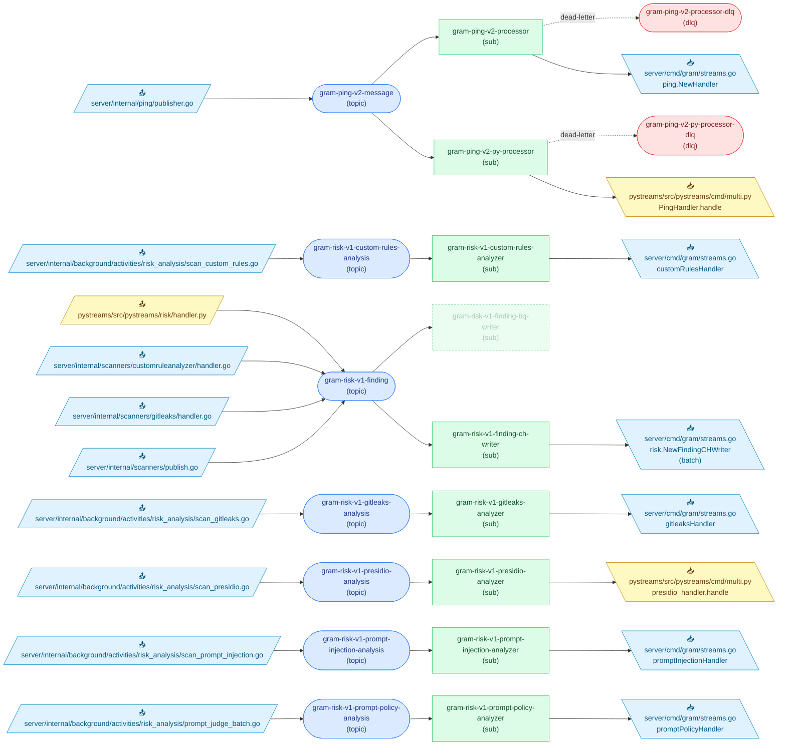

<!-- Code generated by `infra gen-diagram`. DO NOT EDIT. -->

# Pub/Sub Topology

Generated from the proto-declared topology (`infra/gen` descriptors) joined
with ast-grep scans of Go (`server/`) and Python (`pystreams/`) call sites.
Run `mise run gen:infra` to regenerate.

## Topics

| Topic | Kind | Retention | Published by |
| --- | --- | --- | --- |
| [`gram-ping-v2-message`](../infra/proto/gram/ping/v2/ping.proto) | topic | 1d | [`server/internal/ping/publisher.go`](../server/internal/ping/publisher.go) |
| [`gram-ping-v2-processor-dlq`](../infra/proto/gram/ping/v2/processor.proto) | DLQ | — | — |
| [`gram-ping-v2-py-processor-dlq`](../infra/proto/gram/ping/v2/processor.proto) | DLQ | — | — |
| [`gram-risk-v1-custom-rules-analysis`](../infra/proto/gram/risk/v1/custom_rules_analysis.proto) | topic | 7d | [`server/internal/background/activities/risk_analysis/scan_custom_rules.go`](../server/internal/background/activities/risk_analysis/scan_custom_rules.go) |
| [`gram-risk-v1-finding`](../infra/proto/gram/risk/v1/finding.proto) | topic | 7d | [`pystreams/src/pystreams/risk/handler.py`](../pystreams/src/pystreams/risk/handler.py) [`server/internal/scanners/customruleanalyzer/handler.go`](../server/internal/scanners/customruleanalyzer/handler.go) [`server/internal/scanners/gitleaks/handler.go`](../server/internal/scanners/gitleaks/handler.go) [`server/internal/scanners/publish.go`](../server/internal/scanners/publish.go) |
| [`gram-risk-v1-gitleaks-analysis`](../infra/proto/gram/risk/v1/gitleaks_analysis.proto) | topic | 7d | [`server/internal/background/activities/risk_analysis/scan_gitleaks.go`](../server/internal/background/activities/risk_analysis/scan_gitleaks.go) |
| [`gram-risk-v1-presidio-analysis`](../infra/proto/gram/risk/v1/presidio_analysis.proto) | topic | 7d | [`server/internal/background/activities/risk_analysis/scan_presidio.go`](../server/internal/background/activities/risk_analysis/scan_presidio.go) |
| [`gram-risk-v1-prompt-injection-analysis`](../infra/proto/gram/risk/v1/prompt_injection_analysis.proto) | topic | 7d | [`server/internal/background/activities/risk_analysis/scan_prompt_injection.go`](../server/internal/background/activities/risk_analysis/scan_prompt_injection.go) |
| [`gram-risk-v1-prompt-policy-analysis`](../infra/proto/gram/risk/v1/prompt_policy_analysis.proto) | topic | 7d | [`server/internal/background/activities/risk_analysis/prompt_judge_batch.go`](../server/internal/background/activities/risk_analysis/prompt_judge_batch.go) |

## Subscriptions

| Subscription | Topic | Ack | DLQ | Consumed by |
| --- | --- | --- | --- | --- |
| [`gram-ping-v2-processor`](../infra/proto/gram/ping/v2/processor.proto) | `gram-ping-v2-message` | 30s | `gram-ping-v2-processor-dlq` | [`server/cmd/gram/streams.go`](../server/cmd/gram/streams.go) |
| [`gram-ping-v2-py-processor`](../infra/proto/gram/ping/v2/processor.proto) | `gram-ping-v2-message` | 30s | `gram-ping-v2-py-processor-dlq` | [`pystreams/src/pystreams/cmd/multi.py`](../pystreams/src/pystreams/cmd/multi.py) |
| [`gram-risk-v1-custom-rules-analyzer`](../infra/proto/gram/risk/v1/custom_rules_analyzer.proto) | `gram-risk-v1-custom-rules-analysis` | 1m | — | [`server/cmd/gram/streams.go`](../server/cmd/gram/streams.go) |
| [`gram-risk-v1-finding-bq-writer`](../infra/proto/gram/risk/v1/finding_bq_writer.proto) _(deprecated)_ | `gram-risk-v1-finding` | 1m | — | — |
| [`gram-risk-v1-finding-ch-writer`](../infra/proto/gram/risk/v1/finding_ch_writer.proto) | `gram-risk-v1-finding` | 1m | — | [`server/cmd/gram/streams.go`](../server/cmd/gram/streams.go) |
| [`gram-risk-v1-gitleaks-analyzer`](../infra/proto/gram/risk/v1/gitleaks_analyzer.proto) | `gram-risk-v1-gitleaks-analysis` | 1m | — | [`server/cmd/gram/streams.go`](../server/cmd/gram/streams.go) |
| [`gram-risk-v1-presidio-analyzer`](../infra/proto/gram/risk/v1/presidio_analyzer.proto) | `gram-risk-v1-presidio-analysis` | 1m | — | [`pystreams/src/pystreams/cmd/multi.py`](../pystreams/src/pystreams/cmd/multi.py) |
| [`gram-risk-v1-prompt-injection-analyzer`](../infra/proto/gram/risk/v1/prompt_injection_analyzer.proto) | `gram-risk-v1-prompt-injection-analysis` | 1m | — | [`server/cmd/gram/streams.go`](../server/cmd/gram/streams.go) |
| [`gram-risk-v1-prompt-policy-analyzer`](../infra/proto/gram/risk/v1/prompt_policy_analyzer.proto) | `gram-risk-v1-prompt-policy-analysis` | 1m | — | [`server/cmd/gram/streams.go`](../server/cmd/gram/streams.go) |

