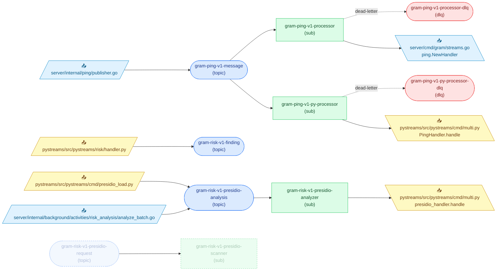

<!-- Code generated by `infra gen-diagram`. DO NOT EDIT. -->

# Pub/Sub Topology

Generated from the proto-declared topology (`infra/gen` descriptors) joined
with ast-grep scans of Go (`server/`) and Python (`pystreams/`) call sites.
Run `mise run gen:infra` to regenerate.

## Topics

| Topic                                                                                      | Kind               | Retention | Published by                                                                                                                                                                                                                                                            |
| ------------------------------------------------------------------------------------------ | ------------------ | --------- | ----------------------------------------------------------------------------------------------------------------------------------------------------------------------------------------------------------------------------------------------------------------------- |
| [`gram-ping-v1-message`](../infra/proto/gram/ping/v1/ping.proto#L10)                       | topic              | 1d        | [`server/internal/ping/publisher.go:36`](../server/internal/ping/publisher.go#L36)                                                                                                                                                                                      |
| [`gram-ping-v1-processor-dlq`](../infra/proto/gram/ping/v1/processor.proto#L9)             | DLQ                | —         | —                                                                                                                                                                                                                                                                       |
| [`gram-ping-v1-py-processor-dlq`](../infra/proto/gram/ping/v1/processor.proto#L23)         | DLQ                | —         | —                                                                                                                                                                                                                                                                       |
| [`gram-risk-v1-finding`](../infra/proto/gram/risk/v1/finding.proto#L13)                    | topic              | 7d        | [`pystreams/src/pystreams/risk/handler.py:166`](../pystreams/src/pystreams/risk/handler.py#L166)                                                                                                                                                                        |
| [`gram-risk-v1-presidio-analysis`](../infra/proto/gram/risk/v1/presidio_analysis.proto#L9) | topic              | 7d        | [`pystreams/src/pystreams/cmd/presidio_load.py:85`](../pystreams/src/pystreams/cmd/presidio_load.py#L85) [`server/internal/background/activities/risk_analysis/analyze_batch.go:364`](../server/internal/background/activities/risk_analysis/analyze_batch.go#L364) |
| [`gram-risk-v1-presidio-request`](../infra/proto/gram/risk/v1/presidio_request.proto#L10)  | topic (deprecated) | 7d        | —                                                                                                                                                                                                                                                                       |

## Subscriptions

| Subscription                                                                                             | Topic                            | Ack | DLQ                             | Consumed by                                                                                |
| -------------------------------------------------------------------------------------------------------- | -------------------------------- | --- | ------------------------------- | ------------------------------------------------------------------------------------------ |
| [`gram-ping-v1-processor`](../infra/proto/gram/ping/v1/processor.proto#L9)                               | `gram-ping-v1-message`           | 30s | `gram-ping-v1-processor-dlq`    | [`server/cmd/gram/streams.go:215`](../server/cmd/gram/streams.go#L215)                     |
| [`gram-ping-v1-py-processor`](../infra/proto/gram/ping/v1/processor.proto#L23)                           | `gram-ping-v1-message`           | 30s | `gram-ping-v1-py-processor-dlq` | [`pystreams/src/pystreams/cmd/multi.py:164`](../pystreams/src/pystreams/cmd/multi.py#L164) |
| [`gram-risk-v1-presidio-analyzer`](../infra/proto/gram/risk/v1/presidio_analyzer.proto#L9)               | `gram-risk-v1-presidio-analysis` | 1m  | —                               | [`pystreams/src/pystreams/cmd/multi.py:169`](../pystreams/src/pystreams/cmd/multi.py#L169) |
| [`gram-risk-v1-presidio-scanner`](../infra/proto/gram/risk/v1/presidio_scanner.proto#L10) _(deprecated)_ | `gram-risk-v1-presidio-request`  | 1m  | —                               | —                                                                                          |
