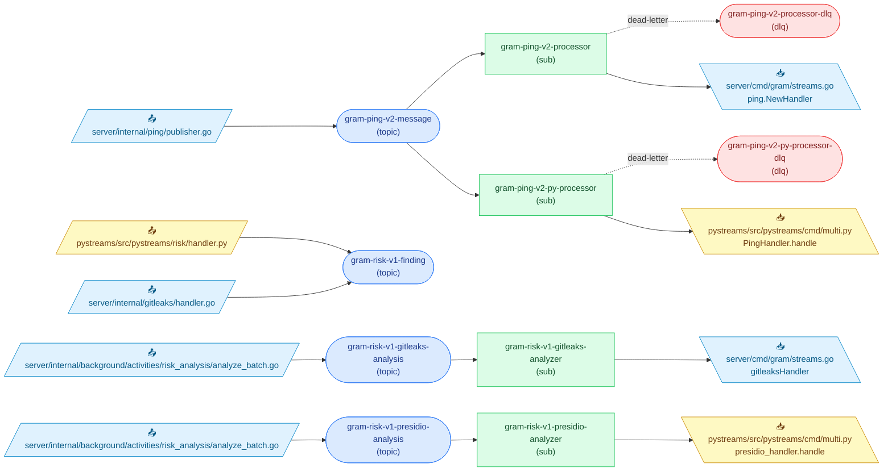

<!-- Code generated by `infra gen-diagram`. DO NOT EDIT. -->

# Pub/Sub Topology

Generated from the proto-declared topology (`infra/gen` descriptors) joined
with ast-grep scans of Go (`server/`) and Python (`pystreams/`) call sites.
Run `mise run gen:infra` to regenerate.

## Topics

| Topic                                                                                   | Kind  | Retention | Published by                                                                                                                                                                |
| --------------------------------------------------------------------------------------- | ----- | --------- | --------------------------------------------------------------------------------------------------------------------------------------------------------------------------- |
| [`gram-ping-v2-message`](../infra/proto/gram/ping/v2/ping.proto)                        | topic | 1d        | [`server/internal/ping/publisher.go`](../server/internal/ping/publisher.go)                                                                                                 |
| [`gram-ping-v2-processor-dlq`](../infra/proto/gram/ping/v2/processor.proto)             | DLQ   | —         | —                                                                                                                                                                           |
| [`gram-ping-v2-py-processor-dlq`](../infra/proto/gram/ping/v2/processor.proto)          | DLQ   | —         | —                                                                                                                                                                           |
| [`gram-risk-v1-finding`](../infra/proto/gram/risk/v1/finding.proto)                     | topic | 7d        | [`pystreams/src/pystreams/risk/handler.py`](../pystreams/src/pystreams/risk/handler.py) [`server/internal/gitleaks/handler.go`](../server/internal/gitleaks/handler.go) |
| [`gram-risk-v1-gitleaks-analysis`](../infra/proto/gram/risk/v1/gitleaks_analysis.proto) | topic | 7d        | [`server/internal/background/activities/risk_analysis/analyze_batch.go`](../server/internal/background/activities/risk_analysis/analyze_batch.go)                           |
| [`gram-risk-v1-presidio-analysis`](../infra/proto/gram/risk/v1/presidio_analysis.proto) | topic | 7d        | [`server/internal/background/activities/risk_analysis/analyze_batch.go`](../server/internal/background/activities/risk_analysis/analyze_batch.go)                           |

## Subscriptions

| Subscription                                                                            | Topic                            | Ack | DLQ                             | Consumed by                                                                       |
| --------------------------------------------------------------------------------------- | -------------------------------- | --- | ------------------------------- | --------------------------------------------------------------------------------- |
| [`gram-ping-v2-processor`](../infra/proto/gram/ping/v2/processor.proto)                 | `gram-ping-v2-message`           | 30s | `gram-ping-v2-processor-dlq`    | [`server/cmd/gram/streams.go`](../server/cmd/gram/streams.go)                     |
| [`gram-ping-v2-py-processor`](../infra/proto/gram/ping/v2/processor.proto)              | `gram-ping-v2-message`           | 30s | `gram-ping-v2-py-processor-dlq` | [`pystreams/src/pystreams/cmd/multi.py`](../pystreams/src/pystreams/cmd/multi.py) |
| [`gram-risk-v1-gitleaks-analyzer`](../infra/proto/gram/risk/v1/gitleaks_analyzer.proto) | `gram-risk-v1-gitleaks-analysis` | 1m  | —                               | [`server/cmd/gram/streams.go`](../server/cmd/gram/streams.go)                     |
| [`gram-risk-v1-presidio-analyzer`](../infra/proto/gram/risk/v1/presidio_analyzer.proto) | `gram-risk-v1-presidio-analysis` | 1m  | —                               | [`pystreams/src/pystreams/cmd/multi.py`](../pystreams/src/pystreams/cmd/multi.py) |
