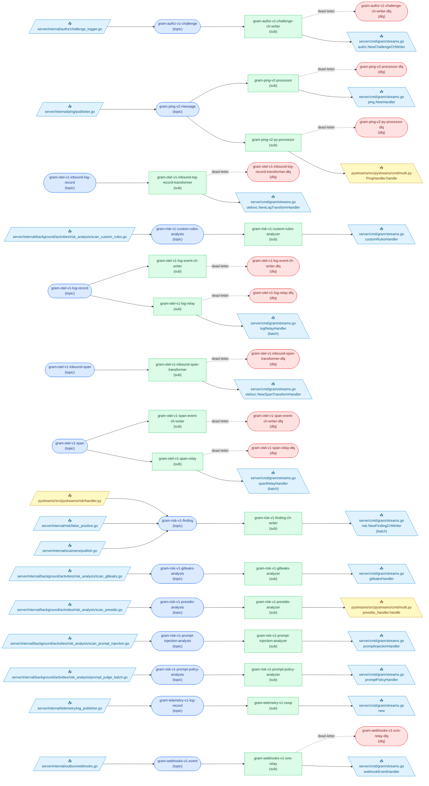

<!-- Code generated by `infra gen-diagram`. DO NOT EDIT. -->

# Pub/Sub Topology

Generated from the proto-declared topology (`infra/gen` descriptors) joined
with ast-grep scans of Go (`server/`) and Python (`pystreams/`) call sites.
Run `mise run gen:infra` to regenerate.

```mermaid
flowchart LR
  classDef topic fill:#dbeafe,stroke:#3b82f6,color:#1e3a8a;
  classDef dlq fill:#fee2e2,stroke:#ef4444,color:#7f1d1d;
  classDef sub fill:#dcfce7,stroke:#22c55e,color:#14532d;
  classDef go fill:#e0f2fe,stroke:#0284c7,color:#075985;
  classDef python fill:#fef9c3,stroke:#ca8a04,color:#713f12;
  classDef deprecated stroke-dasharray:4 3,opacity:0.55;

  t_gram_authz_v1_challenge(["gram-authz-v1-challenge<br/>(topic)"]):::topic
  t_gram_authz_v1_challenge_ch_writer_dlq(["gram-authz-v1-challenge-ch-writer-dlq<br/>(dlq)"]):::dlq
  t_gram_otel_v1_inbound_log_record(["gram-otel-v1-inbound-log-record<br/>(topic)"]):::topic
  t_gram_otel_v1_inbound_log_record_transformer_dlq(["gram-otel-v1-inbound-log-record-transformer-dlq<br/>(dlq)"]):::dlq
  t_gram_otel_v1_inbound_span(["gram-otel-v1-inbound-span<br/>(topic)"]):::topic
  t_gram_otel_v1_inbound_span_transformer_dlq(["gram-otel-v1-inbound-span-transformer-dlq<br/>(dlq)"]):::dlq
  t_gram_otel_v1_log_event_ch_writer_dlq(["gram-otel-v1-log-event-ch-writer-dlq<br/>(dlq)"]):::dlq
  t_gram_otel_v1_log_record(["gram-otel-v1-log-record<br/>(topic)"]):::topic
  t_gram_otel_v1_log_relay_dlq(["gram-otel-v1-log-relay-dlq<br/>(dlq)"]):::dlq
  t_gram_otel_v1_span(["gram-otel-v1-span<br/>(topic)"]):::topic
  t_gram_otel_v1_span_event_ch_writer_dlq(["gram-otel-v1-span-event-ch-writer-dlq<br/>(dlq)"]):::dlq
  t_gram_otel_v1_span_relay_dlq(["gram-otel-v1-span-relay-dlq<br/>(dlq)"]):::dlq
  t_gram_ping_v2_message(["gram-ping-v2-message<br/>(topic)"]):::topic
  t_gram_ping_v2_processor_dlq(["gram-ping-v2-processor-dlq<br/>(dlq)"]):::dlq
  t_gram_ping_v2_py_processor_dlq(["gram-ping-v2-py-processor-dlq<br/>(dlq)"]):::dlq
  t_gram_risk_v1_custom_rules_analysis(["gram-risk-v1-custom-rules-analysis<br/>(topic)"]):::topic
  t_gram_risk_v1_finding(["gram-risk-v1-finding<br/>(topic)"]):::topic
  t_gram_risk_v1_gitleaks_analysis(["gram-risk-v1-gitleaks-analysis<br/>(topic)"]):::topic
  t_gram_risk_v1_presidio_analysis(["gram-risk-v1-presidio-analysis<br/>(topic)"]):::topic
  t_gram_risk_v1_prompt_injection_analysis(["gram-risk-v1-prompt-injection-analysis<br/>(topic)"]):::topic
  t_gram_risk_v1_prompt_policy_analysis(["gram-risk-v1-prompt-policy-analysis<br/>(topic)"]):::topic
  t_gram_telemetry_v1_log_record(["gram-telemetry-v1-log-record<br/>(topic)"]):::topic
  t_gram_webhooks_v1_event(["gram-webhooks-v1-event<br/>(topic)"]):::topic
  t_gram_webhooks_v1_svix_relay_dlq(["gram-webhooks-v1-svix-relay-dlq<br/>(dlq)"]):::dlq
  s_gram_authz_v1_challenge_ch_writer["gram-authz-v1-challenge-ch-writer<br/>(sub)"]:::sub
  s_gram_otel_v1_inbound_log_record_transformer["gram-otel-v1-inbound-log-record-transformer<br/>(sub)"]:::sub
  s_gram_otel_v1_inbound_span_transformer["gram-otel-v1-inbound-span-transformer<br/>(sub)"]:::sub
  s_gram_otel_v1_log_event_ch_writer["gram-otel-v1-log-event-ch-writer<br/>(sub)"]:::sub
  s_gram_otel_v1_log_relay["gram-otel-v1-log-relay<br/>(sub)"]:::sub
  s_gram_otel_v1_span_event_ch_writer["gram-otel-v1-span-event-ch-writer<br/>(sub)"]:::sub
  s_gram_otel_v1_span_relay["gram-otel-v1-span-relay<br/>(sub)"]:::sub
  s_gram_ping_v2_processor["gram-ping-v2-processor<br/>(sub)"]:::sub
  s_gram_ping_v2_py_processor["gram-ping-v2-py-processor<br/>(sub)"]:::sub
  s_gram_risk_v1_custom_rules_analyzer["gram-risk-v1-custom-rules-analyzer<br/>(sub)"]:::sub
  s_gram_risk_v1_finding_ch_writer["gram-risk-v1-finding-ch-writer<br/>(sub)"]:::sub
  s_gram_risk_v1_gitleaks_analyzer["gram-risk-v1-gitleaks-analyzer<br/>(sub)"]:::sub
  s_gram_risk_v1_presidio_analyzer["gram-risk-v1-presidio-analyzer<br/>(sub)"]:::sub
  s_gram_risk_v1_prompt_injection_analyzer["gram-risk-v1-prompt-injection-analyzer<br/>(sub)"]:::sub
  s_gram_risk_v1_prompt_policy_analyzer["gram-risk-v1-prompt-policy-analyzer<br/>(sub)"]:::sub
  s_gram_telemetry_v1_noop["gram-telemetry-v1-noop<br/>(sub)"]:::sub
  s_gram_webhooks_v1_svix_relay["gram-webhooks-v1-svix-relay<br/>(sub)"]:::sub

  p0[/"📤<br/>server/internal/authz/challenge_logger.go"/]:::go
  p0 --> t_gram_authz_v1_challenge
  p1[/"📤<br/>server/internal/ping/publisher.go"/]:::go
  p1 --> t_gram_ping_v2_message
  p2[/"📤<br/>server/internal/background/activities/risk_analysis/scan_custom_rules.go"/]:::go
  p2 --> t_gram_risk_v1_custom_rules_analysis
  p3[/"📤<br/>pystreams/src/pystreams/risk/handler.py"/]:::python
  p3 --> t_gram_risk_v1_finding
  p4[/"📤<br/>server/internal/risk/false_positive.go"/]:::go
  p4 --> t_gram_risk_v1_finding
  p5[/"📤<br/>server/internal/scanners/publish.go"/]:::go
  p5 --> t_gram_risk_v1_finding
  p6[/"📤<br/>server/internal/background/activities/risk_analysis/scan_gitleaks.go"/]:::go
  p6 --> t_gram_risk_v1_gitleaks_analysis
  p7[/"📤<br/>server/internal/background/activities/risk_analysis/scan_presidio.go"/]:::go
  p7 --> t_gram_risk_v1_presidio_analysis
  p8[/"📤<br/>server/internal/background/activities/risk_analysis/scan_prompt_injection.go"/]:::go
  p8 --> t_gram_risk_v1_prompt_injection_analysis
  p9[/"📤<br/>server/internal/background/activities/risk_analysis/prompt_judge_batch.go"/]:::go
  p9 --> t_gram_risk_v1_prompt_policy_analysis
  p10[/"📤<br/>server/internal/telemetry/log_publisher.go"/]:::go
  p10 --> t_gram_telemetry_v1_log_record
  p11[/"📤<br/>server/internal/outbox/webhooks.go"/]:::go
  p11 --> t_gram_webhooks_v1_event
  t_gram_authz_v1_challenge --> s_gram_authz_v1_challenge_ch_writer
  s_gram_authz_v1_challenge_ch_writer -. dead-letter .-> t_gram_authz_v1_challenge_ch_writer_dlq
  t_gram_otel_v1_inbound_log_record --> s_gram_otel_v1_inbound_log_record_transformer
  s_gram_otel_v1_inbound_log_record_transformer -. dead-letter .-> t_gram_otel_v1_inbound_log_record_transformer_dlq
  t_gram_otel_v1_inbound_span --> s_gram_otel_v1_inbound_span_transformer
  s_gram_otel_v1_inbound_span_transformer -. dead-letter .-> t_gram_otel_v1_inbound_span_transformer_dlq
  t_gram_otel_v1_log_record --> s_gram_otel_v1_log_event_ch_writer
  s_gram_otel_v1_log_event_ch_writer -. dead-letter .-> t_gram_otel_v1_log_event_ch_writer_dlq
  t_gram_otel_v1_log_record --> s_gram_otel_v1_log_relay
  s_gram_otel_v1_log_relay -. dead-letter .-> t_gram_otel_v1_log_relay_dlq
  t_gram_otel_v1_span --> s_gram_otel_v1_span_event_ch_writer
  s_gram_otel_v1_span_event_ch_writer -. dead-letter .-> t_gram_otel_v1_span_event_ch_writer_dlq
  t_gram_otel_v1_span --> s_gram_otel_v1_span_relay
  s_gram_otel_v1_span_relay -. dead-letter .-> t_gram_otel_v1_span_relay_dlq
  t_gram_ping_v2_message --> s_gram_ping_v2_processor
  s_gram_ping_v2_processor -. dead-letter .-> t_gram_ping_v2_processor_dlq
  t_gram_ping_v2_message --> s_gram_ping_v2_py_processor
  s_gram_ping_v2_py_processor -. dead-letter .-> t_gram_ping_v2_py_processor_dlq
  t_gram_risk_v1_custom_rules_analysis --> s_gram_risk_v1_custom_rules_analyzer
  t_gram_risk_v1_finding --> s_gram_risk_v1_finding_ch_writer
  t_gram_risk_v1_gitleaks_analysis --> s_gram_risk_v1_gitleaks_analyzer
  t_gram_risk_v1_presidio_analysis --> s_gram_risk_v1_presidio_analyzer
  t_gram_risk_v1_prompt_injection_analysis --> s_gram_risk_v1_prompt_injection_analyzer
  t_gram_risk_v1_prompt_policy_analysis --> s_gram_risk_v1_prompt_policy_analyzer
  t_gram_telemetry_v1_log_record --> s_gram_telemetry_v1_noop
  t_gram_webhooks_v1_event --> s_gram_webhooks_v1_svix_relay
  s_gram_webhooks_v1_svix_relay -. dead-letter .-> t_gram_webhooks_v1_svix_relay_dlq
  c12[\"📥<br/>server/cmd/gram/streams.go<br/>authz.NewChallengeCHWriter"\]:::go
  s_gram_authz_v1_challenge_ch_writer --> c12
  c13[\"📥<br/>server/cmd/gram/streams.go<br/>otelsvc.NewLogTransformHandler"\]:::go
  s_gram_otel_v1_inbound_log_record_transformer --> c13
  c14[\"📥<br/>server/cmd/gram/streams.go<br/>otelsvc.NewSpanTransformHandler"\]:::go
  s_gram_otel_v1_inbound_span_transformer --> c14
  c15[\"📥<br/>server/cmd/gram/streams.go<br/>logRelayHandler<br/>(batch)"\]:::go
  s_gram_otel_v1_log_relay --> c15
  c16[\"📥<br/>server/cmd/gram/streams.go<br/>spanRelayHandler<br/>(batch)"\]:::go
  s_gram_otel_v1_span_relay --> c16
  c17[\"📥<br/>server/cmd/gram/streams.go<br/>ping.NewHandler"\]:::go
  s_gram_ping_v2_processor --> c17
  c18[\"📥<br/>pystreams/src/pystreams/cmd/multi.py<br/>PingHandler.handle"\]:::python
  s_gram_ping_v2_py_processor --> c18
  c19[\"📥<br/>server/cmd/gram/streams.go<br/>customRulesHandler"\]:::go
  s_gram_risk_v1_custom_rules_analyzer --> c19
  c20[\"📥<br/>server/cmd/gram/streams.go<br/>risk.NewFindingCHWriter<br/>(batch)"\]:::go
  s_gram_risk_v1_finding_ch_writer --> c20
  c21[\"📥<br/>server/cmd/gram/streams.go<br/>gitleaksHandler"\]:::go
  s_gram_risk_v1_gitleaks_analyzer --> c21
  c22[\"📥<br/>pystreams/src/pystreams/cmd/multi.py<br/>presidio_handler.handle"\]:::python
  s_gram_risk_v1_presidio_analyzer --> c22
  c23[\"📥<br/>server/cmd/gram/streams.go<br/>promptInjectionHandler"\]:::go
  s_gram_risk_v1_prompt_injection_analyzer --> c23
  c24[\"📥<br/>server/cmd/gram/streams.go<br/>promptPolicyHandler"\]:::go
  s_gram_risk_v1_prompt_policy_analyzer --> c24
  c25[\"📥<br/>server/cmd/gram/streams.go<br/>new"\]:::go
  s_gram_telemetry_v1_noop --> c25
  c26[\"📥<br/>server/cmd/gram/streams.go<br/>webhookEventHandler"\]:::go
  s_gram_webhooks_v1_svix_relay --> c26
```

## Topics

| Topic | Kind | Retention | Published by |
| --- | --- | --- | --- |
| [`gram-authz-v1-challenge`](../infra/proto/gram/authz/v1/challenge.proto) | topic | 7d | [`server/internal/authz/challenge_logger.go`](../server/internal/authz/challenge_logger.go) |
| [`gram-authz-v1-challenge-ch-writer-dlq`](../infra/proto/gram/authz/v1/challenge_ch_writer.proto) | DLQ | — | — |
| [`gram-otel-v1-inbound-log-record`](../infra/proto/gram/otel/v1/inbound_log_record.proto) | topic | — | — |
| [`gram-otel-v1-inbound-log-record-transformer-dlq`](../infra/proto/gram/otel/v1/inbound_log_record_transformer.proto) | DLQ | — | — |
| [`gram-otel-v1-inbound-span`](../infra/proto/gram/otel/v1/inbound_span.proto) | topic | — | — |
| [`gram-otel-v1-inbound-span-transformer-dlq`](../infra/proto/gram/otel/v1/inbound_span_transformer.proto) | DLQ | — | — |
| [`gram-otel-v1-log-event-ch-writer-dlq`](../infra/proto/gram/otel/v1/log_event_ch_writer.proto) | DLQ | — | — |
| [`gram-otel-v1-log-record`](../infra/proto/gram/otel/v1/log_record.proto) | topic | 7d | — |
| [`gram-otel-v1-log-relay-dlq`](../infra/proto/gram/otel/v1/log_relay.proto) | DLQ | — | — |
| [`gram-otel-v1-span`](../infra/proto/gram/otel/v1/span.proto) | topic | 7d | — |
| [`gram-otel-v1-span-event-ch-writer-dlq`](../infra/proto/gram/otel/v1/span_event_ch_writer.proto) | DLQ | — | — |
| [`gram-otel-v1-span-relay-dlq`](../infra/proto/gram/otel/v1/span_relay.proto) | DLQ | — | — |
| [`gram-ping-v2-message`](../infra/proto/gram/ping/v2/ping.proto) | topic | 1d | [`server/internal/ping/publisher.go`](../server/internal/ping/publisher.go) |
| [`gram-ping-v2-processor-dlq`](../infra/proto/gram/ping/v2/processor.proto) | DLQ | — | — |
| [`gram-ping-v2-py-processor-dlq`](../infra/proto/gram/ping/v2/processor.proto) | DLQ | — | — |
| [`gram-risk-v1-custom-rules-analysis`](../infra/proto/gram/risk/v1/custom_rules_analysis.proto) | topic | 7d | [`server/internal/background/activities/risk_analysis/scan_custom_rules.go`](../server/internal/background/activities/risk_analysis/scan_custom_rules.go) |
| [`gram-risk-v1-finding`](../infra/proto/gram/risk/v1/finding.proto) | topic | 7d | [`pystreams/src/pystreams/risk/handler.py`](../pystreams/src/pystreams/risk/handler.py) [`server/internal/risk/false_positive.go`](../server/internal/risk/false_positive.go) [`server/internal/scanners/publish.go`](../server/internal/scanners/publish.go) |
| [`gram-risk-v1-gitleaks-analysis`](../infra/proto/gram/risk/v1/gitleaks_analysis.proto) | topic | 7d | [`server/internal/background/activities/risk_analysis/scan_gitleaks.go`](../server/internal/background/activities/risk_analysis/scan_gitleaks.go) |
| [`gram-risk-v1-presidio-analysis`](../infra/proto/gram/risk/v1/presidio_analysis.proto) | topic | 7d | [`server/internal/background/activities/risk_analysis/scan_presidio.go`](../server/internal/background/activities/risk_analysis/scan_presidio.go) |
| [`gram-risk-v1-prompt-injection-analysis`](../infra/proto/gram/risk/v1/prompt_injection_analysis.proto) | topic | 7d | [`server/internal/background/activities/risk_analysis/scan_prompt_injection.go`](../server/internal/background/activities/risk_analysis/scan_prompt_injection.go) |
| [`gram-risk-v1-prompt-policy-analysis`](../infra/proto/gram/risk/v1/prompt_policy_analysis.proto) | topic | 7d | [`server/internal/background/activities/risk_analysis/prompt_judge_batch.go`](../server/internal/background/activities/risk_analysis/prompt_judge_batch.go) |
| [`gram-telemetry-v1-log-record`](../infra/proto/gram/telemetry/v1/log_record.proto) | topic | 7d | [`server/internal/telemetry/log_publisher.go`](../server/internal/telemetry/log_publisher.go) |
| [`gram-webhooks-v1-event`](../infra/proto/gram/webhooks/v1/event.proto) | topic | 7d | [`server/internal/outbox/webhooks.go`](../server/internal/outbox/webhooks.go) |
| [`gram-webhooks-v1-svix-relay-dlq`](../infra/proto/gram/webhooks/v1/svix_relay.proto) | DLQ | — | — |

## Subscriptions

| Subscription | Topic | Ack | DLQ | Consumed by |
| --- | --- | --- | --- | --- |
| [`gram-authz-v1-challenge-ch-writer`](../infra/proto/gram/authz/v1/challenge_ch_writer.proto) | `gram-authz-v1-challenge` | 1m | `gram-authz-v1-challenge-ch-writer-dlq` | [`server/cmd/gram/streams.go`](../server/cmd/gram/streams.go) |
| [`gram-otel-v1-inbound-log-record-transformer`](../infra/proto/gram/otel/v1/inbound_log_record_transformer.proto) | `gram-otel-v1-inbound-log-record` | 1m | `gram-otel-v1-inbound-log-record-transformer-dlq` | [`server/cmd/gram/streams.go`](../server/cmd/gram/streams.go) |
| [`gram-otel-v1-inbound-span-transformer`](../infra/proto/gram/otel/v1/inbound_span_transformer.proto) | `gram-otel-v1-inbound-span` | 1m | `gram-otel-v1-inbound-span-transformer-dlq` | [`server/cmd/gram/streams.go`](../server/cmd/gram/streams.go) |
| [`gram-otel-v1-log-event-ch-writer`](../infra/proto/gram/otel/v1/log_event_ch_writer.proto) | `gram-otel-v1-log-record` | 1m | `gram-otel-v1-log-event-ch-writer-dlq` | — |
| [`gram-otel-v1-log-relay`](../infra/proto/gram/otel/v1/log_relay.proto) | `gram-otel-v1-log-record` | 1m | `gram-otel-v1-log-relay-dlq` | [`server/cmd/gram/streams.go`](../server/cmd/gram/streams.go) |
| [`gram-otel-v1-span-event-ch-writer`](../infra/proto/gram/otel/v1/span_event_ch_writer.proto) | `gram-otel-v1-span` | 1m | `gram-otel-v1-span-event-ch-writer-dlq` | — |
| [`gram-otel-v1-span-relay`](../infra/proto/gram/otel/v1/span_relay.proto) | `gram-otel-v1-span` | 1m | `gram-otel-v1-span-relay-dlq` | [`server/cmd/gram/streams.go`](../server/cmd/gram/streams.go) |
| [`gram-ping-v2-processor`](../infra/proto/gram/ping/v2/processor.proto) | `gram-ping-v2-message` | 30s | `gram-ping-v2-processor-dlq` | [`server/cmd/gram/streams.go`](../server/cmd/gram/streams.go) |
| [`gram-ping-v2-py-processor`](../infra/proto/gram/ping/v2/processor.proto) | `gram-ping-v2-message` | 30s | `gram-ping-v2-py-processor-dlq` | [`pystreams/src/pystreams/cmd/multi.py`](../pystreams/src/pystreams/cmd/multi.py) |
| [`gram-risk-v1-custom-rules-analyzer`](../infra/proto/gram/risk/v1/custom_rules_analyzer.proto) | `gram-risk-v1-custom-rules-analysis` | 1m | — | [`server/cmd/gram/streams.go`](../server/cmd/gram/streams.go) |
| [`gram-risk-v1-finding-ch-writer`](../infra/proto/gram/risk/v1/finding_ch_writer.proto) | `gram-risk-v1-finding` | 1m | — | [`server/cmd/gram/streams.go`](../server/cmd/gram/streams.go) |
| [`gram-risk-v1-gitleaks-analyzer`](../infra/proto/gram/risk/v1/gitleaks_analyzer.proto) | `gram-risk-v1-gitleaks-analysis` | 1m | — | [`server/cmd/gram/streams.go`](../server/cmd/gram/streams.go) |
| [`gram-risk-v1-presidio-analyzer`](../infra/proto/gram/risk/v1/presidio_analyzer.proto) | `gram-risk-v1-presidio-analysis` | 1m | — | [`pystreams/src/pystreams/cmd/multi.py`](../pystreams/src/pystreams/cmd/multi.py) |
| [`gram-risk-v1-prompt-injection-analyzer`](../infra/proto/gram/risk/v1/prompt_injection_analyzer.proto) | `gram-risk-v1-prompt-injection-analysis` | 1m | — | [`server/cmd/gram/streams.go`](../server/cmd/gram/streams.go) |
| [`gram-risk-v1-prompt-policy-analyzer`](../infra/proto/gram/risk/v1/prompt_policy_analyzer.proto) | `gram-risk-v1-prompt-policy-analysis` | 1m | — | [`server/cmd/gram/streams.go`](../server/cmd/gram/streams.go) |
| [`gram-telemetry-v1-noop`](../infra/proto/gram/telemetry/v1/noop.proto) | `gram-telemetry-v1-log-record` | 1m | — | [`server/cmd/gram/streams.go`](../server/cmd/gram/streams.go) |
| [`gram-webhooks-v1-svix-relay`](../infra/proto/gram/webhooks/v1/svix_relay.proto) | `gram-webhooks-v1-event` | 1m | `gram-webhooks-v1-svix-relay-dlq` | [`server/cmd/gram/streams.go`](../server/cmd/gram/streams.go) |

## Notes

- Topic `gram-otel-v1-inbound-log-record` has no publisher in `server/` or `pystreams/`.
- Topic `gram-otel-v1-inbound-span` has no publisher in `server/` or `pystreams/`.
- Topic `gram-otel-v1-log-record` has no publisher in `server/` or `pystreams/`.
- Topic `gram-otel-v1-span` has no publisher in `server/` or `pystreams/`.
- Subscription `gram-otel-v1-log-event-ch-writer` has no consumer in `server/` or `pystreams/`.
- Subscription `gram-otel-v1-span-event-ch-writer` has no consumer in `server/` or `pystreams/`.

