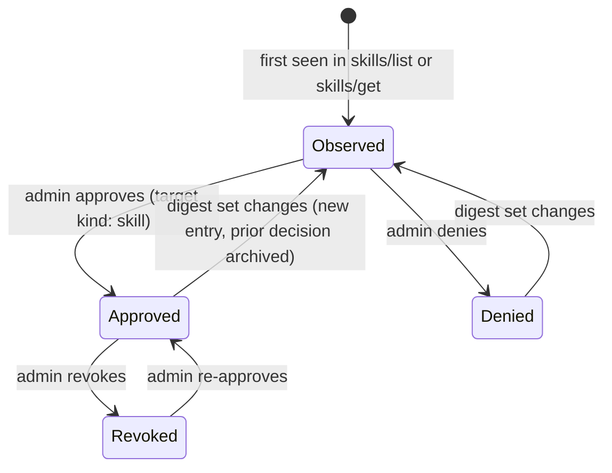
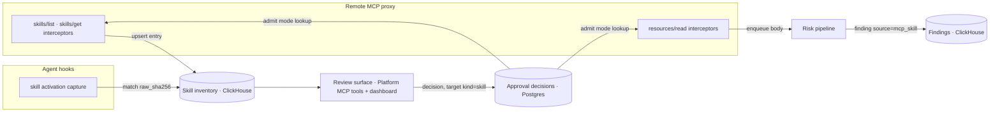

# RFC: Skills over MCP — Gateway Governance

Status: Draft  
Author: Sagar Batchu  
Reviewers: <NAMES>  
Team channel: <CHANNEL>  
Linear project: <LINK>  
Design partners: <NAMES>  
Interested customers/prospects: <NAMES>  
Related RFCs: [Skills over MCP — Serving Gram-Managed Skills](2026-09-14-skills-over-mcp-serving.md) (child; depends on the skill-entry identity and inventory defined here)

## Overview

The Model Context Protocol working group has published an experimental
extension, [SEP-2640](https://github.com/modelcontextprotocol/ext-skills),
that lets an MCP server publish Agent Skills over the same authenticated
connection it uses for tools. A server advertises
`io.modelcontextprotocol/skills` on `initialize`, answers `skills/list` and
`skills/get` with per-skill entries (a `SKILL.md` URI, its verbatim
frontmatter, and a manifest of every file with a SHA-256 digest), and serves
the files through ordinary `resources/read`. Hugging Face ships it server-side
today; fast-agent ships it client-side. GitHub has a demo branch, and Slack,
Figma, and Adobe are listed as testing candidates. No major coding agent
implements the client half yet.

Today Gram's remote MCP proxy is a transport-level relay
(`server/internal/remotemcp/proxy/proxy.go:1-10`). It forwards any JSON-RPC
method to the upstream server unchanged and only inspects the methods it has
typed interceptors for: `initialize`, `tools/list`, `tools/call`,
`resources/list`, and `resources/read` (`proxy.go:276-337`). The
`resources/read` hook carries only usage-tracking and usage-limit interceptors
(`server/internal/remotemcp/resources_read_usage_tracking_interceptor.go:16`).
Nothing scans resource bodies or tool descriptions for prompt injection; risk
scanning runs over hook-ingested prompts and tool calls only
(`server/internal/risk/scanner.go`, `pystreams/src/pystreams/risk/scanner.py`).
The MCP method census does not know `skills/list` and buckets it into `other`
(`server/internal/mcp/mcprequests/method.go`), so we cannot even tell whether
clients are already asking.

The concrete consequence: the moment a vendor behind a Gram-governed plugin
starts answering `skills/list`, instruction text authored by that vendor flows
through Gram into every connected agent with no inventory, no approval, no
scan, and no audit trail. The working group's own security section calls this
content "untrusted model input" and puts origin tagging and per-skill approval
on the host. Enterprises that bought Gram as the control point for MCP will
reasonably expect the same control point to cover skills.

This RFC proposes that Gram treat MCP-served skills the way it already treats
shadow MCP servers: observe them at the gateway, record them in an inventory,
scan their bodies, and let an administrator flip a plugin into an admit mode
that hides unapproved skills from the agent. Observe is the default so that
shipping the feature changes no customer-visible behaviour.

### User stories

- An AI platform administrator wants to know which skills their users' agents
  are loading from vendor MCP servers, with the same visibility they have for
  tools, so they can review content before it shapes agent behaviour.
- A security reviewer wants a prompt-injection scan on every skill body that
  transits the gateway, and a risk finding when one trips, because a skill is
  a larger and more persuasive text surface than a tool description.
- An administrator of a regulated organization wants to require approval per
  skill per plugin and have the approval invalidate itself when the vendor
  changes the skill's content.

## Goals

- Every `skills/list` and `skills/get` response, and every `resources/read`
  of a skill file, that transits the remote MCP proxy produces an inventory
  entry identified by server, skill URI, and digest set.
- An administrator can see MCP-served skills in the same review surface as
  shadow MCP servers and decide on them with the same decision tool.
- A plugin can be switched to admit mode, in which unapproved skills are not
  visible to, and cannot be read by, the agent.
- A skill body transiting the proxy is scanned by the existing risk pipeline
  and produces a finding on a hit.
- Skill activations captured by hooks are matched to inventory entries so
  that clients fetching skills outside the gateway still appear.
- Rollout is staged and reversible via a feature flag with the existing
  legacy → report → enforce ladder.

### Non-goals

- Serving Gram-managed skills over MCP. That is the child RFC.
- Governing skills that never touch Gram: local filesystem skills, plugin
  marketplaces, git-distributed skills. Hook-side activation capture already
  covers those partially and is unchanged here.
- Rewriting or sanitizing skill content in flight. Gram either relays a skill
  or hides it.
- Implementing the host obligations of SEP-2640 (origin tagging inside the
  model context, per-origin namespacing). Those belong to the agent.
- Supporting the optional `resources/directory/read` method. It is a
  server-side listing convenience and carries no additional content.

### Stretch goals

- Surface skill inventory and decisions in the dashboard's existing MCP
  review pages, not only through the Platform MCP tools.
- Emit a per-user "skills loaded" dimension into telemetry so usage can be
  grouped by skill the way it is grouped by tool.

## TLDR / Key Decisions

- **Observe at the proxy with typed interceptors, not in hooks.** The proxy
  is the only place Gram sees the `skills/list` catalog and the digest
  manifests; hooks only see what an agent chose to activate.
- **Skill identity is server + URI + digest-set hash.** SEP-2640 has no
  version field and binds approval to the digest set, so content addressing
  is the only change detector that agrees with what hosts will do.
- **Observe by default, admit per plugin.** Shipping observe changes nothing
  customers see. Admit reuses the catalog-filtering pattern the proxy already
  applies to `tools/list` for `mcp:connect` grants.
- **Approvals ride the shadow-MCP decision flow with a new target kind.**
  One review queue and one decision tool keep the administrator's mental
  model intact and avoid a second approval UI.
- **Skill bodies are scanned as a new risk source.** This is the first
  content scan on the proxy path; the scan is asynchronous so it never adds
  latency to a read.
- **Extend the method census immediately.** Adding `skills/list` and
  `skills/get` to the known-method list is a one-line change that tells us
  whether clients are asking before anything else ships.

## Proposal

### Where governance attaches

```mermaid
sequenceDiagram
    participant Agent
    participant Proxy as Gram remote MCP proxy
    participant Upstream as Vendor MCP server
    participant Inv as Skill inventory (ClickHouse)
    participant Risk as Risk pipeline

    Agent->>Proxy: initialize
    Proxy->>Upstream: initialize
    Upstream-->>Proxy: capabilities.extensions["io.modelcontextprotocol/skills"]
    Proxy-->>Agent: (relayed; capability recorded on the session)

    Agent->>Proxy: skills/list
    Proxy->>Upstream: skills/list
    Upstream-->>Proxy: entries [{uri, frontmatter, resources[{uri,digest,size}]}]
    Proxy->>Inv: upsert (server, uri, digest-set hash, frontmatter)
    alt plugin in admit mode
        Proxy-->>Agent: entries minus unapproved
    else observe (default)
        Proxy-->>Agent: entries unchanged
    end

    Agent->>Proxy: resources/read skill://pdf/SKILL.md
    Proxy->>Upstream: resources/read
    Upstream-->>Proxy: body
    Proxy->>Risk: enqueue body for scanning (async)
    Proxy-->>Agent: body (or -32602 in admit mode when unapproved)
```

The proxy gains three typed interceptors, declared next to the existing ones
in `server/internal/remotemcp/proxy/proxy.go:297-337` and wired in
`server/internal/remotemcp/proxymanager.go`:

| Hook                                            | Runs on                                                           | Purpose                                                   |
| ----------------------------------------------- | ----------------------------------------------------------------- | --------------------------------------------------------- |
| `SkillsListResponseInterceptor`                 | `skills/list` responses                                           | Record each entry; in admit mode, drop unapproved entries |
| `SkillsGetResponseInterceptor`                  | `skills/get` responses                                            | Same as above for a single entry                          |
| `ResourcesReadRequestInterceptor` (skill-aware) | `resources/read` requests whose URI matches a recorded skill file | In admit mode, refuse unapproved reads before forwarding  |

A fourth, response-side `resources/read` interceptor enqueues skill bodies
for scanning. It keys on the URI having been seen in a recorded manifest
rather than on the `skill://` scheme, because SEP-2640 permits other schemes.

The `initialize` response interceptor (there is already a PostHog one at
`server/internal/remotemcp/initialize_posthog_event_interceptor.go`) records
whether the upstream advertised the extension. This gives an inventory of
"servers that can serve skills" before any client asks.

### Skill entry identity and state

A skill entry is the tuple `(remote server id, skill URI, digest-set hash)`.
The digest-set hash is the SHA-256 over the sorted `resources[].digest`
values. This is exactly the set SEP-2640 binds approval to: if the set
changes, "the host MUST treat the prior approval as revoked and re-prompt".
Gram's approval is bound the same way, so Gram and a conforming host never
disagree about whether a skill is the one that was approved.



Frontmatter is stored verbatim as JSON, as the spec delivers it. The
`allowed-tools` field, if present, is recorded and shown to the reviewer but
never acted on; SEP-2640 requires hosts to ignore it for MCP-origin skills
unless the user explicitly grants it.

### Inventory storage

Skill entries live in ClickHouse next to `shadow_mcp_inventory_urls`
(`server/clickhouse/schema.sql:291`), because the write path is the same
fire-and-forget, high-cardinality shape as the existing inventory upsert
(`server/internal/telemetry/shadow_mcp_inventory.go:36`). Decision-relevant
columns:

| Column                                        | Type             | Meaning                                                        |
| --------------------------------------------- | ---------------- | -------------------------------------------------------------- |
| `organization_id`, `project_id`               | UUID             | Tenant scope, matching the existing inventory                  |
| `remote_mcp_server_id`                        | UUID             | The governed upstream, joins to `plugin_servers`               |
| `skill_uri`                                   | String           | `skills[].uri` as served, typically `skill://<path>/SKILL.md`  |
| `skill_name`                                  | String           | `frontmatter.name`, denormalized for display and hook matching |
| `digest_set_hash`                             | FixedString(64)  | Identity of this content revision                              |
| `skill_md_digest`                             | FixedString(64)  | Digest of `SKILL.md` alone; matches hook-captured `raw_sha256` |
| `frontmatter`                                 | JSON             | Verbatim, for review                                           |
| `resource_count`, `total_bytes`               | UInt             | Checked against the spec's 512-file and 16 MiB limits          |
| `first_seen_at`, `last_seen_at`, `seen_count` | timestamps, UInt | Same semantics as the server inventory                         |

Decisions are Postgres rows, because they are administrator-authored and
audited. They ride the existing approval-request model with a new target
kind `skill` alongside the server and tool-namespace kinds
(`server/design/access/design.go`, `server/internal/access/shadow_mcp_inventory.go:62`
on the LiteLLM branch). A decision row stores the `digest_set_hash` it was
made against, so a lookup for the current entry naturally misses once
content changes.

### Modes and rollout ladder

Mode is a property of the plugin, stored on `plugins`
(`server/database/schema.sql:854`) as `skill_admission` with values
`observe` (default) and `admit`. It is per plugin rather than per server
because plugins are the unit administrators assign to people
(`plugin_assignments`, `schema.sql:5845`), and one server may be in a
relaxed plugin for engineers and a strict plugin for everyone else.

Enforcement follows the shadow-MCP admission ladder
(`server/internal/shadowmcp/admission/rollout.go:19-27`):

| Ladder step | `skills/list` behaviour                                  | `resources/read` behaviour                     |
| ----------- | -------------------------------------------------------- | ---------------------------------------------- |
| `legacy`    | relay unchanged, no inventory                            | relay unchanged                                |
| `report`    | relay unchanged, inventory written, would-filter counted | relay unchanged, scan enqueued                 |
| `enforce`   | relay minus unapproved when plugin is `admit`            | `-32602` for unapproved when plugin is `admit` |

The ladder is resolved from a feature flag before any per-request work,
mirroring `server/internal/shadowmcp/admission/guard.go:45`, so flag I/O never
runs inside a proxied request's critical path.

Refusing a read with `-32602` (invalid params) rather than an authorization
error is deliberate: it is the code SEP-2640 assigns to an unknown skill URI,
so a conforming host treats the skill as not served rather than as a fault.

### Risk scanning

Skill bodies are enqueued to the existing risk pipeline with a new source
value `mcp_skill` in the findings table (`server/clickhouse/schema.sql:1451`,
whose `source` enum already holds `shadow_mcp`, `prompt_injection`,
`llm_judge`, `presidio`, and `gitleaks`). The same prompt-injection and
secret detectors run; a finding carries the inventory identity so the review
surface can link a finding to the entry and its decision. Scanning is
asynchronous and never blocks or alters the relayed body.

Scan results do not change mode automatically. A finding is evidence for the
reviewer, which matches how shadow-MCP findings feed approval requests today
(`server/internal/audit/mcpapprovalrequests.go:16-21`, `evidence_changed`).

### Hook-side matching

Hooks already capture activated skill manifests and record them in
`skill_observations` with a `raw_sha256`
(`server/internal/hooks/upload_skill_content.go:68-95`,
`server/database/schema.sql:777`). When an observation's hash equals a recorded
`skill_md_digest`, the observation is linked to the inventory entry. This
catches two cases the proxy cannot: a client that connected to the vendor
directly, and a skill cached on disk from an earlier session. It also means
Gram-served skills from the child RFC, whose digests Gram computes itself,
are matched by the same rule.

### Data flow summary



### User Experience

**Dashboard experience.** The shadow MCP review pages gain a "Skills" tab per
server listing entries with name, description, file count, total size,
digest-set hash, first and last seen, current decision, and any findings. The
plugin settings page gains a "Skill admission" toggle with the two modes and
copy explaining that admit hides unapproved skills from agents. Stretch: a
"would be hidden" count while the ladder is at `report`.

**CLI or API experience.** The management API adds skill entries to the
existing inventory list and get methods and accepts `target_kind: "skill"` on
the decision method. The Platform MCP tools `list_shadow_mcp_inventory`,
`get_shadow_mcp_review`, and `decide_shadow_mcp_access`
(`server/internal/platformmcp/tool_shadow_inventory.go:18-28`,
`shadow_decision.go:22`) grow the same way, so an assistant can review skills
without new tools. No CLI change; the CLI has no skills surface today.

**Self-service workflow.** Nothing to set up. Inventory appears as soon as a
governed server advertises the extension and any client asks. Admit is an
explicit per-plugin opt-in.

**Documentation changes.** One page under the AI Control Plane docs: what
skills over MCP are, what Gram records, how admit mode behaves, and the
caveat that admit only governs traffic that transits the gateway.

**Migration experience.** None. Existing plugins default to `observe`.

### Billing

Billing impact: Unverified. Skill reads transit the same `resources/read`
hook as function resources, and the usage-tracking interceptor at
`server/internal/remotemcp/resources_read_usage_tracking_interceptor.go:16`
meters reads today. Whether a skill read should count as a metered resource
read is a packaging decision; the proposal's default is to exclude reads of
recorded skill files from metering, since a skill is documentation the host
fetches lazily and may fetch repeatedly. Owner: <BILLING OWNER>.

### Threat Modeling

Trust boundaries: the vendor server is untrusted; the proxy is Gram's; the
agent host is the customer's. This RFC adds a content path (skill bodies)
and a policy path (decisions) across the first boundary.

| Threat                                                                  | Control                                                                                                                                      |
| ----------------------------------------------------------------------- | -------------------------------------------------------------------------------------------------------------------------------------------- |
| Prompt injection in a skill body reaches the model                      | Asynchronous scan with `mcp_skill` source; findings surfaced to reviewer; admit mode hides unapproved skills                                 |
| Vendor swaps approved content for malicious content under the same name | Approval bound to digest-set hash; any change produces a new unapproved entry                                                                |
| Listing and file disagree (server lies in the manifest)                 | Gram records the manifest digest and, when scanning, the fetched body's digest; a mismatch is a finding. Hosts verify independently per spec |
| Skill declares `allowed-tools` to widen agent permissions               | Recorded and displayed, never enforced; spec requires hosts ignore it without explicit grant                                                 |
| Skill from server A references resources on server B                    | Proxy sessions are per server; a cross-server read is a separate proxied request to B and is governed by B's plugin                          |
| Oversized skill (512 files or 16 MiB) as a resource-exhaustion vector   | Limits checked from the entry alone before any read; entries over limit are flagged and hidden in admit mode                                 |
| Admit filter leaks whether a skill exists                               | `skills/get` and `resources/read` for unapproved skills return the same `-32602` a server returns for an unknown URI                         |
| Client bypasses the gateway and loads skills directly                   | Hook-side hash matching surfaces the activation; residual risk accepted and documented                                                       |
| Inventory becomes an oracle of vendor catalogs across tenants           | Inventory is tenant-scoped like the server inventory; no cross-org aggregation                                                               |

Accepted risks: admit mode cannot govern clients that do not use the gateway;
scans are best-effort and asynchronous. Information Security reviewer:
<INFOSEC REVIEWER>.

## Alternatives Considered

### Enforce in hooks instead of the proxy

Hooks already block shadow MCP servers (`server/internal/hooks/shadow_mcp_access.go:43`)
and see activations. But hooks see a skill only after the agent chose to load
it, never see the catalog or digest manifest, and exist only on clients with a
hook integration. The proxy sees every governed connection regardless of
client. Hooks are kept as the bypass detector, not the primary control.

### Admit by default

Safer on paper, but a client that expected a skill silently loses it, and no
administrator has yet seen a single MCP-served skill to know what they are
approving. Observe-first matches how shadow-MCP inventory earned trust before
enforcement existed.

### A separate skills approval queue and UI

Cleaner data model, but administrators would face two review queues for
content from the same server. Reusing the approval-request model with a new
target kind is the pattern the LiteLLM tool-namespace work already
established and costs no new UI.

### Postgres for the inventory

Would allow foreign keys to `plugin_servers`. Rejected because the write is
per request at proxy speed and high cardinality; the existing server
inventory made the same call for the same reason.

## Rollout and Validation

1. **Measure demand first.** Add `skills/list`, `skills/get`, and
   `resources/directory/read` to the known-method census
   (`server/internal/mcp/mcprequests/method.go`) and record extension
   advertisement in the `initialize` interceptor. Ship independently.
2. **`report` ladder step.** Inventory and scanning on, filtering off. Success:
   entries appear for a test server (the Hugging Face MCP server implements
   v1 and is public), findings appear for a seeded injection skill, no change
   in proxy p99 latency.
3. **`enforce` with `admit` opt-in.** Enable for a design partner plugin.
   Success: unapproved skills absent from `skills/list`, reads refused with
   `-32602`, approved skills unaffected, approval invalidated after a content
   change.
4. **Default `enforce`.** Since plugins default to `observe`, this changes
   nothing for tenants that have not opted in.

Observability: counters per ladder step for entries recorded, entries
filtered, reads refused, and scans enqueued; the existing proxy metrics carry
method labels.

Failure scenarios and rollback: an interceptor panic or a ClickHouse outage
must degrade to relay, never to refusal; the ladder flag can be dropped to
`legacy` per org without a deploy. Admit mode is a per-plugin toggle an
administrator can flip back at any time.

Testing: proxy interceptor unit tests against fixture `skills/list`
responses, including paginated and `"dynamic"` manifests; an end-to-end test
against a local server that implements SEP-2640 v1; a hook test that a
captured manifest links to an inventory entry by hash.

## Open Questions

- Should a Gram-hosted upstream (a server whose URL matches
  `shadowmcp.IsGramHostedMCPURL`) be exempt from inventory, since its skills
  are already Gram-managed under the child RFC? Owner: this RFC's author.
- The spec allows `resources: "dynamic"` with no digests. Should admit mode
  always hide dynamic skills, or allow approval of the name alone? Proposed:
  always hide; a reviewer cannot approve content that has no identity.
- Is the plugin the right scope for the mode, or does the server need its own
  override for the case where one server is trusted everywhere? Owner:
  product.
- Does the risk pipeline need a skill-specific detector (for example,
  instructions that tell the agent to disable other skills or call tools on
  another server), beyond the generic injection classifier? Owner: risk.
- Metering of skill reads (see Billing).
