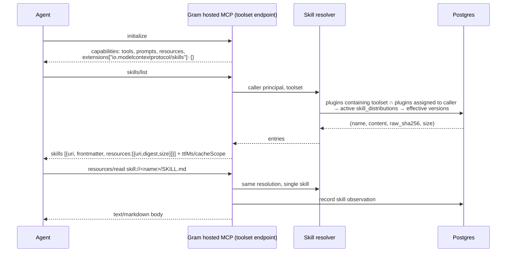
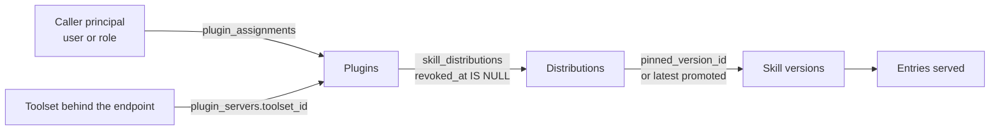

# RFC: Skills over MCP — Serving Gram-Managed Skills

Status: Draft  
Author: Sagar Batchu  
Reviewers: <NAMES>  
Team channel: <CHANNEL>  
Linear project: <LINK>  
Design partners: <NAMES>  
Interested customers/prospects: <NAMES>  
Related RFCs: [Skills over MCP — Gateway Governance](2026-09-14-skills-over-mcp-governance.md) (parent; defines the skill-entry identity and inventory this RFC reuses, and ships first)

## Overview

Gram distributes skills to people in five ways today, and none of them is
MCP. Skills are baked into downloadable plugin packages as
`skills/<name>/SKILL.md` files (`server/internal/plugins/generate.go:2979`),
embedded into every Platform MCP package from a go-embed bundle
(`generate.go:427`, `:2671`), served as a public share page
(`server/internal/skills/sharepage.go:113`), injected into assistant turns
(`server/internal/assistants/provisioning.go:381`), and exposed to
administrators through Platform MCP authoring tools
(`server/internal/platformmcp/tool_skills.go:67`). Every one of these is a
file or RPC path that a person or a build step must run. Delivery to a device
depends on a plugin package being re-downloaded; the sync-receipts table that
would make delivery observable has no reader on main
(`server/database/schema.sql:890`).

Meanwhile the hosted MCP server already advertises the `resources` capability
and dispatches `resources/list` and `resources/read` for function-backed
resources (`server/internal/mcp/rpc_initialize.go:124-128`,
`server/internal/mcp/impl.go:1628-1633`). The SEP-2640 skills extension is
two more methods and one capability key on top of that plumbing.

The consequence of the status quo is that a skill update reaches an agent
only when the plugin is republished and the device fetches the new package,
targeting is frozen at package build time, and activation is observable only
through hooks. With skills over MCP, the MCP connection an agent already holds
becomes the delivery channel: the agent discovers skills on demand, loads only
the one it needs, and sees an update the next time it lists. Targeting and
revocation follow plugin assignment at request time rather than at package
build time. This is the "dynamic sync, not package baking" direction the
control plane has been moving toward for servers, applied to skills.

Adoption is early. Hugging Face's server and the fast-agent client implement
v1; Claude Code, Cursor, Codex, and VS Code answer `resources/read` but not
`skills/list`. This RFC therefore adds the MCP path without removing any
existing one, and is sized so that it is cheap to be ready when clients
arrive.

### User stories

- A platform administrator distributes a skill to a plugin and wants every
  agent connected through that plugin to see it on its next listing, with no
  package republish.
- An administrator pins a skill to a version for one plugin and tracks latest
  in another, and wants each connection to receive the right one.
- A skill author wants to know a skill was actually loaded, not just
  downloaded, so efficacy scoring has a signal that does not depend on hooks
  being installed.

## Goals

- The hosted MCP server advertises `io.modelcontextprotocol/skills` and
  answers `skills/list`, `skills/get`, and `resources/read` for skills
  distributed to plugins the caller is assigned to.
- The Platform MCP server serves its reviewed bundled skills the same way.
- A served entry carries a digest the parent RFC's inventory recognizes, so
  Gram-served skills and third-party skills share one identity model.
- A skill read records an activation for efficacy scoring.
- Pinned versions and revocations are honoured at request time.
- Existing package-based delivery is unchanged.

### Non-goals

- Multi-file skill bundles. A skill version is one markdown blob
  (`skill_versions.content`, `server/database/schema.sql:614`); v1 serves
  exactly one resource per skill.
- The optional `resources/directory/read` method. With one file per skill
  there is nothing to enumerate.
- Serving skills through the remote MCP proxy for third-party upstreams. The
  proxy relays what the upstream serves; governance of that is the parent RFC.
- Retiring plugin packages or the device-side sync work on unmerged branches.
- Change notifications. SEP-2640 has none; hosts re-list.

### Stretch goals

- Multi-file bundles once a files table exists, with `resources/directory/read`
  behind `directoryRead: true`.
- A per-plugin MCP endpoint that serves the plugin's servers and skills at
  one URL, replacing the toolset-scoped resolution rule below.
- Retire the go-embed Platform MCP skill bundle once the reference clients
  load skills over MCP at runtime.

## TLDR / Key Decisions

- **Implement the extension on the hosted server, next to existing resource
  dispatch.** The capability, resources plumbing, cache hints, and caller
  resolution already exist; the increment is two handlers and one resolver.
- **A toolset endpoint serves the skills of plugins that contain it and are
  assigned to the caller.** This keeps the URL customers already configure and
  uses the only mechanism that ties skills to people today, plugin membership
  plus plugin assignment.
- **Single-file v1, digest from the stored raw hash.** The spec digests raw
  bytes; `skill_versions.raw_sha256` is exactly that, so an entry can be
  built without re-reading content.
- **Public unauthenticated toolsets serve no skills.** Skills are distributed
  to principals; an anonymous caller has none.
- **A skill read is an activation, not a metered resource call.** It records
  a skill observation and bypasses the function-resource billing path.
- **Dual delivery.** Packages keep shipping SKILL.md files until clients
  consume the MCP path; nothing is removed.

## Proposal

### Wire surface

New dispatch cases in `server/internal/mcp/impl.go` beside `resources/read`:

| Method           | Handler                        | Result                                                                                                    |
| ---------------- | ------------------------------ | --------------------------------------------------------------------------------------------------------- |
| `skills/list`    | new `handleSkillsList`         | Entries for every resolved skill, with list cache hints from `hostedListCacheHints` marked caller-varying |
| `skills/get`     | new `handleSkillsGet`          | One entry, or `-32602` when the URI does not resolve for this caller                                      |
| `resources/read` | existing `handleResourcesRead` | Branches on a resolved skill URI before the function-resource lookup                                      |

`resources/list` continues to list only function resources. SEP-2640 states
that skill files are addressable whether or not listed, and keeping them out
of `resources/list` avoids doubling the catalog for clients that enumerate
resources eagerly.

An entry is built entirely from columns:

| Entry field           | Source                                                                                                                                                         |
| --------------------- | -------------------------------------------------------------------------------------------------------------------------------------------------------------- |
| `uri`                 | `skill://<skills.name>/SKILL.md`                                                                                                                               |
| `frontmatter`         | parsed from the version's content on the way out; `name` and `description` are required and are already validated on write (`spec_valid`, `validation_errors`) |
| `resources[0].uri`    | same as `uri`                                                                                                                                                  |
| `resources[0].digest` | `sha256:` + `skill_versions.raw_sha256`                                                                                                                        |
| `resources[0].size`   | byte length of `content`                                                                                                                                       |

Because the manifest has one file, the parent RFC's digest-set hash for a
Gram-served skill is the hash of one digest, and `skill_md_digest` equals
`raw_sha256`. A hook-captured activation therefore links to a Gram-served
skill by the same rule as to a third-party one.

### Resolution rule

The caller's principal is the one the hosted path already resolves for
`tools/list` authorization; a plugin is in scope when a `plugin_assignments`
row (`server/database/schema.sql:5845`) names the caller's user, one of the
caller's roles, or `*`. A plugin contains the toolset when a `plugin_servers`
row (`schema.sql:5798`) references it. Skills are the plugin's active
`skill_distributions` (`schema.sql:3262`), each resolved to its pinned version
or, when `pinned_version_id` is null, the latest promoted version.

When the same skill reaches the caller through two plugins at different
versions, the pinned one wins over latest, and two pins conflict in favour of
the newer version. The conflict is logged; it is an authoring problem the
dashboard can surface later.

Unauthenticated calls against a public toolset resolve to no principal and
therefore no skills. The capability is still advertised, so a client's
behaviour does not change between anonymous and signed-in sessions except in
what the list contains.

### Platform MCP

The Platform MCP server (`server/internal/mcp/serve_platform.go:215-225`)
advertises only `tools` today. It gains the same three handlers, backed not by
distributions but by the embedded reviewed skills that
`loadPlatformMCPSkills` already validates (`generate.go:2671`). Entries are
computed once at startup. This lets the Platform MCP serve its own
how-to skills to any host that implements the extension, and lets the
package-embedded copy be retired later without a data-model change.

### Activation and efficacy

A `resources/read` of a skill writes a `skill_observations` row
(`schema.sql:777`) with the served `raw_sha256`, the caller, and the session,
tagged with an origin of `mcp`. Today observations come only from hooks; this
gives efficacy scoring (`skill_efficacy_*`, `schema.sql:914-929`) a signal for
every connection, and gives the parent RFC's inventory a first-party row to
match against. Reads are deduplicated per session and digest so a host that
re-fetches within a session does not inflate counts.

### Caching

Per SEP-2549, list and get results carry `ttlMs` and `cacheScope`. Because
the entry set depends on the caller's assignments, results are marked
caller-varying, the same treatment `hostedListCacheHints` gives a private
toolset's tools. A short TTL bounds how long a revoked distribution stays
visible to a host that cached the list.

### User Experience

**Dashboard experience.** No new page. The plugin detail page, which already
lists servers and skills, gains a note that skills are available over MCP to
connected agents and a per-skill "last loaded over MCP" timestamp sourced from
observations. The skill detail page shows the served digest so an
administrator can compare it with what a host reports.

**CLI or API experience.** No management API change. The MCP surface of every
hosted toolset endpoint grows by one capability key and two methods, which is
additive for existing clients; a client that does not know the extension
ignores the key. The Platform MCP endpoint grows the same way.

**Self-service workflow.** Distributing a skill to a plugin is unchanged; the
MCP path is a consequence of distribution, not a new step.

**Documentation changes.** The skills docs gain a section "Loading skills
over MCP" listing which clients support it and explaining that package
delivery continues to work. The MCP server docs list the new capability.

**Migration experience.** None. Packages continue to include skills.

### Billing

Billing impact: Unverified, with a proposed default. The hosted
`resources/read` handler runs function resources through the tool proxy and
billing tracker (`server/internal/mcp/rpc_resources_read.go:54-120`). Skill
reads branch before that path and are not metered as resource calls. Whether
skills over MCP is an entitlement of a specific plan is a packaging decision;
the code path gates only on the feature flag. Owner: <BILLING OWNER>.

### Threat Modeling

The trust boundary is between Gram and the agent host. Gram is the author of
record for the content, so the main risks are disclosure and staleness rather
than injection.

| Threat                                                                          | Control                                                                                                                                                                  |
| ------------------------------------------------------------------------------- | ------------------------------------------------------------------------------------------------------------------------------------------------------------------------ |
| A caller enumerates skills distributed to plugins they are not assigned to      | Resolution intersects plugin membership with the caller's assignments; `skills/get` for an out-of-scope URI returns `-32602`, indistinguishable from a nonexistent skill |
| A revoked or archived skill remains loadable                                    | Resolution runs on every call; `revoked_at` and `archived_at` exclude the row; short caller-varying TTL bounds host caches                                               |
| A host loads a stale cached body under a fresh listing                          | Digest changes with content; the host's own SEP-2640 verification rejects the mismatch                                                                                   |
| Skill content includes secrets an author pasted                                 | Existing on-write validation and the parent RFC's scan apply to Gram-authored content as well; no change to authoring policy here                                        |
| A host treats a Gram-served skill as a local skill and grants `allowed-tools`   | Host obligation per spec; Gram does not emit `allowed-tools` for skills that do not declare it and never expands it                                                      |
| Enumeration cost: a large plugin with many skills makes `skills/list` expensive | Entries are column-built with no content read; pagination via `cursor` keeps an entry atomic per spec                                                                    |

Accepted risks: none beyond those inherent to distributing content to the
assigned principal. Information Security reviewer: <INFOSEC REVIEWER>.

## Alternatives Considered

### A dedicated per-plugin MCP endpoint

Serve each plugin's servers and skills at one URL. Cleaner, and it makes the
plugin the unit of connection as well as of assignment. Rejected for v1
because it introduces a new URL customers must configure in every client and
a routing layer over hosted and remote servers that does not exist today. Kept
as a stretch goal; the resolver in this RFC is reusable there.

### Skills as MCP prompts

`prompts/list` and `prompts/get` are already dispatched by the hosted server
and are model-visible in more clients than resources are. But prompts have no
file manifest, no digest, and no lazy-loading convention; a host would inject
the whole body on selection. This also diverges from the direction every
tracked implementation is taking.

### Skills as ordinary resources with no extension

Serve `skill://` URIs through `resources/list` and stop. Works with any
client that can read resources, but gives a host no way to distinguish a
skill from any other resource, no digest to bind approval to, and no
frontmatter without a read. The extension exists to fix exactly this.

### Wait for client adoption before building

Cheapest. Rejected because the increment is small, the reference server and
client exist to test against today, and the parent RFC needs first-party
entries in the inventory to distinguish Gram-served skills from third-party
ones.

## Rollout and Validation

1. **Behind a feature flag per org** in `server/internal/feature/flags.go`,
   default off. The capability key is not advertised when the flag is off, so
   nothing is observable.
2. **Internal dogfood** on the Platform MCP with the reviewed skills, tested
   against fast-agent, which is the only client that implements v1 today.
   Success: `skills/list` matches the embedded set, digests verify, a read
   records an observation.
3. **Design partner plugin** on a hosted toolset. Success: entries match the
   plugin's distributions for two principals with different assignments, a pin
   change is visible on the next list, a revocation disappears within the TTL.
4. **Default on.** Additive, so no customer action.

Observability: hosted MCP metrics already carry method labels
(`server/internal/mcp/impl.go:1603`); add the two methods to the census
(`server/internal/mcp/mcprequests/method.go`) and a counter for skill reads by
origin.

Failure scenarios and rollback: a resolver error must fail the request, never
serve another caller's skills. The flag drops the capability and the handlers
in one step without a deploy. Because packages are unchanged, no client loses
skills when the flag is off.

Testing: handler unit tests with fixtures for assignment by user, by role, and
by wildcard, plus pin and revocation cases; a conformance test against the
spec's example payloads; an end-to-end test with fast-agent in CI if its
install footprint is acceptable, otherwise a recorded transcript.

## Open Questions

- Should a toolset endpoint also serve skills distributed to plugins that
  contain the toolset but are not assigned to the caller when the toolset
  itself is public? Proposed: no; assignment is the audience.
- What `ttlMs` is right? Tools lists use the hosted defaults; skills may
  warrant a shorter value because revocation is a security action. Owner:
  this RFC's author.
- Should `skill_observations` rows from MCP reads count toward efficacy the
  same as hook-captured activations, given a read does not prove the model
  used the skill? Owner: efficacy scoring.
- Does the Platform MCP's embedded bundle stay in packages indefinitely, or
  is there a client-adoption threshold that triggers removal? Owner: product.
- Entitlement and metering (see Billing).
