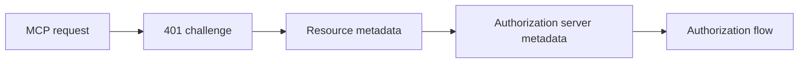

# Debug MCP OAuth Flows

Use this runbook to test an MCP OAuth flow with a local Gram server. Use a
fixed HTTPS tunnel so that the OAuth provider can send redirects to the server.

## Prepare the local server

1. Get access to the team ngrok account.
2. Create a fixed domain on the
   [ngrok domains page](https://dashboard.ngrok.com/domains).
3. Set the server URL:

   ```bash
   mise set --file mise.local.toml GRAM_SERVER_URL=https://<NGROK_DOMAIN>
   ```

4. Start the development environment.
5. Start the tunnel in a separate terminal:

   ```bash
   ngrok http --url=<NGROK_DOMAIN> https://localhost:8080
   ```

To use an IDE debugger, start the debugger and run
`pitchfork start dashboard` in a separate terminal.

## Follow the discovery flow



Set the test URLs:

```bash
export MCP_RESOURCE=https://mcp.example.com/mcp/example
export RESOURCE_METADATA=https://mcp.example.com/.well-known/oauth-protected-resource/mcp/example
export UPSTREAM_ISSUER=https://auth.example.com/tenant/example
```

### 1. Check the challenge

```bash
curl -si "$MCP_RESOURCE" | grep -Ei '^(HTTP|WWW-Authenticate:)'
```

The response must be `401`. The `WWW-Authenticate` header must contain the
`resource_metadata` URL for this MCP resource.

### 2. Check the resource metadata

```bash
curl -fsS "$RESOURCE_METADATA" | jq '{resource, authorization_servers}'
```

| Mode            | `resource`       | `authorization_servers`    |
| --------------- | ---------------- | -------------------------- |
| Gram-hosted     | MCP resource URL | MCP resource URL           |
| Upstream issuer | MCP resource URL | Configured upstream issuer |

Gram owns the MCP resource and its RFC 9728 metadata in both modes. In upstream
mode, only authorization-server discovery moves to the upstream issuer.

### 3. Check the authorization server metadata

For an issuer that has a path, insert
`/.well-known/oauth-authorization-server` before the path:

```bash
curl -fsS https://auth.example.com/.well-known/oauth-authorization-server/tenant/example \
  | jq '{issuer, authorization_endpoint, token_endpoint, registration_endpoint, authorization_response_iss_parameter_supported}'
```

- `issuer` must exactly equal `$UPSTREAM_ISSUER`; case and trailing slashes are
  significant. Do not continue on mismatch.
- Each endpoint must be an absolute HTTPS URL.
- An endpoint must not contain user information or a fragment.
- Endpoint origins can be different from the issuer origin.

### 4. Check the authorization response

Check `authorization_response_iss_parameter_supported` in the provider metadata:

- If the value is `true`, the response must contain `iss`. The value must be
  exactly equal to the issuer that the client used.
- If the value is absent or `false`, do not require `iss`.

## Find endpoint connection failures

List all advertised endpoints:

```bash
metadata=$(curl -fsS https://auth.example.com/.well-known/oauth-authorization-server/tenant/example)
printf '%s' "$metadata" | jq -r '.authorization_endpoint, .token_endpoint, .registration_endpoint // empty'
```

- Check DNS, TLS, routing, and allowlists for each endpoint.
- Make sure that the user's browser can reach the authorization endpoint.
- Make sure that the OAuth client can reach the token and registration endpoints.
- An HTTP `400`, `401`, or `405` can show that the network connection works.

Do not put secrets, authorization codes, tokens, or credentials in commands,
logs, feature-flag data, or rollout notes.

## Change an issuer

Issuer changes create a new identity; case and trailing slashes are significant.
Clear client discovery and authentication data or reconnect. Then authenticate
again.
