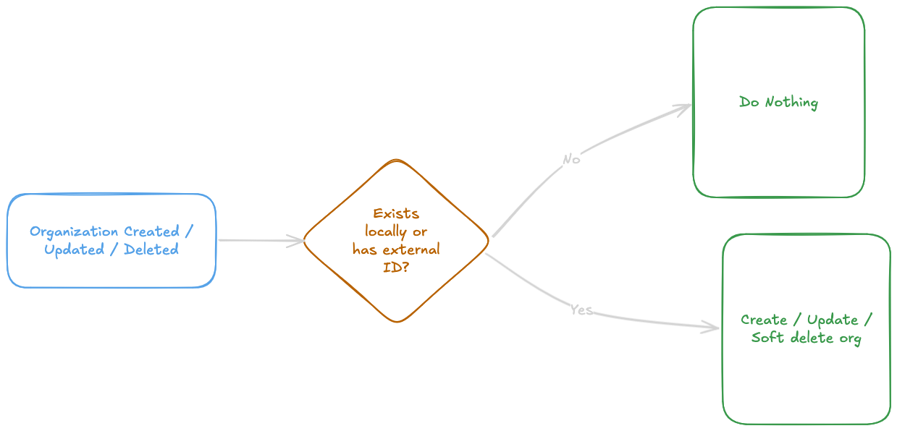
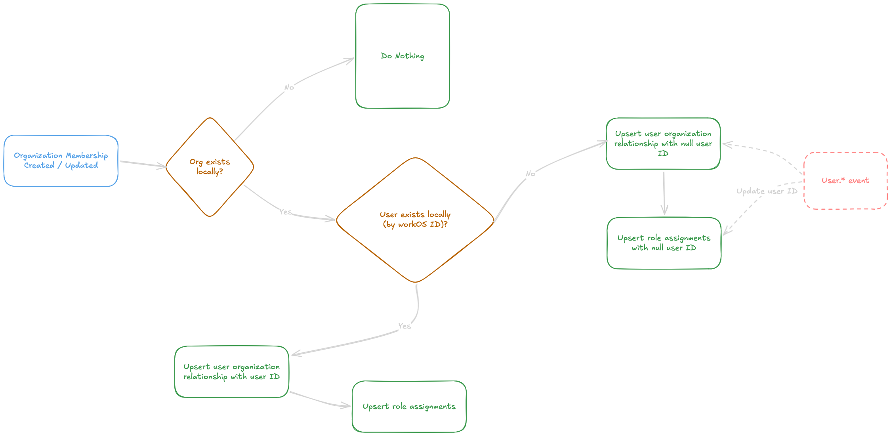
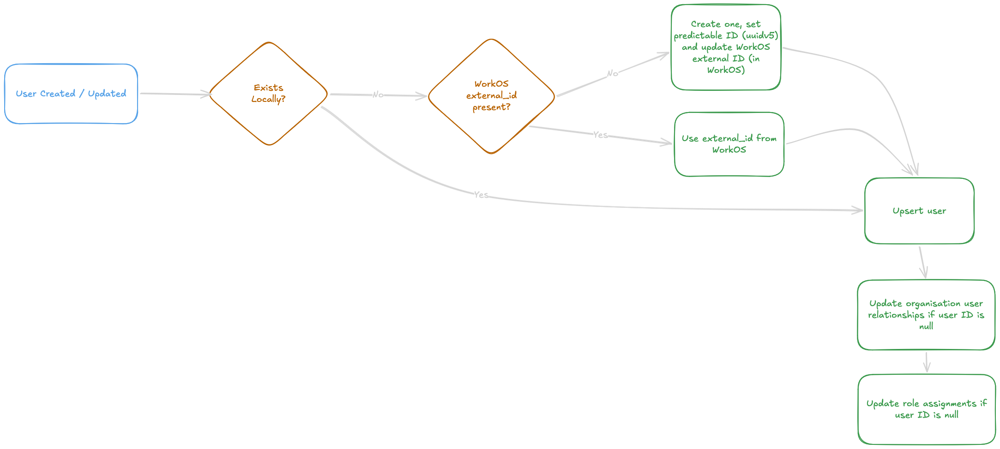

# WorkOS Sync

This document summarizes the main WorkOS synchronization paths and the resulting local database state.

The sync works as follows:

1. We have a Webhook endpoint which is invoked by WorkOS when certain events happen
2. When the webhook is called, we trigger a temporal workflow
3. We discard whatever information comes in the webhooks, and use the workOS events API to list events (we have
   tables and cursors tracking last event IDs to use as a starting point)
4. We go through each event in order and replay these events to update our local database state

WorkOS sync works as a best effort / eventual consistency path. We assume that events can come out of order and handle that accordingly.

Within that rule, there is one guarantee: organization and organization_membership events will always be in order,
given we process events in order from WorkOS.

## Event Catalog

| Event                             | Handler                      | `ShouldProcessEvent` baseline                                                                                              | Result                                                                                                                                                                                      |
| --------------------------------- | ---------------------------- | -------------------------------------------------------------------------------------------------------------------------- | ------------------------------------------------------------------------------------------------------------------------------------------------------------------------------------------- |
| `organization.created`            | Organization event processor | Existing org `workos_last_event_id`, else `workos_updated_at`                                                              | Links/upserts the Gram organization by existing `workos_id`, or by WorkOS `external_id` if the org is not linked yet. Skips unlinked orgs with no `external_id`.                            |
| `organization.updated`            | Organization event processor | Existing org `workos_last_event_id`, else `workos_updated_at`                                                              | Updates local organization name, slug, WorkOS ID, and WorkOS timestamp fields when the event wins.                                                                                          |
| `organization.deleted`            | Organization event processor | Existing org `workos_last_event_id`, else `workos_updated_at`                                                              | Disables the local organization by WorkOS ID. Unknown org deletes are skipped.                                                                                                              |
| `organization_role.created`       | Organization event processor | Existing org-role `workos_last_event_id`, else `workos_updated_at`                                                         | Upserts the WorkOS-managed role for the local organization. Unknown orgs are skipped.                                                                                                       |
| `organization_role.updated`       | Organization event processor | Existing org-role `workos_last_event_id`, else `workos_updated_at`                                                         | Updates WorkOS-managed org role name, description, and WorkOS timestamps.                                                                                                                   |
| `organization_role.deleted`       | Organization event processor | Existing org-role `workos_last_event_id`, else `workos_updated_at`                                                         | Soft-deletes the org role and deletes grants whose principal is that role. Unknown orgs or missing local roles are skipped.                                                                 |
| `role.created`                    | Global role processor        | Existing global-role `workos_last_event_id`, else `workos_updated_at`                                                      | Upserts the WorkOS-managed global role.                                                                                                                                                     |
| `role.updated`                    | Global role processor        | Existing global-role `workos_last_event_id`, else `workos_updated_at`                                                      | Updates WorkOS-managed global role name, description, and WorkOS timestamps.                                                                                                                |
| `role.deleted`                    | Global role processor        | Existing global-role `workos_last_event_id`, else `workos_updated_at`                                                      | Soft-deletes the global role. Missing local roles are skipped.                                                                                                                              |
| `organization_membership.created` | Organization event processor | Existing relationship by `workos_membership_id`, else by `(organization_id, user_id)` when user is known, else no baseline | Upserts an active relationship when the user is known; otherwise creates a pending relationship with `user_id = NULL`. Syncs role assignments the same way. Unknown orgs are skipped.       |
| `organization_membership.updated` | Organization event processor | Existing relationship by `workos_membership_id`, else by `(organization_id, user_id)` when user is known, else no baseline | Refreshes membership metadata and makes local role assignments match the WorkOS role slugs. Pending rows remain pending until the user sync links them.                                     |
| `organization_membership.deleted` | Organization event processor | Existing relationship by `workos_membership_id`, else by `(organization_id, user_id)` when user is known, else no baseline | Soft-deletes the relationship and role assignments for the WorkOS user. If needed, records a membership tombstone so older create/update replays do not resurrect deleted membership state. |
| `user.created`                    | User event processor         | Per-user cursor, plus SQL `workos_updated_at` guard on the `users` row                                                     | Resolves a Gram user ID, upserts the user, links pending relationships and role assignments by `workos_user_id`, and attempts to set WorkOS `external_id` after commit if it was missing.   |
| `user.updated`                    | User event processor         | Per-user cursor, plus SQL `workos_updated_at` guard on the `users` row                                                     | Updates local user profile fields when the WorkOS payload is current enough, then links any pending relationship/assignment rows.                                                           |
| `user.deleted`                    | User event processor         | Per-user cursor, plus SQL `workos_updated_at` guard on the `users` row                                                     | Soft-deletes/disables the local user by WorkOS ID. Memberships and assignments are not directly changed by the user delete path.                                                            |

## Summary Matrix

| Area                  | Events                                                                                                  | Cursor scope                 | Main local state                                         |
| --------------------- | ------------------------------------------------------------------------------------------------------- | ---------------------------- | -------------------------------------------------------- |
| Organization          | `organization.created`, `organization.updated`, `organization.deleted`                                  | One cursor per WorkOS org    | Gram organization metadata and WorkOS linkage            |
| Organization roles    | `organization_role.created`, `organization_role.updated`, `organization_role.deleted`                   | One cursor per WorkOS org    | WorkOS-managed org roles and grants for deleted roles    |
| Global roles          | `role.created`, `role.updated`, `role.deleted`                                                          | Singleton global-role cursor | WorkOS-managed global roles                              |
| Memberships           | `organization_membership.created`, `organization_membership.updated`, `organization_membership.deleted` | One cursor per WorkOS org    | Org relationships and org role assignments               |
| Users                 | `user.created`, `user.updated`, `user.deleted`                                                          | One cursor per WorkOS user   | Gram users, plus pending relationship/assignment linking |
| Organization backfill | Snapshot, not event-driven                                                                              | No event cursor              | Org metadata, org roles, users, memberships, assignments |

## Cursor And Freshness Rules

Each event processor has two layers of ordering:

- The stream cursor decides where the next WorkOS Events API page starts.
- The row-level freshness check decides whether the current event should mutate a local row.

Organization-scoped events share the per-organization cursor in `workos_organization_syncs`. This includes `organization.*`, `organization_role.*`, and `organization_membership.*`.

Global `role.*` events are not scoped to an organization, so they use the same cursor table with a singleton empty WorkOS organization ID key.

User events use `workos_user_syncs`, keyed by WorkOS user ID. The user event processor advances the cursor even when a page contains another user's event; the payload ID check makes that event a no-op for the current user.

`ShouldProcessEvent` is used for organization metadata, organization roles, global roles, and memberships. It works like this:

- If the local row has `workos_last_event_id`, compare event IDs. WorkOS event IDs are time-ordered, so only a strictly greater event ID applies.
- If the local row does not have `workos_last_event_id`, compare timestamps. The incoming event takes precedence when its payload `updated_at` is equal to or newer than the local row's `workos_updated_at`; an older event is ignored.
- If neither local value exists, the event applies.

This handles three common cases:

- Duplicate event delivery: same or older event ID is ignored for that row.
- Replay after backfill: event only applies if it is at least as fresh as the snapshot that wrote `workos_updated_at`.
- Out-of-order local processing: stale payloads cannot overwrite newer row state.

User upserts and deletes do not call `ShouldProcessEvent` directly. They rely on the per-user event cursor and SQL guards that only update the `users` row when the incoming `workos_updated_at` is at least as fresh as the stored value.

## Membership And User Outcomes

| Path                                     | Gram user known? | Relationship result                     | Role assignment result                        |
| ---------------------------------------- | ---------------- | --------------------------------------- | --------------------------------------------- |
| Membership event before user event       | No               | Pending row with `user_id = NULL`       | Pending rows with `user_id = NULL`            |
| Membership event after user exists       | Yes              | Active row with `user_id`               | Active rows with `user_id`                    |
| User event after pending membership      | Yes after event  | Pending relationship linked             | Pending assignments linked                    |
| Backfill membership with resolvable user | Yes              | Active row with `user_id`               | Active rows with `user_id`                    |
| Backfill membership with no Gram user ID | No               | Skipped                                 | Skipped                                       |
| Membership deleted                       | Maybe            | Relationship soft-deleted or tombstoned | Assignments soft-deleted                      |
| User deleted                             | Existing user    | User soft-deleted                       | Membership/assignments unchanged by user path |

## Flow Diagrams

### Organization Event Flow



### Membership Event Flow



### User Event Flow



## Local Tables

The relevant local state is split across:

- `users`: Gram users linked to WorkOS users by `users.workos_id`.
- `organization_user_relationships`: organization membership rows, linked to WorkOS by `workos_user_id` and `workos_membership_id`.
- `organization_role_assignments`: role assignments, linked to WorkOS by `workos_user_id`, `workos_membership_id`, and role URNs.
- WorkOS sync cursor tables: track the last processed WorkOS event IDs for organization and user event streams.

Soft-deleted rows use `deleted_at`. WorkOS events and snapshots are applied only when their WorkOS timestamp/event cursor should win over the local row.

## Organization Membership Event Before User Event

This path happens when an `organization_membership.created` or `organization_membership.updated` event is processed before the matching WorkOS `user.created` or `user.updated` event.

### Known Organization, Unknown User

Input:

- WorkOS organization exists locally.
- WorkOS membership event references a WorkOS user ID.
- No local `users` row exists yet for that WorkOS user ID.

Result:

- `organization_user_relationships` is upserted with:
  - `organization_id`
  - `workos_user_id`
  - `workos_membership_id`
  - `user_id = NULL`
- `organization_role_assignments` is synced with:
  - `workos_user_id`
  - `workos_membership_id`
  - `user_id = NULL`
  - resolved role URNs for the WorkOS role slugs that already exist locally
- The organization event cursor advances.

End state:

- The membership and role assignment are represented locally, but are not yet attached to a Gram user.
- Later user sync can link both tables by matching `workos_user_id`.

### Known Organization, Known User

Input:

- WorkOS organization exists locally.
- Local `users.workos_id` matches the WorkOS membership user ID.

Result:

- `organization_user_relationships` is upserted with `user_id` populated.
- `organization_role_assignments` is synced with `user_id` populated.
- If an older tombstoned relationship exists for the same `(organization_id, user_id)`, the sync reuses/reactivates that relationship instead of creating a conflicting duplicate.

End state:

- The Gram user has an active organization relationship.
- The Gram user has the current role assignments for that WorkOS membership.

### Unknown Organization

Input:

- WorkOS membership event references an organization that has no local Gram organization metadata.

Result:

- The event is skipped.
- No membership or role assignment rows are written.
- The organization event cursor still advances.

End state:

- No local organization state is created from a membership event alone.
- Organization metadata must be linked through the organization sync path.

### Membership Deleted Event

Input:

- WorkOS sends `organization_membership.deleted`.

Result:

- Matching `organization_user_relationships` row is soft-deleted.
- Matching `organization_role_assignments` rows for that `workos_user_id` are soft-deleted.
- If the relationship did not exist, a tombstone can be inserted by membership ID so stale replayed creates do not resurrect old state.

End state:

- The user no longer has an active organization relationship from that WorkOS membership.
- Role assignments from that membership are no longer active.

## User Event Created Or Updated

This path is handled by the WorkOS user event processor.

### User Has WorkOS `external_id`

Input:

- WorkOS user event has `external_id`.

Result:

- `external_id` is treated as the Gram user ID.
- `users` is upserted with WorkOS profile fields and timestamps.
- Pending `organization_role_assignments` for the WorkOS user are linked by setting `user_id`.
- Pending `organization_user_relationships` for the WorkOS user are linked by setting `user_id`.

End state:

- The local Gram user row exists and is linked to the WorkOS user.
- Any memberships and role assignments that arrived earlier are attached to that Gram user.

### User Has No WorkOS `external_id`, Existing Local User Exists

Input:

- WorkOS user event has no `external_id`.
- A local user already exists with matching `users.workos_id`.

Result:

- Existing local user ID is reused.
- `users` is updated from the WorkOS payload.
- Pending membership and role assignment rows are linked to that user.
- After the DB transaction commits, the processor attempts to set WorkOS `external_id` to the local Gram user ID.

End state:

- Local state is consistent even if the WorkOS `external_id` update fails.
- A warning is logged if updating WorkOS fails.

### User Has No WorkOS `external_id`, No Local User Exists

Input:

- WorkOS user event has no `external_id`.
- No local user exists with matching `users.workos_id`.

Result:

- A deterministic Gram user ID is generated from the WorkOS user ID.
- `users` is inserted with that generated ID.
- Pending relationships and role assignments are linked to that generated user ID.
- After commit, WorkOS `external_id` is updated to that generated Gram user ID.

End state:

- The WorkOS user has a local Gram user.
- Pending membership/role data becomes visible through normal Gram user/org joins.

### User Deleted Event

Input:

- WorkOS sends `user.deleted`.

Result:

- The local `users` row matching `workos_id` is disabled/soft-deleted using WorkOS timestamps.
- Organization memberships and role assignments are not directly changed by the user delete path.

End state:

- User state reflects the WorkOS delete.
- Membership cleanup remains driven by membership delete events or organization backfill snapshots.

## Organization Backfill

The WorkOS organization backfill is snapshot-based. It fetches:

- current WorkOS organization metadata
- current WorkOS organization roles
- current WorkOS organization users
- current WorkOS organization memberships

It then applies local state in this order:

1. Backfill organization metadata.
2. Backfill organization roles.
3. For each membership:
   1. Find the matching WorkOS user snapshot.
   2. Backfill that WorkOS user into `users`.
   3. If a Gram user ID was resolved, upsert the membership relationship.
4. Sync role assignments for that membership.

Organization backfill also backfills users for the organization. For each WorkOS membership, it finds the matching WorkOS user snapshot and tries to apply that user locally before applying the membership and role assignments. If the user cannot be resolved to a Gram user ID, the membership and role assignment rows for that membership are skipped.

## Running Backfill From Temporal UI

Use Temporal UI's **Start Workflow** page.

Common fields:

- **Task Queue:** `main` locally, or the deployment's `TEMPORAL_TASK_QUEUE` value.
- **Workflow Type:** `BackfillWorkOSWorkflow`
- **Encoding:** `json/plain`

Use a unique workflow ID. The application-generated format is:

- All organizations: `v1:backfill-workos:<unix timestamp>`
- One organization: `v1:backfill-workos:<workos organization id>:<unix timestamp>`

Any unique ID is fine from the UI, but matching this shape makes workflow history easier to scan.

### Backfill Global Roles And One Organization

Input:

```json
{
  "workos_organization_id": "org_..."
}
```

Result:

- Backfills global WorkOS roles first.
- Backfills the specified WorkOS organization.
- Backfills that organization's users as part of the organization membership pass.
- Backfills the organization's WorkOS-managed roles, memberships, and role assignments.

This is the preferred option when reconciling one known WorkOS organization.

### Backfill Global Roles And All Organizations

Input:

```json
{}
```

Result:

- Backfills global WorkOS roles first.
- Lists every WorkOS organization.
- Backfills each organization one at a time.
- Backfills users for each organization as part of each organization's membership pass.

If an individual organization backfill fails during an all-org run, the workflow logs that org failure and continues with the remaining organizations.

### Global Role Backfill Behavior

There is no separate global-role-only workflow. Global role backfill is always run at the start of `BackfillWorkOSWorkflow`, before any organization work.

Global role backfill:

- Lists current WorkOS global roles.
- Upserts current WorkOS-managed global roles locally.
- Soft-deletes local WorkOS-managed global roles that are missing from the current WorkOS snapshot.

Operational failure handling is covered in [WorkOS Sync Runbook](workos-sync-runbook.md).

### Organization Metadata

Input:

- WorkOS organization has a local row by `workos_id`, or it has `external_id` pointing at the Gram organization ID.

Result:

- Local organization metadata is updated from the WorkOS snapshot if the snapshot should win.

End state:

- Organization metadata reflects the current WorkOS organization snapshot.

If the organization is unknown and has no `external_id`, the org backfill skips it.

### Organization Roles

Input:

- WorkOS returns current organization roles.

Result:

- Current WorkOS organization roles are upserted locally.
- Local WorkOS-managed organization roles missing from the snapshot are soft-deleted.
- Grants for soft-deleted organization roles are removed.
- Global roles are backfilled separately before organization backfill runs.

End state:

- Local WorkOS-managed organization roles match the current WorkOS role snapshot.

### Membership With Resolvable User

Input:

- WorkOS membership exists in the snapshot.
- Matching WorkOS user snapshot exists.
- User backfill resolves a Gram user ID from either:
  - existing local `users.workos_id`, or
  - WorkOS `external_id`.

Result:

- User row is inserted/updated locally if needed.
- Membership relationship is upserted with `user_id`.
- Role assignments are synced with `user_id`.

End state:

- The Gram user has an active organization relationship.
- The Gram user has active role assignments matching the WorkOS membership snapshot.

### Membership With User Snapshot But No Resolved Gram User ID

Input:

- WorkOS membership exists in the snapshot.
- Matching WorkOS user snapshot exists.
- WorkOS user has no `external_id`.
- No local user exists with matching `users.workos_id`.

Result:

- Backfill logs a warning.
- Backfill does not create a deterministic local user ID.
- Backfill does not upsert the membership relationship.
- Backfill does not sync role assignments for that membership.
- Backfill does not update WorkOS `external_id`.

End state:

- Local DB is unchanged for that user/membership.
- The missing Gram user ID is treated as an operational warning to handle separately.

This is intentionally different from the user event path. Backfill only changes local database state; it does not create new local user identities when WorkOS has not already been linked to a Gram user.

### Membership Without Matching User Snapshot

Input:

- WorkOS membership snapshot references a user ID not present in the WorkOS org users snapshot.

Result:

- Backfill fails with an invariant error.

End state:

- No partial transaction is committed for that organization backfill.
- This state is treated as an inconsistent WorkOS snapshot or wrapper bug, not a normal skip case.

### Existing Local User Is Newer Than Backfill Snapshot

Input:

- Local `users.workos_updated_at` is newer than the WorkOS user snapshot timestamp.

Result:

- User row is not overwritten by the older snapshot.
- The resolved Gram user ID is still returned.
- Membership and role assignment snapshot can still be applied for that resolved user.

End state:

- User profile fields keep the newer local WorkOS state.
- Organization membership state still reflects the organization snapshot.

## Rejoin And Tombstone Cases

### User Leaves And Rejoins Same Organization

Input:

- Existing `(organization_id, user_id)` relationship was soft-deleted.
- WorkOS later sends or backfills a new active membership for the same user/org, usually with a new `workos_membership_id`.

Result:

- The existing tombstoned relationship is reused/reactivated.
- `workos_membership_id`, `workos_user_id`, WorkOS timestamp, and cursor fields are updated.
- A duplicate `(organization_id, user_id)` row is not inserted.

End state:

- The user has one active relationship for that organization.
- Historical tombstone state does not block rejoin.

### Pending Relationship Exists And User Later Syncs

Input:

- A membership event created a pending relationship with `user_id = NULL`.
- A tombstoned relationship also exists for the same `(organization_id, user_id)`.
- A later user event resolves the WorkOS user to that Gram user ID.

Result:

- The tombstoned relationship is re-linked/reactivated with the pending WorkOS membership fields.
- The pending placeholder row is soft-deleted.

End state:

- There is one active relationship for `(organization_id, user_id)`.
- The relationship points at the current WorkOS membership.
