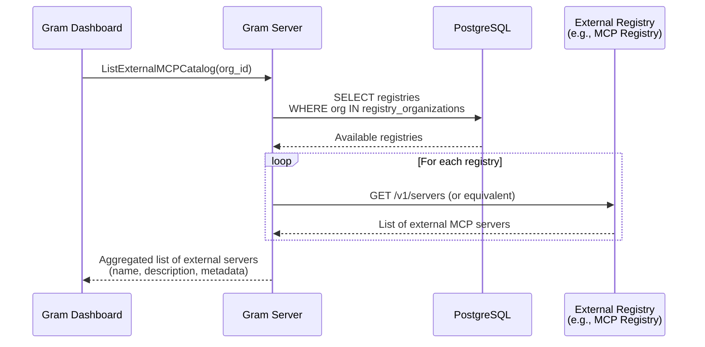

# External Links

- [MCP Registry GitHub Repository](https://github.com/modelcontextprotocol/registry)
- [Official MCP Registry Documentation](https://registry.modelcontextprotocol.io/docs)

# Overview

*Replace this section with an overview of the problem space and the impact it is having on ourselves or our customers and a high level overview of the approach to take to solve it. Try to sell the problem to the reader and set the stage for solving it.*

# Goals

*Replace this section with a high level overview of the overall goal of this RFC followed by a list of goals and stretch goals:*

- A
- list
- of
- goals

# TLDR / Key Decisions

*Fill this in last after you have finished the "Proposal".  This should be a consolidated summary of the pitch.*

- We are forced into a position where the gram application representation of tools diverges from the true set of tools available in the server. This creates the problem that we need to proxy the available tools in an external MCP into the Gram User Experience (this problem we are deferring) and a problem that we need to incorporate these tools into the MCP proxy. This problem we must solve now. We choose to solve this problem by adding a special tool to external MCP sources. This allows our toolset abstractions to remain intact while supporting the immediate use case
- This will cause servers with OAuth configurations to proliferate within Gram. Right now, we have a 1 OAuth configuration per toolset constraint in our system. We will continue to maintain this constraint and enforce it as truly as possible (as in we will allow mixing external MCP sources with other Gram sources, but not mixing sources with multiple OAuth configurations)
- Registry results will not be cached for v0 (Linear ticket to be created for future caching implementation)
- System designed to support multiple registries per organization despite v0 expecting only one (prepares for future "Gram Catalogs" feature)
- External server validation happens asynchronously to prevent blocking deployment operations on external dependencies
- **MCP resources are out of scope for v0** - only tools will be supported initially

# Proposal

## System Diagram



## 1. Listing Available Servers from Registries

**Database Schema:**

```sql
-- Stores external MCP registries
CREATE TABLE IF NOT EXISTS registries (
    id UUID PRIMARY KEY DEFAULT gen_random_uuid(),
    name TEXT NOT NULL,
    url TEXT NOT NULL,  -- API endpoint for registry
    created_at TIMESTAMPTZ NOT NULL DEFAULT NOW(),
    updated_at TIMESTAMPTZ NOT NULL DEFAULT NOW() ON UPDATE NOW(),
    deleted_at TIMESTAMPTZ,
    deleted BOOLEAN NOT NULL GENERATED ALWAYS AS (deleted_at IS NOT NULL) STORED
);

-- Controls which organizations can access which registries
CREATE TABLE IF NOT EXISTS registry_organizations (
    registry_id UUID NOT NULL REFERENCES registries(id) ON DELETE SET NULL,
    organization_id UUID NOT NULL REFERENCES organizations(id) ON DELETE SET NULL,
    created_at TIMESTAMPTZ NOT NULL DEFAULT NOW(),
    updated_at TIMESTAMPTZ NOT NULL DEFAULT NOW() ON UPDATE NOW(),
    deleted_at TIMESTAMPTZ,
    deleted BOOLEAN NOT NULL GENERATED ALWAYS AS (deleted_at IS NOT NULL) STORED,
    PRIMARY KEY (registry_id, organization_id)
);
```

### Implementation

**New Package:** `server/internal/externalmcp/`

This package will handle all external MCP registry interactions.

**New RPC Endpoint:** `ListExternalMCPCatalog`

```go
// ExternalMCPServer represents an external MCP server from a registry
var ExternalMCPServer = Type("ExternalMCPServer", func() {
    Description("An external MCP server available from a registry")

    Attribute("name", String, "Reverse-DNS identifier (e.g., 'ai.exa/exa')", func() {
        Example("ai.exa/exa")
    })
    Attribute("version", String, "Semantic version", func() {
        Example("1.0.0")
    })
    Attribute("description", String, "Human-readable description")
    Attribute("registryId", String, "Which registry this came from", func() {
        Format(FormatUUID)
    })
    Attribute("title", String, "Friendly display name")
    Attribute("iconUrl", String, "First icon src (if available)", func() {
        Format(FormatURI)
    })

    Required("name", "version", "description", "registryId")
})

// ListExternalMCPCatalog lists available external MCP servers from configured registries.
// Proxies requests to external registries in real-time (no caching for v0).
//
// Pagination strategy:
// - Without registryId: Returns first 100 results across all registries, rejects pagination parameters
// - With registryId: Enables pagination for that specific registry
// - V0 assumes small collections; pagination primarily for future-proofing
Method("listExternalMCPCatalog", func() {
    Description("List available external MCP servers from configured registries")

    Payload(func() {
        Attribute("organizationId", String, "Organization ID", func() {
            Format(FormatUUID)
        })
        Attribute("registryId", String, "Optional registry ID for pagination", func() {
            Format(FormatUUID)
        })
        Attribute("cursor", String, "Pagination cursor")
        Required("organizationId")
    })

    Result(func() {
        Attribute("servers", ArrayOf(ExternalMCPServer), "List of available external MCP servers")
        Attribute("nextCursor", String, "Pagination cursor for next page")
        Required("servers")
    })

    HTTP(func() {
        GET("/organizations/{organizationId}/external-mcp-catalog")
        Param("registryId")
        Param("cursor")
        Response(StatusOK)
    })
})
```


## 2. Creating Sources from External Servers

### Schema Changes

Following the pattern of `deployments_openapiv3_assets`, `deployments_packages`, and `deployments_functions`, we introduce:

```sql
CREATE TABLE IF NOT EXISTS deployments_external_mcps (
  id uuid NOT NULL DEFAULT generate_uuidv7(),
  deployment_id uuid NOT NULL,
  registry_id uuid NOT NULL,

  -- Server identification from registry
  name TEXT NOT NULL,    -- Reverse-DNS name (e.g., "ai.exa/exa")
  version TEXT NOT NULL, -- Version from registry

  -- Resolved connection details (populated during deployment processing)
  remote_url TEXT NOT NULL, -- Resolved URL from registry
  oauth_detected BOOLEAN NOT NULL DEFAULT FALSE, -- Whether OAuth was detected in server metadata

  -- Metadata
  slug TEXT NOT NULL CHECK (slug <> '' AND CHAR_LENGTH(slug) <= 60),

  CONSTRAINT deployments_external_mcps_pkey PRIMARY KEY (id),
  CONSTRAINT deployments_external_mcps_deployment_id_fkey
    FOREIGN KEY (deployment_id) REFERENCES deployments (id) ON DELETE CASCADE,
  CONSTRAINT deployments_external_mcps_registry_id_fkey
    FOREIGN KEY (registry_id) REFERENCES registries (id) ON DELETE SET NULL,
  CONSTRAINT deployments_external_mcps_deployment_id_slug_key
    UNIQUE (deployment_id, slug)
);

CREATE TABLE IF NOT EXISTS external_mcp_tool_definitions (
  id uuid NOT NULL DEFAULT generate_uuidv7(),
  tool_urn TEXT NOT NULL,

  project_id uuid NOT NULL,
  deployment_id uuid NOT NULL,
  deployments_external_mcp_id uuid NOT NULL, -- References deployments_external_mcps

  created_at timestamptz NOT NULL DEFAULT clock_timestamp(),
  updated_at timestamptz NOT NULL DEFAULT clock_timestamp(),
  deleted_at timestamptz,
  deleted boolean NOT NULL GENERATED ALWAYS AS (deleted_at IS NOT NULL) stored,

  CONSTRAINT external_mcp_tool_definitions_pkey PRIMARY KEY (id),
  CONSTRAINT external_mcp_tool_definitions_deployment_id_fkey
    FOREIGN KEY (deployment_id) REFERENCES deployments (id) ON DELETE CASCADE,
  CONSTRAINT external_mcp_tool_definitions_deployments_external_mcp_id_fkey
    FOREIGN KEY (deployments_external_mcp_id) REFERENCES deployments_external_mcps (id) ON DELETE CASCADE,
  CONSTRAINT external_mcp_tool_definitions_project_id_fkey
    FOREIGN KEY (project_id) REFERENCES projects (id) ON DELETE CASCADE
);

CREATE UNIQUE INDEX IF NOT EXISTS external_mcp_tool_definitions_deployment_id_tool_urn_key
  ON external_mcp_tool_definitions (deployment_id, tool_urn) WHERE deleted IS FALSE;
CREATE INDEX IF NOT EXISTS external_mcp_tool_definitions_deployments_external_mcp_id_idx
  ON external_mcp_tool_definitions (deployments_external_mcp_id) WHERE deleted IS FALSE;

CREATE TABLE IF NOT EXISTS external_mcp_variable_definitions (
  id uuid NOT NULL DEFAULT generate_uuidv7(),
  deployments_external_mcp_id uuid NOT NULL,

  -- Variable identification
  name TEXT NOT NULL, -- Name of the header or environment variable

  -- Variable configuration
  description TEXT, -- Description of the input
  format TEXT, -- Input format (e.g., 'filepath', 'string', 'number', 'boolean')
  choices TEXT[], -- List of possible values for the input
  default_value TEXT, -- Default value for the input
  placeholder TEXT, -- Placeholder for UI display
  value TEXT, -- The value for the input (identifiers in {curly_braces} replaced at runtime)

  -- Variable constraints
  is_required BOOLEAN NOT NULL DEFAULT FALSE,
  is_secret BOOLEAN NOT NULL DEFAULT FALSE, -- Whether the input is a secret (password, token, etc.)

  created_at timestamptz NOT NULL DEFAULT clock_timestamp(),
  updated_at timestamptz NOT NULL DEFAULT clock_timestamp(),
  deleted_at timestamptz,
  deleted boolean NOT NULL GENERATED ALWAYS AS (deleted_at IS NOT NULL) stored,

  CONSTRAINT external_mcp_variable_definitions_pkey PRIMARY KEY (id),
  CONSTRAINT external_mcp_variable_definitions_deployments_external_mcp_id_fkey
    FOREIGN KEY (deployments_external_mcp_id) REFERENCES deployments_external_mcps (id) ON DELETE CASCADE,
  CONSTRAINT external_mcp_variable_definitions_name_key
    UNIQUE (deployments_external_mcp_id, name)
);

CREATE INDEX IF NOT EXISTS external_mcp_variable_definitions_deployments_external_mcp_id_idx
  ON external_mcp_variable_definitions (deployments_external_mcp_id) WHERE deleted IS FALSE;
```

### Design Changes

**Extend `CreateDeploymentForm` and `EvolveDeploymentForm`:**

```go
// AddExternalMCPForm specifies a new external MCP source
var AddExternalMCPForm = Type("AddExternalMCPForm", func() {
    Description("Form for adding a new external MCP source to a deployment")

    Attribute("name", String, "Server name from registry (e.g., 'ai.exa/exa')", func() {
        Example("ai.exa/exa")
    })
    Attribute("registryId", String, "Internal registry UUID", func() {
        Format(FormatUUID)
    })

    Required("name", "registryId")
})

// UpsertExternalMCPForm updates or creates an external MCP source
var UpsertExternalMCPForm = Type("UpsertExternalMCPForm", func() {
    Description("Form for updating or creating an external MCP source")

    Attribute("id", String, "Existing source ID (for updates)", func() {
        Format(FormatUUID)
    })
    Attribute("name", String, "Server name from registry", func() {
        Example("ai.exa/exa")
    })
    Attribute("registryId", String, "Internal registry UUID", func() {
        Format(FormatUUID)
    })

    Required("name", "registryId")
})

// Extend CreateDeploymentForm
// Add to existing CreateDeploymentForm definition:
// Attribute("externalMcps", ArrayOf(AddExternalMCPForm), "External MCP sources to add")

// Extend EvolveDeploymentForm
// Add to existing EvolveDeploymentForm definition:
// Attribute("externalMcps", ArrayOf(UpsertExternalMCPForm), "External MCP sources to upsert")
```

### Source Processing

**Background Workflow Extension:**

The existing `ProcessDeploymentWorkflow` in `server/internal/background/deployments.go` will be extended to handle external MCP sources alongside OpenAPI and Functions sources.

**Extension to ProcessDeployment activity:**

In `server/internal/background/activities/process_deployment.go`, add `doExternalMCP()` method:

```
TODO: revisit - this snippet is very uninformative

For each external MCP in deployment:
  - Spawn goroutine in pool
  - Create extractor
  - Validate server exists in registry
  - Fetch server connection details from registry
  - Create proxy tool definition
  - Record metrics
```

**Key behaviors:**
- Failure modes:
  * Fail to find specified exeternal server in registry
  * Mismatch between server version and specified version
  * Server specifieds any `packages`
  * Server _doesn't_ specify any remotes
- Result is going to be a single tool definition with the name `proxy`

### Tool Definition Tables

Following the pattern of OpenAPI (`http_tool_definitions`) and Functions (`function_tool_definitions`), external MCP sources will create tool definitions.

**Existing patterns:**
- **OpenAPI**: Creates `http_tool_definitions` via `CreateOpenAPIv3ToolDefinition` query (server/internal/deployments/queries.sql:408)
  - Stores HTTP method, path, schema, security, server URL
  - References `openapiv3_document_id` from `deployments_openapiv3_assets`
- **Functions**: Creates `function_tool_definitions` and `function_resource_definitions` via `CreateFunctionsTool` and `CreateFunctionsResource` queries
  - Stores runtime, input schema, variables
  - References `function_id` from `deployments_functions`

**Note:** This table only stores the proxy tool registration. Tool metadata (name, description, input_schema) is resolved at runtime from the external MCP server.

**Note on MCP Resources:**

MCP resources are **out of scope for v0**. Resources seem confusing in an era before Gram apps exist - they expose server-specific data (like file contents, database records) without clear use cases in the current toolset model.

**Future work:** Create Linear ticket to attempt calling external MCP's `list_resources` endpoint. If resources are returned, add them to the server for future use.

**Extractor workflow:**
1. Resolve registry from database using `registry_id`
2. Query resolved registry URL to fetch server details using `name` and `version`
4. Create single proxy tool with:
   - Tool name: `proxy`
   - Tool URN pattern: `tools:externalmcp:<slug>:proxy`
     - Type: `externalmcp`
     - Source slug: The `slug` field from `deployments_external_mcps`
     - Tool name: `proxy`
5. Store in `external_mcp_tool_definitions` with minimal metadata

## 3. Tool Calling & Proxy Architecture

This section covers how tool calls are routed through Gram to external MCP servers, with transparent proxying of `list_tools` and `call_tool`.

### External MCP Integration

#### Tool URN Format

External MCP tools use URN: `tools:externalmcp:<slug>:proxy`
- Kind: `externalmcp`
- Source: The `slug` from `deployments_external_mcps`
- Name: `proxy` (single proxy tool per external server)

#### list_tools Extension

**Location:** `server/internal/mcp/rpc_tools_list.go`

**Extended Flow:**
1. Query database for tools (includes proxy tools from `external_mcp_tool_definitions`)
2. Iterate over tools and detect `externalmcp` kind
3. For each external MCP proxy tool:
   - Look up `external_mcp_tool_definitions` record
   - Resolve `deployments_external_mcps` via `external_mcp_id`
   - Query registry for server connection details (URL, transport)
   - **Instantiate MCP client** pointing to external server
   - Call `client.ListTools()` through MCP protocol
   - Receive external tool list from remote server
   - **Prefix tool names** (e.g., `github:create_issue`, `github:list_repos`)
   - Flatten into overall tool list response
4. Return combined list of local tools + external tools

**Tool Name Prefixing:**
- Pattern: `{source-slug}:{original-tool-name}`
- Example: If external MCP has slug `github`, tools become `github:create_issue`, `github:list_repos`
- Ensures uniqueness across multiple external servers in same toolset

#### call_tool Extension

**Location:** `server/internal/toolsets/shared.go:42` (GetToolCallPlanByURN)

**Add new case:**
```go
case urn.ToolKindExternalMCP:
    // Query external_mcp_tool_definitions by URN
    tool, err := t.toolsRepo.GetExternalMCPToolByURN(ctx, ...)
    return t.extractExternalMCPToolCallPlan(ctx, tool)
```

**extractExternalMCPToolCallPlan workflow:**
1. Query `external_mcp_tool_definitions` by URN
2. Follow `external_mcp_id` to `deployments_external_mcps`
3. Query registry for server connection details
4. Return `gateway.NewExternalMCPToolCallPlan()` containing:
   - External server URL + transport
   - Original tool name (strip prefix)
   - Authentication details (if any)

**Location:** `server/internal/gateway/proxy.go:125` (ToolProxy.Do)

**Add new case:**
```go
case ToolKindExternalMCP:
    return tp.doExternalMCP(ctx, logger, w, requestBody, env, plan.Descriptor, plan.ExternalMCP, toolCallLogger)
```

**doExternalMCP implementation:**
1. Parse tool name from request (strip prefix to get original name)
2. **Instantiate MCP client** pointing to external server URL
3. Initialize MCP session (handshake, capabilities negotiation)
4. Call `client.CallTool(originalToolName, arguments)` through MCP protocol
5. Receive MCP response from external server
6. Check `isMCPPassthrough` (likely true for external MCP tools)
7. Return raw MCP response to client

### MCP Client Implementation

**New Package:** `server/internal/external_mcp/client.go`

**Responsibilities:**
- Implement MCP client protocol (JSON-RPC over HTTP/stdio/SSE)
- Handle MCP initialization handshake
- Support `list_tools`, `call_tool`, `list_resources`, `read_resource` methods
- Connection pooling/caching for repeated calls
- Timeout and retry logic

**Key Methods:**
```go
type MCPClient interface {
    Initialize(ctx context.Context) error
    ListTools(ctx context.Context) ([]MCPTool, error)
    CallTool(ctx context.Context, name string, args map[string]any) (*MCPToolResult, error)
    Close() error
}
```

### Response Passthrough

**Existing Infrastructure:**
- `mcp/passthrough.go:5` - `isMCPPassthrough(meta)` function
- Checks for `gram.ai/kind: "mcp-passthrough"` in tool meta
- Returns raw MCP response without content chunk formatting

**For External MCP:**
- External MCP tools will have `Meta: {"gram.ai/kind": "mcp-passthrough"}`
- This ensures raw MCP responses are returned transparently
- No additional formatting/wrapping by Gram

### Caching Strategy

**V0 Approach:**
- No caching of external `list_tools` responses
- Each `list_tools` call queries external server in real-time
- Connection pooling only (reuse MCP client connections)

**Future Considerations:**
- Cache `list_tools` responses with TTL
- Invalidate cache on deployment changes
- Background refresh of tool schemas

### Error Handling

**Registry Unavailable:**
- Log error, mark external MCP source as degraded
- Continue serving other tools in toolset
- Return partial tool list with warning

**External Server Unavailable:**
- During `list_tools`: Exclude external tools from response
- During `call_tool`: Return MCP error response to client
- Log to deployment events for debugging

**Version Mismatch:**
- If specified version doesn't exist in registry: Fail deployment processing
- Mark source as failed in deployment status

## 4. OAuth & Authentication

**Status:** Out of scope for v0

**Rationale:**
External MCP servers with OAuth do not represent a regression from the current system. The existing constraint ("no mixing multiple OAuth2 providers in a toolset") applies to current sources and will be designed/implemented separately from this work.

**Trivial Fallback Option:**
If OAuth becomes a blocker, we can implement a simple restriction: "Only one source allowed in any toolset containing an external MCP source." This ensures no OAuth conflicts but is overly restrictive.

**Preferred Approach:**
Design and implement homogeneous OAuth provider representation across all source types (OpenAPI, Functions, External MCP), then enforce the constraint uniformly. This work should happen in parallel or shortly after external MCP v0.

**Future Work:**
- Extract OAuth provider info from external MCP server metadata (from registry or server capabilities)
- Store OAuth provider per source
- Validate OAuth provider consistency when adding sources to toolsets
- Surface OAuth provider in UI when configuring external MCP sources

## User Experience

### Add Source Flow

**Entry Point:**

When users click "Add Source" in the Gram dashboard, they see a menu with options:
- From API Spec
- From Functions
- **Import External MCP** ← NEW

*Screenshot placeholder: "Add Source" button location in Gram UI*

**Import External MCP Dialog:**

1. **Browse Servers**
   - Shows list from `ListExternalMCPCatalog` RPC
   - Each server card displays: Title, Description, Status badge, Icon (if available)
   - Search/filter functionality
   - *Wireframe placeholder: Server selection grid*

2. **Configure Source**
   - User selects a server
   - Prompted to provide:
     - **Slug**: URL-friendly identifier (auto-generated from server name, editable)
   - Auth configuration (see OAuth section below)
   - *Wireframe placeholder: Configuration form*

3. **Add to Toolset**
   - Select which toolset (existing or create new)
   - Submit creates deployment with `AddExternalMCPForm`
   - Background processing validates and provisions source

**Feature Flag:** `external-mcp-catalog` in PostHog
- V0 shows "Enterprise feature - Contact sales" banner for orgs without flag
- Future: General availability

### Documentation Changes

*To be added: Links to setup guides, example integrations, troubleshooting*

## Billing

*How will this feature impact billing for customers ? Is it is a priced feature? If so which tier does it fall or does it require a rethink in existing pricing. Please check in with #sales for any impact to pricing.*

# Open Questions

*This section will contain any open questions that you come across writing your RFC or that are discovered during review:*

- **Version pinning vs. latest:** Should we specify the exact version at source creation time and pin to it, or always fetch the latest version from the registry when deploying? Pinning provides stability; latest provides automatic updates. Consider: breaking changes in external servers, user expectations, rollback scenarios.

- **Slug generation from reverse-DNS names:** The MCP registry uses reverse-DNS naming (e.g., "ai.exa/exa", "com.github/github"). Can we use these directly as source slugs with minimal sanitization (replace `/` with `-`)? Or do we need user-provided slugs? Consider: uniqueness within deployment, URL safety, user clarity.
