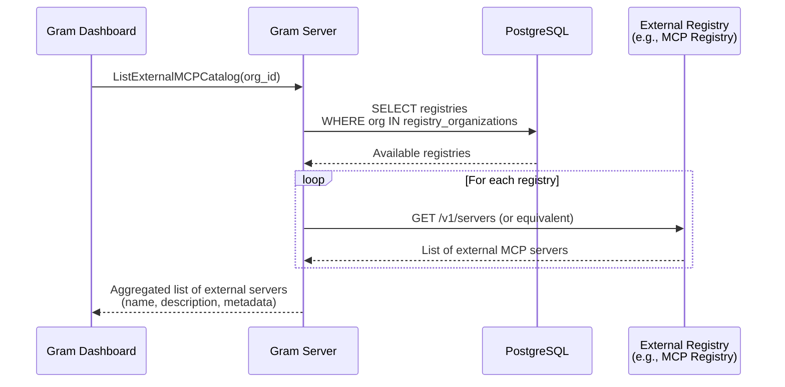

# External Links

- [MCP Registry GitHub Repository](https://github.com/modelcontextprotocol/registry)
- [Official MCP Registry Documentation](https://registry.modelcontextprotocol.io/docs)

# Overview

*Replace this section with an overview of the problem space and the impact it is having on ourselves or our customers and a high level overview of the approach to take to solve it. Try to sell the problem to the reader and set the stage for solving it.*

# Goals

*Replace this section with a high level overview of the overall goal of this RFC followed by a list of goals and stretch goals:*

- A
- list
- of
- goals

# TLDR / Key Decisions

*Fill this in last after you have finished the "Proposal".  This should be a consolidated summary of the pitch.*

- Registry results will not be cached for v0 (Linear ticket to be created for future caching implementation)
- System designed to support multiple registries per organization despite v0 expecting only one (prepares for future "Gram Catalogs" feature)
- External server validation happens asynchronously to prevent blocking deployment operations on external dependencies

# Proposal

*The proposal section should go into detail on how the problem will be solved. It should try to balance brevity with enough detail to get the point across. This is a living document and it could start with just high level bullet points that get broken down further and further as feedback and questions come in. Diagrams, charts, code examples all speak louder than words so use them where possible.*

## 1. Listing Available Servers from Registries

This section covers how users discover and browse external MCP servers from configured registries.

### System Diagram



**Database Schema:**

```sql
-- Stores external MCP registries
CREATE TABLE IF NOT EXISTS registries (
    id UUID PRIMARY KEY DEFAULT gen_random_uuid(),
    name TEXT NOT NULL,
    url TEXT NOT NULL,  -- API endpoint for registry
    created_at TIMESTAMPTZ NOT NULL DEFAULT NOW(),
    updated_at TIMESTAMPTZ NOT NULL DEFAULT NOW() ON UPDATE NOW(),
    deleted_at TIMESTAMPTZ,
    deleted BOOLEAN NOT NULL GENERATED ALWAYS AS (deleted_at IS NOT NULL) STORED
);

-- Controls which organizations can access which registries
CREATE TABLE IF NOT EXISTS registry_organizations (
    registry_id UUID NOT NULL REFERENCES registries(id) ON DELETE SET NULL,
    organization_id UUID NOT NULL REFERENCES organizations(id) ON DELETE SET NULL,
    created_at TIMESTAMPTZ NOT NULL DEFAULT NOW(),
    updated_at TIMESTAMPTZ NOT NULL DEFAULT NOW() ON UPDATE NOW(),
    deleted_at TIMESTAMPTZ,
    deleted BOOLEAN NOT NULL GENERATED ALWAYS AS (deleted_at IS NOT NULL) STORED,
    PRIMARY KEY (registry_id, organization_id)
);
```

### Implementation

**New Package:** `server/internal/external_mcp/`

This package will handle all external MCP registry interactions.

**New RPC Endpoint:** `ListExternalMCPCatalog`

Located in Goa design files, this endpoint:
- Takes organization ID as parameter
- Returns list of available external MCP servers from all accessible registries
- Proxies requests to external registries in real-time (no caching for v0)

**Package Structure:**

```
server/internal/external_mcp/
├── service.go          # Service interface and implementation
├── registry_client.go  # HTTP client for external registry APIs
├── queries.sql         # SQLc queries for registries tables
└── impl.go            # RPC endpoint implementations
```

**Flow:**
1. Client calls `ListExternalMCPCatalog(org_id)`
2. Server queries `registry_organizations` to find accessible registries
3. For each registry, proxy HTTP call to registry's list endpoint
4. Aggregate results and return to client
5. Client displays in "Import External MCP" dialog

**Error Handling:**
- If registry is unavailable, log error but continue with other registries
- Return partial results if some registries fail
- Include registry source in response so UI can indicate which servers are from which registry

**Response Type Design:**

```go
// ListExternalMCPCatalogResponse is returned by the ListExternalMCPCatalog RPC
type ListExternalMCPCatalogResponse struct {
    Servers    []ExternalMCPServer `json:"servers"`
    NextCursor *string             `json:"nextCursor,omitempty"` // For pagination
}

// ExternalMCPServer represents an external MCP server from a registry
type ExternalMCPServer struct {
    Name        string    `json:"name"`        // Reverse-DNS identifier (e.g., "ai.exa/exa")
    Version     string    `json:"version"`     // Semantic version
    Description string    `json:"description"` // Human-readable description
    RegistryID  string    `json:"registryId"`  // Which registry this came from
    Status      string    `json:"status"`      // "active", "deprecated", "deleted"
    UpdatedAt   time.Time `json:"updatedAt"`   // When server was last updated
    Title       *string   `json:"title,omitempty"` // Friendly display name
    IconURL     *string   `json:"iconUrl,omitempty"` // First icon src (if available)
}
```

**Mapping from MCP Registry Response:**
- `Name` ← `server.name`
- `Version` ← `server.version`
- `Description` ← `server.description`
- `Status` ← `_meta.io.modelcontextprotocol.registry/official.status`
- `UpdatedAt` ← `_meta.io.modelcontextprotocol.registry/official.updatedAt`
- `Title` ← `server.title`
- `IconURL` ← `server.icons[0].src` (first icon if present)

**Note:** Only servers with `remotes[]` are supported; servers with `packages[]` are filtered during source creation.

## 2. Creating Sources from External Servers

This section covers how external MCP servers are added to deployments and how those sources are processed.

### Goa Design Changes

**Extend `CreateDeploymentForm` and `EvolveDeploymentForm`:**

```go
// In CreateDeploymentForm
type CreateDeploymentForm struct {
    // ... existing fields ...
    ExternalMCPs []AddExternalMCPForm `json:"externalMcps,omitempty"`
}

// In EvolveDeploymentForm
type EvolveDeploymentForm struct {
    // ... existing fields ...
    ExternalMCPs []UpsertExternalMCPForm `json:"externalMcps,omitempty"`
}

// AddExternalMCPForm specifies a new external MCP source
type AddExternalMCPForm struct {
    Name       string `json:"name"`       // Server name from registry (e.g., "ai.exa/exa")
    RegistryID string `json:"registryId"` // Internal registry UUID
}

// UpsertExternalMCPForm updates or creates an external MCP source
type UpsertExternalMCPForm struct {
    ID         *string `json:"id,omitempty"` // Existing source ID (for updates)
    Name       string  `json:"name"`         // Server name from registry
    RegistryID string  `json:"registryId"`   // Internal registry UUID
}
```

**Update `ListExternalMCPCatalogResponse`:**

```go
// ExternalMCPServer now includes internal RegistryID
type ExternalMCPServer struct {
    Name        string    `json:"name"`
    Version     string    `json:"version"`
    Description string    `json:"description"`
    RegistryID  string    `json:"registryId"`  // Internal UUID (not registry name)
    // ... rest of fields ...
}
```

### Schema Changes

Following the pattern of `deployments_openapiv3_assets`, `deployments_packages`, and `deployments_functions`, we introduce:

```sql
CREATE TABLE IF NOT EXISTS deployments_external_mcps (
  id uuid NOT NULL DEFAULT generate_uuidv7(),
  deployment_id uuid NOT NULL,
  registry_id uuid NOT NULL,

  -- Server identification from registry
  name TEXT NOT NULL,    -- Reverse-DNS name (e.g., "ai.exa/exa")
  version TEXT NOT NULL, -- Version from registry

  -- Metadata
  slug TEXT NOT NULL CHECK (slug <> '' AND CHAR_LENGTH(slug) <= 60),

  CONSTRAINT deployments_external_mcps_pkey PRIMARY KEY (id),
  CONSTRAINT deployments_external_mcps_deployment_id_fkey
    FOREIGN KEY (deployment_id) REFERENCES deployments (id) ON DELETE CASCADE,
  CONSTRAINT deployments_external_mcps_registry_id_fkey
    FOREIGN KEY (registry_id) REFERENCES registries (id) ON DELETE SET NULL,
  CONSTRAINT deployments_external_mcps_deployment_id_slug_key
    UNIQUE (deployment_id, slug)
);
```

**Rationale:**
- `registry_id` + `name` + `version` provide enough information to fetch server details from registry at runtime
- Connection details (URL, transport type) are resolved by querying the registry during source processing
- Transport type will always be remote (no need to store)
- `slug` follows existing pattern for user-facing identification

### Source Processing

*TODO: Research how source processing works for API specs and Functions, then propose workflow for external MCP sources*

### Key Decision: Async Validation

External server validity will be validated asynchronously rather than during the CreateDeployment/EvolveDeployment HTTP handlers. This prevents external server dependencies from blocking deployment operations.

The validation workflow:
1. Handler accepts `name` + `registryID` and creates deployment record
2. Background workflow validates server exists in registry
3. If invalid, mark source as failed with error details
4. If valid, proceed with source processing

## User Experience

### Add Source Flow

**Entry Point:**

When users click "Add Source" in the Gram dashboard, they see a menu with options:
- From API Spec
- From Functions
- **Import External MCP** ← NEW

*Screenshot placeholder: "Add Source" button location in Gram UI*

**Import External MCP Dialog:**

1. **Browse Servers**
   - Shows list from `ListExternalMCPCatalog` RPC
   - Each server card displays: Title, Description, Status badge, Icon (if available)
   - Search/filter functionality
   - *Wireframe placeholder: Server selection grid*

2. **Configure Source**
   - User selects a server
   - Prompted to provide:
     - **Slug**: URL-friendly identifier (auto-generated from server name, editable)
   - Auth configuration (see OAuth section below)
   - *Wireframe placeholder: Configuration form*

3. **Add to Toolset**
   - Select which toolset (existing or create new)
   - Submit creates deployment with `AddExternalMCPForm`
   - Background processing validates and provisions source

**Feature Flag:** `external-mcp-catalog` in PostHog
- V0 shows "Enterprise feature - Contact sales" banner for orgs without flag
- Future: General availability

### Documentation Changes

*To be added: Links to setup guides, example integrations, troubleshooting*

## Billing

*How will this feature impact billing for customers ? Is it is a priced feature? If so which tier does it fall or does it require a rethink in existing pricing. Please check in with #sales for any impact to pricing.*

# Open Questions

*This section will contain any open questions that you come across writing your RFC or that are discovered during review:*

- A
- list
- of
- questions