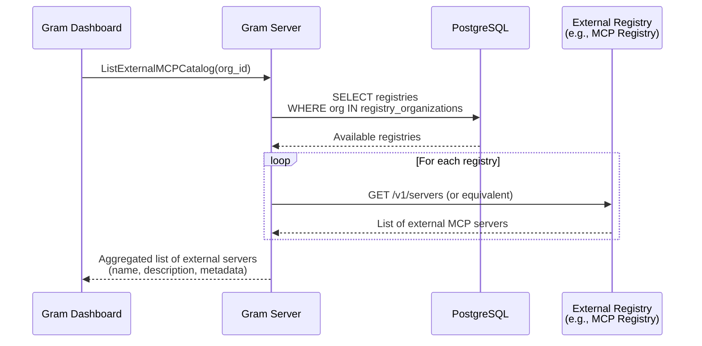

# External Links

- [MCP Registry GitHub Repository](https://github.com/modelcontextprotocol/registry)
- [Official MCP Registry Documentation](https://registry.modelcontextprotocol.io/docs)

# Overview

*Replace this section with an overview of the problem space and the impact it is having on ourselves or our customers and a high level overview of the approach to take to solve it. Try to sell the problem to the reader and set the stage for solving it.*

# Goals

*Replace this section with a high level overview of the overall goal of this RFC followed by a list of goals and stretch goals:*

- A
- list
- of
- goals

# TLDR / Key Decisions

*Fill this in last after you have finished the “Proposal”.  This should be a consolidated summary of the pitch.*

- Short bullet points describing
- The most important things to review

# Proposal

*The proposal section should go into detail on how the problem will be solved. It should try to balance brevity with enough detail to get the point across. This is a living document and it could start with just high level bullet points that get broken down further and further as feedback and questions come in. Diagrams, charts, code examples all speak louder than words so use them where possible.*

## 1. Listing Available Servers from Registries

This section covers how users discover and browse external MCP servers from configured registries.

### UX Affordance

**Add Source Button Location:**

*Screenshot placeholder: Gram UI showing the "Add Source" button location*

When users click "Add Source", they will see a new option:

*Wireframe placeholder: Add Source menu with options:*
- From API Spec
- From Functions
- **Import External MCP** ← NEW

### System Diagram



**Database Schema:**

```sql
-- Stores external MCP registries
CREATE TABLE IF NOT EXISTS registries (
    id UUID PRIMARY KEY DEFAULT gen_random_uuid(),
    name TEXT NOT NULL,
    url TEXT NOT NULL,  -- API endpoint for registry
    created_at TIMESTAMPTZ NOT NULL DEFAULT NOW(),
    updated_at TIMESTAMPTZ NOT NULL DEFAULT NOW() ON UPDATE NOW(),
    deleted_at TIMESTAMPTZ,
    deleted BOOLEAN NOT NULL GENERATED ALWAYS AS (deleted_at IS NOT NULL) STORED
);

-- Controls which organizations can access which registries
CREATE TABLE IF NOT EXISTS registry_organizations (
    registry_id UUID NOT NULL REFERENCES registries(id) ON DELETE SET NULL,
    organization_id UUID NOT NULL REFERENCES organizations(id) ON DELETE SET NULL,
    created_at TIMESTAMPTZ NOT NULL DEFAULT NOW(),
    updated_at TIMESTAMPTZ NOT NULL DEFAULT NOW() ON UPDATE NOW(),
    deleted_at TIMESTAMPTZ,
    deleted BOOLEAN NOT NULL GENERATED ALWAYS AS (deleted_at IS NOT NULL) STORED,
    PRIMARY KEY (registry_id, organization_id)
);
```

### Implementation

**New Package:** `server/internal/external_mcp/`

This package will handle all external MCP registry interactions.

**New RPC Endpoint:** `ListExternalMCPCatalog`

Located in Goa design files, this endpoint:
- Takes organization ID as parameter
- Returns list of available external MCP servers from all accessible registries
- Proxies requests to external registries in real-time (no caching for v0)

**Package Structure:**

```
server/internal/external_mcp/
├── service.go          # Service interface and implementation
├── registry_client.go  # HTTP client for external registry APIs
├── queries.sql         # SQLc queries for registries tables
└── impl.go            # RPC endpoint implementations
```

**Flow:**
1. Client calls `ListExternalMCPCatalog(org_id)`
2. Server queries `registry_organizations` to find accessible registries
3. For each registry, proxy HTTP call to registry's list endpoint
4. Aggregate results and return to client
5. Client displays in "Import External MCP" dialog

**Error Handling:**
- If registry is unavailable, log error but continue with other registries
- Return partial results if some registries fail
- Include registry source in response so UI can indicate which servers are from which registry

## User Experience

*This section should detail how the feature will be accessed by customers in the the product either via the UI. Specifically what is the user journey and the interactions points in the UI and CLI that need to be built out for a self service experience.

Additionally please detail any changes to Documentation that would be required to aid the user experience.*

## Billing

*How will this feature impact billing for customers ? Is it is a priced feature? If so which tier does it fall or does it require a rethink in existing pricing. Please check in with #sales for any impact to pricing.*

# Open Questions

*This section will contain any open questions that you come across writing your RFC or that are discovered during review:*

- A
- list
- of
- questions