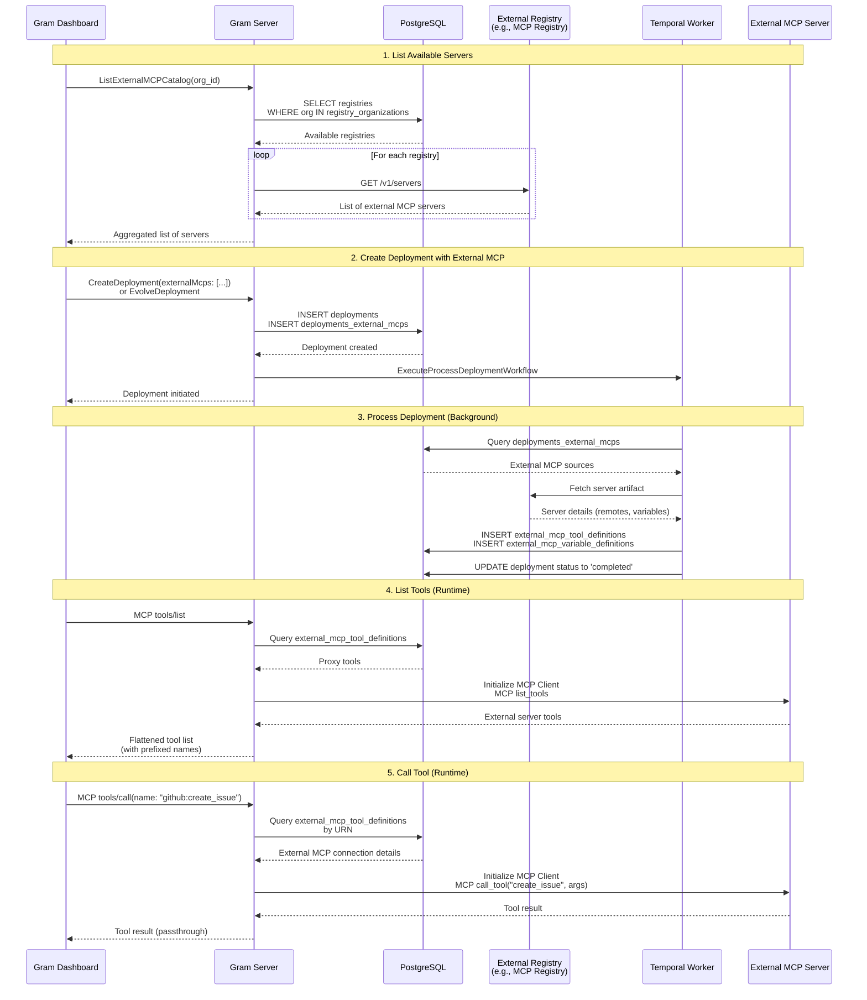

# External Links

- [MCP Registry GitHub Repository](https://github.com/modelcontextprotocol/registry)
- [Official MCP Registry Documentation](https://registry.modelcontextprotocol.io/docs)

# Overview

*Replace this section with an overview of the problem space and the impact it is having on ourselves or our customers and a high level overview of the approach to take to solve it. Try to sell the problem to the reader and set the stage for solving it.*

# Goals

*Replace this section with a high level overview of the overall goal of this RFC followed by a list of goals and stretch goals:*

- A
- list
- of
- goals

# TLDR / Key Decisions

*Fill this in last after you have finished the "Proposal".  This should be a consolidated summary of the pitch.*

- We are forced into a position where the gram application representation of tools diverges from the true set of tools available in the server. This creates the problem that we need to proxy the available tools in an external MCP into the Gram User Experience (this problem we are deferring) and a problem that we need to incorporate these tools into the MCP proxy. This problem we must solve now. We choose to solve this problem by adding a special tool to external MCP sources. This allows our toolset abstractions to remain intact while supporting the immediate use case
- This will cause servers with OAuth configurations to proliferate within Gram. Right now, we have a 1 OAuth configuration per toolset constraint in our system. We will continue to maintain this constraint and enforce it as truly as possible (as in we will allow mixing external MCP sources with other Gram sources, but not mixing sources with multiple OAuth configurations)
- Registry results will not be cached for v0 (Linear ticket to be created for future caching implementation)
- System designed to support multiple registries per organization despite v0 expecting only one (prepares for future "Gram Catalogs" feature)
- External server validation happens asynchronously to prevent blocking deployment operations on external dependencies
- **MCP resources are out of scope for v0** - only tools will be supported initially

# Proposal

## System Diagram



## 1. Listing Available Servers from Registries

**Database Schema:**

```sql
-- Stores external MCP registries
CREATE TABLE IF NOT EXISTS registries (
    id UUID PRIMARY KEY DEFAULT gen_random_uuid(),
    name TEXT NOT NULL,
    url TEXT NOT NULL,  -- API endpoint for registry
    created_at TIMESTAMPTZ NOT NULL DEFAULT NOW(),
    updated_at TIMESTAMPTZ NOT NULL DEFAULT NOW() ON UPDATE NOW(),
    deleted_at TIMESTAMPTZ,
    deleted BOOLEAN NOT NULL GENERATED ALWAYS AS (deleted_at IS NOT NULL) STORED
);

-- Controls which organizations can access which registries
CREATE TABLE IF NOT EXISTS registry_organizations (
    registry_id UUID NOT NULL REFERENCES registries(id) ON DELETE SET NULL,
    organization_id UUID NOT NULL REFERENCES organizations(id) ON DELETE SET NULL,
    created_at TIMESTAMPTZ NOT NULL DEFAULT NOW(),
    updated_at TIMESTAMPTZ NOT NULL DEFAULT NOW() ON UPDATE NOW(),
    deleted_at TIMESTAMPTZ,
    deleted BOOLEAN NOT NULL GENERATED ALWAYS AS (deleted_at IS NOT NULL) STORED,
    PRIMARY KEY (registry_id, organization_id)
);
```

### Implementation

**New Package:** `server/internal/externalmcp/`

This package will handle all external MCP registry interactions.

**New RPC Endpoint:** `ListExternalMCPCatalog`

```go
// ExternalMCPServer represents an external MCP server from a registry
var ExternalMCPServer = Type("ExternalMCPServer", func() {
    Description("An external MCP server available from a registry")

    Attribute("name", String, "Reverse-DNS identifier (e.g., 'ai.exa/exa')", func() {
        Example("ai.exa/exa")
    })
    Attribute("version", String, "Semantic version", func() {
        Example("1.0.0")
    })
    Attribute("description", String, "Human-readable description")
    Attribute("registryId", String, "Which registry this came from", func() {
        Format(FormatUUID)
    })
    Attribute("title", String, "Friendly display name")
    Attribute("iconUrl", String, "First icon src (if available)", func() {
        Format(FormatURI)
    })

    Required("name", "version", "description", "registryId")
})

// ListExternalMCPCatalog lists available external MCP servers from configured registries.
// Proxies requests to external registries in real-time (no caching for v0).
//
// Pagination strategy:
// - Without registryId: Returns first 100 results across all registries, rejects pagination parameters
// - With registryId: Enables pagination for that specific registry
// - V0 assumes small collections; pagination primarily for future-proofing
Method("listExternalMCPCatalog", func() {
    Description("List available external MCP servers from configured registries")

    Payload(func() {
        Attribute("organizationId", String, "Organization ID", func() {
            Format(FormatUUID)
        })
        Attribute("registryId", String, "Optional registry ID for pagination", func() {
            Format(FormatUUID)
        })
        Attribute("cursor", String, "Pagination cursor")
        Required("organizationId")
    })

    Result(func() {
        Attribute("servers", ArrayOf(ExternalMCPServer), "List of available external MCP servers")
        Attribute("nextCursor", String, "Pagination cursor for next page")
        Required("servers")
    })

    HTTP(func() {
        GET("/organizations/{organizationId}/external-mcp-catalog")
        Param("registryId")
        Param("cursor")
        Response(StatusOK)
    })
})
```


## 2. Creating Sources from External Servers

### Schema Changes

Following the pattern of `deployments_openapiv3_assets`, `deployments_packages`, and `deployments_functions`, we introduce:

```sql
CREATE TABLE IF NOT EXISTS deployments_external_mcps (
  id uuid NOT NULL DEFAULT generate_uuidv7(),
  deployment_id uuid NOT NULL,
  registry_id uuid NOT NULL,

  -- Server identification from registry
  name TEXT NOT NULL,    -- Reverse-DNS name (e.g., "ai.exa/exa")
  version TEXT NOT NULL, -- Version from registry

  -- Resolved connection details (populated during deployment processing)
  remote_url TEXT NOT NULL, -- Resolved URL from registry
  oauth_detected BOOLEAN NOT NULL DEFAULT FALSE, -- Whether OAuth was detected in server metadata

  -- Metadata
  slug TEXT NOT NULL CHECK (slug <> '' AND CHAR_LENGTH(slug) <= 60),

  CONSTRAINT deployments_external_mcps_pkey PRIMARY KEY (id),
  CONSTRAINT deployments_external_mcps_deployment_id_fkey
    FOREIGN KEY (deployment_id) REFERENCES deployments (id) ON DELETE CASCADE,
  CONSTRAINT deployments_external_mcps_registry_id_fkey
    FOREIGN KEY (registry_id) REFERENCES registries (id) ON DELETE SET NULL,
  CONSTRAINT deployments_external_mcps_deployment_id_slug_key
    UNIQUE (deployment_id, slug)
);

CREATE TABLE IF NOT EXISTS external_mcp_tool_definitions (
  id uuid NOT NULL DEFAULT generate_uuidv7(),
  tool_urn TEXT NOT NULL,

  project_id uuid NOT NULL,
  deployment_id uuid NOT NULL,
  deployments_external_mcp_id uuid NOT NULL, -- References deployments_external_mcps

  created_at timestamptz NOT NULL DEFAULT clock_timestamp(),
  updated_at timestamptz NOT NULL DEFAULT clock_timestamp(),
  deleted_at timestamptz,
  deleted boolean NOT NULL GENERATED ALWAYS AS (deleted_at IS NOT NULL) stored,

  CONSTRAINT external_mcp_tool_definitions_pkey PRIMARY KEY (id),
  CONSTRAINT external_mcp_tool_definitions_deployment_id_fkey
    FOREIGN KEY (deployment_id) REFERENCES deployments (id) ON DELETE CASCADE,
  CONSTRAINT external_mcp_tool_definitions_deployments_external_mcp_id_fkey
    FOREIGN KEY (deployments_external_mcp_id) REFERENCES deployments_external_mcps (id) ON DELETE CASCADE,
  CONSTRAINT external_mcp_tool_definitions_project_id_fkey
    FOREIGN KEY (project_id) REFERENCES projects (id) ON DELETE CASCADE
);

CREATE UNIQUE INDEX IF NOT EXISTS external_mcp_tool_definitions_deployment_id_tool_urn_key
  ON external_mcp_tool_definitions (deployment_id, tool_urn) WHERE deleted IS FALSE;
CREATE INDEX IF NOT EXISTS external_mcp_tool_definitions_deployments_external_mcp_id_idx
  ON external_mcp_tool_definitions (deployments_external_mcp_id) WHERE deleted IS FALSE;

CREATE TABLE IF NOT EXISTS external_mcp_variable_definitions (
  id uuid NOT NULL DEFAULT generate_uuidv7(),
  deployments_external_mcp_id uuid NOT NULL,

  -- Variable identification
  name TEXT NOT NULL, -- Name of the header or environment variable

  -- Variable configuration
  description TEXT, -- Description of the input
  format TEXT, -- Input format (e.g., 'filepath', 'string', 'number', 'boolean')
  choices TEXT[], -- List of possible values for the input
  default_value TEXT, -- Default value for the input
  placeholder TEXT, -- Placeholder for UI display
  value TEXT, -- The value for the input (identifiers in {curly_braces} replaced at runtime)

  -- Variable constraints
  is_required BOOLEAN NOT NULL DEFAULT FALSE,
  is_secret BOOLEAN NOT NULL DEFAULT FALSE, -- Whether the input is a secret (password, token, etc.)

  created_at timestamptz NOT NULL DEFAULT clock_timestamp(),
  updated_at timestamptz NOT NULL DEFAULT clock_timestamp(),
  deleted_at timestamptz,
  deleted boolean NOT NULL GENERATED ALWAYS AS (deleted_at IS NOT NULL) stored,

  CONSTRAINT external_mcp_variable_definitions_pkey PRIMARY KEY (id),
  CONSTRAINT external_mcp_variable_definitions_deployments_external_mcp_id_fkey
    FOREIGN KEY (deployments_external_mcp_id) REFERENCES deployments_external_mcps (id) ON DELETE CASCADE,
  CONSTRAINT external_mcp_variable_definitions_name_key
    UNIQUE (deployments_external_mcp_id, name)
);

CREATE INDEX IF NOT EXISTS external_mcp_variable_definitions_deployments_external_mcp_id_idx
  ON external_mcp_variable_definitions (deployments_external_mcp_id) WHERE deleted IS FALSE;
```

### Design Changes

**Extend `CreateDeploymentForm` and `EvolveDeploymentForm`:**

```go
// AddExternalMCPForm specifies a new external MCP source
var AddExternalMCPForm = Type("AddExternalMCPForm", func() {
    Description("Form for adding a new external MCP source to a deployment")

    Attribute("name", String, "Server name from registry (e.g., 'ai.exa/exa')", func() {
        Example("ai.exa/exa")
    })
    Attribute("registryId", String, "Internal registry UUID", func() {
        Format(FormatUUID)
    })

    Required("name", "registryId")
})

// UpsertExternalMCPForm updates or creates an external MCP source
var UpsertExternalMCPForm = Type("UpsertExternalMCPForm", func() {
    Description("Form for updating or creating an external MCP source")

    Attribute("id", String, "Existing source ID (for updates)", func() {
        Format(FormatUUID)
    })
    Attribute("name", String, "Server name from registry", func() {
        Example("ai.exa/exa")
    })
    Attribute("registryId", String, "Internal registry UUID", func() {
        Format(FormatUUID)
    })

    Required("name", "registryId")
})

// Extend CreateDeploymentForm
// Add to existing CreateDeploymentForm definition:
// Attribute("externalMcps", ArrayOf(AddExternalMCPForm), "External MCP sources to add")

// Extend EvolveDeploymentForm
// Add to existing EvolveDeploymentForm definition:
// Attribute("externalMcps", ArrayOf(UpsertExternalMCPForm), "External MCP sources to upsert")
```

### Source Processing

**Background Workflow Extension:**

The existing `ProcessDeploymentWorkflow` in `server/internal/background/deployments.go` will be extended to handle external MCP sources alongside OpenAPI and Functions sources.

**Extension to ProcessDeployment activity:**

In `server/internal/background/activities/process_deployment.go`, add `doExternalMCP()` method:

```
For each external MCP in deployment:
  1. Validate server name at specified version exists in registry
  2. Fetch server artifact from registry
  3. Validate server artifact meets requirements (especially that the server has only
     remotes and no local packages)
  4. Out of scope: Instantiate an MCP Client and detect server capabilities are as expected
     (for now that the server supports tool calls, but we imagine expanding this in the future)
  5. Out of scope: Use instantiated client to list resources and create a proxy resource for
     the server in a new table if it has resources available
  6. Create proxy tool definition
  7. Record metrics
```


## 3. Tool Calling & Proxy Architecture

This section covers how tool calls are routed through Gram to external MCP servers, with transparent proxying of `list_tools` and `call_tool`.

### External Server URNs

**Significant Departure from Previous System Behavior:**

External MCP sources break a previous property of Gram's system: to this point tools in Gram have always had a 1:1 mapping with tools in the resulting MCP server. The special tools in this new source type have only a single tool entry but are **unfolded** into multiple tools in the final MCP server.

**URN Structure:**

While the URN maintains the same structure as other tool types (`tools:{kind}:{source}:{name}`), the `name` field now maps to a **behavior in Gram's system** rather than a concrete tool:

```
tools:externalmcp:<slug>:proxy
```

Right now, we only define one special name, but one option for expanding the behavior of external MCPs would be to add more possible names to this urn scheme. We also should keep in mind that if we abandon this approach and decide to denormalize and synchronize tools to Gram application tools, the existence of these proxy tools is probably going to be gross enough that we should throw away the whole source type and introduce a new one.

### External MCP Integration

#### list_tools Changes

**Location:** `server/internal/mcp/rpc_tools_list.go`

**Extended Flow:**
1. Query database for tools (includes proxy tools from `external_mcp_tool_definitions`)
2. Iterate over tools and detect `externalmcp` kind
3. For each external MCP proxy tool:
   - Look up `external_mcp_tool_definitions` record
   - Resolve `deployments_external_mcps` via `external_mcp_id`
   - Query registry for server connection details (URL, transport)
   - **Instantiate MCP client** pointing to external server
   - Call `client.ListTools()` through MCP protocol
   - Receive external tool list from remote server
   - **Prefix tool names** (e.g., `github:create_issue`, `github:list_repos`)
   - Flatten into overall tool list response
4. Return combined list of local tools + external tools

**Tool Name Prefixing:**
- Pattern: `{source-slug}:{original-tool-name}`
- Example: If external MCP has slug `github`, tools become `github:create_issue`, `github:list_repos`
- Ensures uniqueness across multiple external servers in same toolset

#### call_tool Changes

The two major concerns for extending call_tool are:
1. Resolving the tool from the name in the call. Right now we just match the name of the tool against the name of the tools in the set. We may take the opportunity to account for unpredictable behavior for toolsets with multiple tools at this time.
2. Proxying to the external MCP server. This is tricky because it requires us to align on a conceptual model of whether we are proxying the request or we are terminating and making a new request. This author is partial to the latter approach, as it more closely mirrors the behavior of other source types and it gives Gram control over server capabilities and behaviors.

#### initialize and ping

For now, our server takes ownership over registering capabilities with the client. It will accept requests, but not proxy to external MCP backends for initialization requests. We can revisit this if there is drift between the capabilities of our server and the various possible backends

## 4. OAuth & Authentication

The simplest version of the problem at hand with adding external MCPs as a source is that we are entering a world where sources have lots of OAuth providers. Today, Gram servers and MCP as a protocol more broadly have the limitation that we are constrained to a single OAuth provider per toolset (or resulting server). There are many ways to work with this limitation, but to enable moving forward we will introduce an application constraint that limits the number of sources with distinct OAuth providers that can exist in a single toolset.

When adding sources this will require us to detect which sources (for now only API sources and External MCPs) have an OAuth provider. Then ensure there is at most one of these sources per toolset.

In the future we can explore workarounds, but any workarounds that would move us past this limitation are deemed too complex for this increment.

## User Experience

### Add Source Flow

**Entry Point:**

When users click "Add Source" in the Gram dashboard, they see a menu with options:
- From API Spec
- From Functions
- **Import External MCP** ← NEW

*Screenshot placeholder: "Add Source" button location in Gram UI*

**Import External MCP Dialog:**

1. **Browse Servers**
   - Shows list from `ListExternalMCPCatalog` RPC
   - Each server card displays: Title, Description, Status badge, Icon (if available)
   - Search/filter functionality
   - *Wireframe placeholder: Server selection grid*

2. **Configure Source**
   - User selects a server
   - Prompted to provide:
     - **Slug**: URL-friendly identifier (auto-generated from server name, editable)
   - Auth configuration (see OAuth section below)
   - *Wireframe placeholder: Configuration form*

3. **Add to Toolset**
   - Select which toolset (existing or create new)
   - Submit creates deployment with `AddExternalMCPForm`
   - Background processing validates and provisions source

**Feature Flag:** `external-mcp-catalog` in PostHog
- V0 shows "Enterprise feature - Contact sales" banner for orgs without flag
- Future: General availability

@claude we're gonna need to flesh something out here about how we're going to branch to handle our new tool type in the various dashboard places where we represent tools

### Documentation Changes

*To be added: Links to setup guides, example integrations, troubleshooting*

## Billing

*How will this feature impact billing for customers ? Is it is a priced feature? If so which tier does it fall or does it require a rethink in existing pricing. Please check in with #sales for any impact to pricing.*

# Open Questions

*This section will contain any open questions that you come across writing your RFC or that are discovered during review:*

- **Version pinning vs. latest:** Should we specify the exact version at source creation time and pin to it, or always fetch the latest version from the registry when deploying? Pinning provides stability; latest provides automatic updates. Consider: breaking changes in external servers, user expectations, rollback scenarios.

- **Slug generation from reverse-DNS names:** The MCP registry uses reverse-DNS naming (e.g., "ai.exa/exa", "com.github/github"). Can we use these directly as source slugs with minimal sanitization (replace `/` with `-`)? Or do we need user-provided slugs? Consider: uniqueness within deployment, URL safety, user clarity.

# The Author's Opinion on where we should go

In this implementation,
