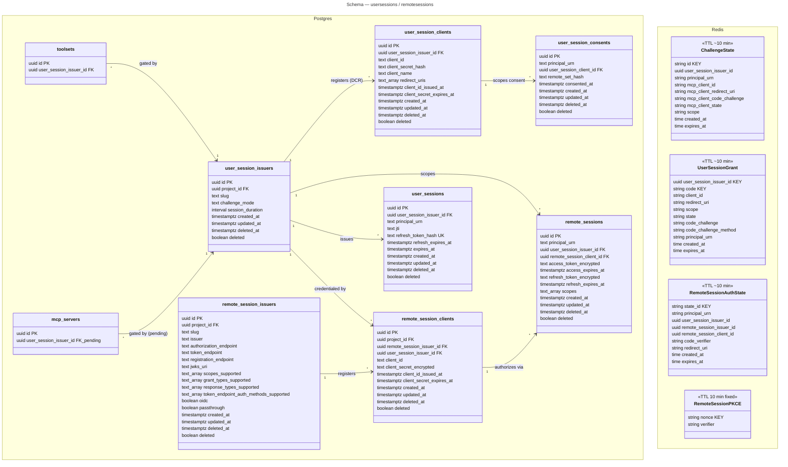
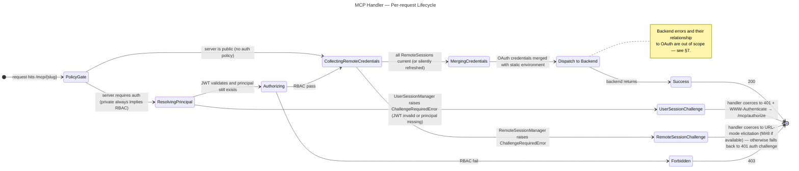
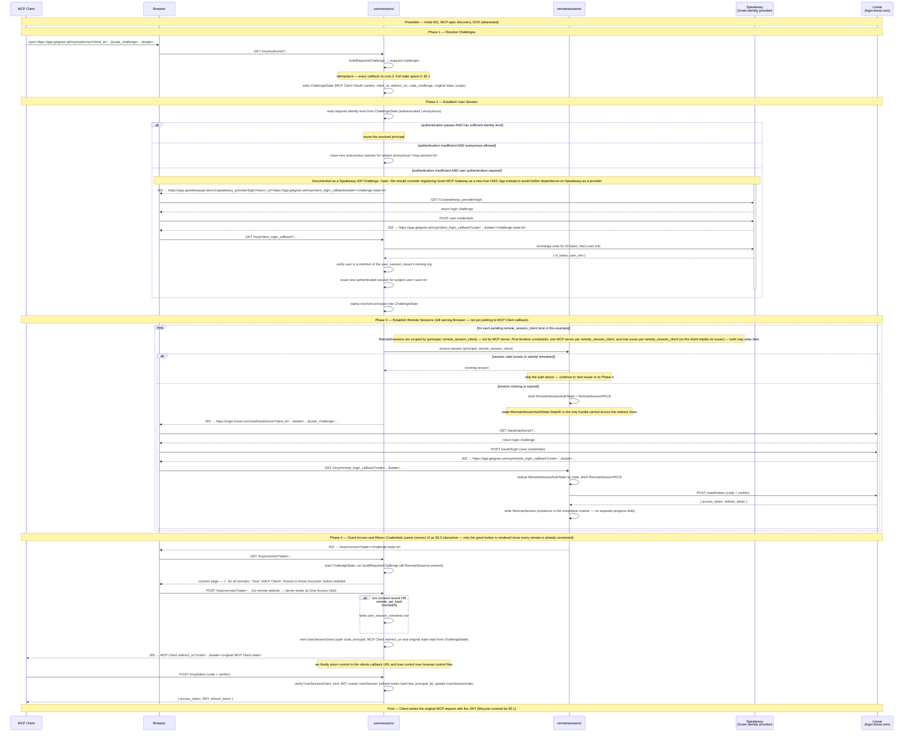
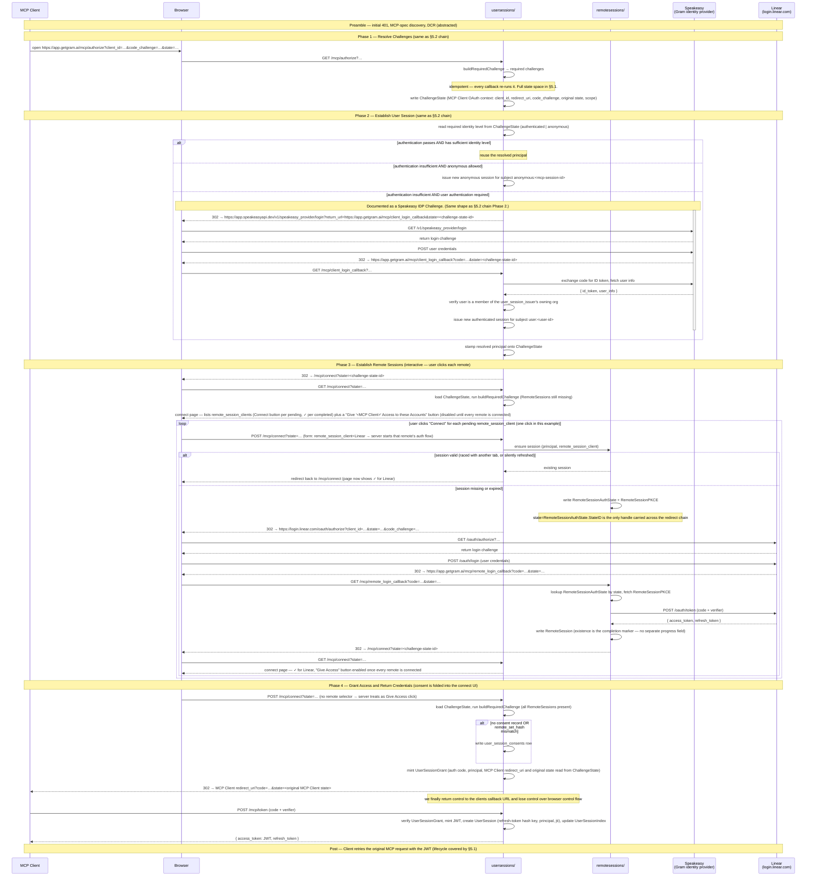
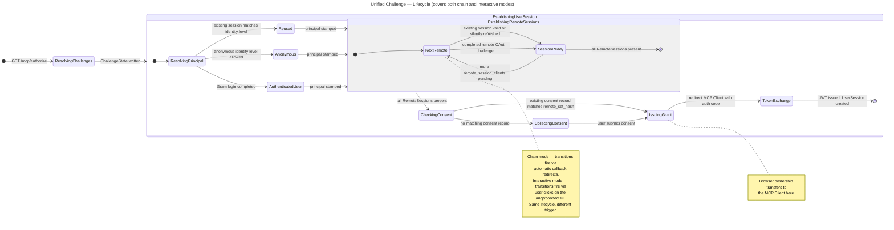

# Overview
We currently have a product need to secure OAuth servers with a Gram login, but we are presented with a problem: securing servers with Gram login uses the same method as securing credentials for upstream OAuth providers with some special behavior applied. In order to remove this product constraint, instead of relaxing the constraint on allowing a single vs multiple upstream OAuth providers, we will instead allow securing the sessions that upstream OAuth tokens are stored keyed by sessions that are allowed to be an authenticated resource.

Our solution is to decouple the `oauth` package into two packages:

1. _usersessions_: allow Gram to act as an authorization server for MCP clients and resolve identities to either anonymous sessions or Gram principals
2. _remotesessions_: functionality where Gram acts as a Client for remote MCP Servers

We take the opportunity to solve many ongoing design challenges:

1. Store remote OAuth credentials as their own documents keyed on session rather than as properties of the user session document
2. Resolve language overloading and unify the concepts of `external_oauth_providers` and `oauth_proxy_providers`
3. Reduce the number of discrete authentication pathways on the `/mcp` endpoint
4. Allow multiple remote OAuth providers for a single MCP session
5. Make stronger guarantees of consent collection for each user

We leave out of scope: Playground OAuth (i.e. settings where Gram acts as an MCP OAuth Client rather than an `issuer`) and tampering with Gram management API sessions.

# Goals
<empty-block/>
*To be filled in.*

# TLDR / Key Decisions
<empty-block/>
*To be filled in.*

# Proposal
## Definitions

This section is the canonical glossary for the rest of the spike. Section 2a is a refresher of the OAuth terms we use unmodified; section 2b defines the Gram-specific terms this RFC introduces. When a Gram term overlaps with a generic OAuth term, the Gram definition wins inside this codebase.

### 2a. General OAuth terms (refresher)

<table fit-page-width="true" header-row="true">
	<tr>
		<td>Term</td>
		<td>Meaning in this document</td>
	</tr>
	<tr>
		<td>**Authorization Server (AS)**</td>
		<td>Issues access and refresh tokens; runs `/authorize`, `/token`, and (when applicable) `/register`. Synonyms in the wild: _issuer_, _OAuth provider_, _identity provider_ (when the AS also speaks OIDC). RFC 6749 §1.1.</td>
	</tr>
	<tr>
		<td>**Resource Server (RS)**</td>
		<td>Hosts protected resources; validates access tokens presented by clients. Synonyms: _protected resource_ (RFC 9728), _audience_ (when referred to by what a token's `aud` claim binds). RFC 6749 §1.1.</td>
	</tr>
	<tr>
		<td>**Client**</td>
		<td>The application that requests access on behalf of a user. Synonyms: _application_, _relying party_ (in OIDC). RFC 6749 §1.1.</td>
	</tr>
	<tr>
		<td>**OIDC (OpenID Connect)**</td>
		<td>A protocol layered on OAuth that mandates a particular OAuth flow to enable external providers to solve authentication challenges. We adopt OIDC's JWT _schema_ but not its mandated public-key signing.</td>
	</tr>
	<tr>
		<td>**DCR (Dynamic Client Registration)**</td>
		<td>A client registers itself with an AS via `/register`. RFC 7591.</td>
	</tr>
</table>

### 2b. Gram-specific terms

The following terms are introduced or redefined by this RFC. When the codebase still has legacy structures with overlapping names, the legacy term is called out explicitly. **Reviewers should take special care to comment and align on these terms.**

#### User session

The session Gram maintains with an MCP client. A user session has exactly one principal (`user`, `apikey`, or `anonymous`), is bound to exactly one toolset, and is materialised as:

- A signed access token
- A Redis-backed refresh document, keyed `(session_id, user_session_issuer_id)`

This RFC also deprecates the legacy `Gram-Chat-Session` header. Chat-session JWTs become `Authorization`-header-delivered tokens that share the same JWT schema and signing key as user sessions; the two flows unify under one claim shape and one revocation path, differing only in `sub` and `aud`.

#### User session issuer (`user_session_issuer`)

The Gram-side authorization-server configuration that issues user sessions for a toolset. Replaces today's `oauth_proxy_servers` row. A toolset that wants to gate MCP traffic with a Gram-issued session points at a `user_session_issuer`. A `user_session_issuer` may reference zero or more `remote_session_issuer`s — i.e. there can be multiple remote OAuth challenges to satisfy on the way to issuing a user session. (See _chain_ vs _interactive_ below for how those challenges are presented.)

#### Remote OAuth issuer (`remote_session_issuer`)

An upstream Authorization Server's identity record. Holds AS metadata (RFC 8414 fields), the issuer URL, and a required `oidc bool` flag (defaulted `false`) that may unlock OIDC-aware behaviour when `true`. Issuer rows can be auto-discovered (e.g. by hitting an upstream `/.well-known/oauth-authorization-server`) and are managed independently of the credentials Gram presents to the issuer.

Conceptually this is closer to today's `oauth_proxy_provider` than to `external_oauth_server_metadata`. The behavioural difference between the two legacy modes collapses onto a single `passthrough` flag on the issuer.

#### Remote OAuth client (`remote_session_client`)

Credentials Gram uses when acting as a client of a `remote_session_issuer`. One issuer can have many clients in the schema; in initial scope we use 1:1, but the structure leaves room for, e.g., multiple Notion-app credentials against a single shared Notion MCP. This serves as a jump table between `oauth_proxy_providers` and `user_session_issuers` — i.e. each `remote_session_client` should have its own `user_session_issuer` associated. We would likely be better served to have a single `remote_session_client` for each provider that can be shared across all of Gram, but we leave the definition of a permission model for client IDs and secrets (which can be customer-provided) out of scope here.

#### Passthrough mode (on a `remote_session_issuer`)

Mode where the bearer the MCP client sent us is forwarded to the upstream as-is, rather than Gram exchanging for an upstream token of its own. We still conform to the abstractions — if storing a remote session document is what homogeneity requires, we store one. Notably, the MCP client will register a client directly with the remote Authorization Server rather than with Gram. The access token will be delivered directly to that authorization server as it is received by the client.

This is the **same concept** as Milestone #2's _passthrough authentication_. The two names are aliases.

#### Chain vs Interactive (modes on a `user_session_issuer`)

Both modes describe how multi-remote OAuth challenges are presented after Gram issues a user session.

- **Chain.** From the Gram callback, redirect through each subsequent remote challenge in turn, build the entire session, then redirect back to the MCP client callback for the final token exchange. There is no intermediate UI listing the remotes. Consent must still be prompted _somewhere_ in the request stream — chain mode does not skip consent, it just doesn't render a "click each server" screen.
- **Interactive.** Gram issues the user session up front, then renders a UX where the user clicks each remote OAuth server to authenticate. This is the same screen that Milestone #8's URL-mode elicitation points at when refreshing stale remote credentials.
- **Just-In-Time** (out of scope). We only offer the challenge for tokens that the client is trying to use for _this_ given request. Similar behavior to _chain_ but more aggressive.

#### Anonymous principal

The current system allows attaching remote credentials to an arbitrary identity scoped to an MCP session. We introduce a new principal type for this scenario. This principal can never have scopes, but can access credentials for which it has solved a challenge.

Materialised as a `PrincipalType` joining the existing `user` and `role` types in `urn.Principal`, with the URN shape `anonymous:<mcp-session-id>`. The `mcp-session-id` segment is the same value the MCP handler injects into the `user_session_issuer` per goal #11.

`role:<slug>` is **not** a valid `sub` value — roles are not authentication subjects. The valid `sub` URN shapes are exactly `user:<id>`, `apikey:<uuid>`, and `anonymous:<mcp-session-id>`. `urn.APIKey` stays a parallel URN kind (it is not a `PrincipalType`) — this RFC keeps that separation but allows both PrincipalType URNs and APIKey URNs to share the `sub` claim.

#### Consent record

Persistent record that a given principal has consented for a given `user_session_client` to access **all** of the `remote_session_tokens` on that client's owning `user_session_issuer`. The `/authorize` endpoint may skip the consent prompt only when a matching consent record exists. Existence of a session alone is not sufficient. Consent is **per-client**, not per-issuer — granting consent to MCP client X does not grant consent to MCP client Y registered with the same issuer. (Where this record lives — Postgres table vs. another Redis doc — is a §4 design question.)

---

## Architecture overview

### 3.1 Layout

Today's `server/internal/oauth/` is replaced by two qualified packages:

- **`usersessions/`** — Gram-as-Authorization-Server. AS endpoints, client-session JWT issuance + refresh, principal resolution, consent enforcement.
- **`remotesessions/`** — Gram-as-OAuth-Client. The dance with each `remote_session_issuer` (discovery, code exchange, token storage, refresh) and presentation of materialised credentials.

`server/internal/mcp/` orchestrates both. A new `mcp/challenge.go` takes errors from `usersessions` and `remotesessions` and coerces them into the right shape for MCP auth challenges.

There is no homogeneous dependency story between these packages. `mcp/` will know both. `usersessions` will sometimes need remote-session state to complete identity resolution (notably around passthrough remote-token issuers). `user_session_issuer` configurations will sometimes need to know which backends they relate to. We won't enforce a hard one-direction rule; we'll keep each dependency as narrow as the implementation actually requires and revisit if any single direction starts carrying real weight.

### 3.2 Who owns what

<table fit-page-width="true" header-row="true">
	<tr>
		<td>Concept</td>
		<td>Lives in</td>
	</tr>
	<tr>
		<td>`user_session_issuer` (config + JWT issuance)</td>
		<td>`usersessions/`</td>
	</tr>
	<tr>
		<td>Consent records, consent-prompt logic</td>
		<td>`usersessions/`</td>
	</tr>
	<tr>
		<td>Anonymous principal provisioning (MCP-only)</td>
		<td>`usersessions/`</td>
	</tr>
	<tr>
		<td>`remote_session_issuer`, `remote_session_client` (config)</td>
		<td>`remotesessions/`</td>
	</tr>
	<tr>
		<td>Remote session documents (Redis)</td>
		<td>`remotesessions/`</td>
	</tr>
	<tr>
		<td>Passthrough mode (the "no exchange" code path)</td>
		<td>`remotesessions/`</td>
	</tr>
	<tr>
		<td>Chain / Interactive challenge orchestration</td>
		<td>`mcp/` (orchestrates), `usersessions/` + `remotesessions/` (execute primitives)</td>
	</tr>
	<tr>
		<td>MCP auth challenge translation</td>
		<td>`mcp/challenge.go`</td>
	</tr>
	<tr>
		<td>Tool-call credential injection</td>
		<td>Resolved by `mcp/`; presented to the backend as opaque inputs</td>
	</tr>
</table>

### 3.3 The MCP request — orchestration

`server/internal/mcp/` orchestrates each request in four steps:

1. **Resolve the credential to an identity.** Call `usersessions` to validate whatever the client presented (Gram-issued JWT, or nothing — in which case the supplied `mcp_session_id` becomes the id of an anonymous session). Returns a principal.
2. **Authorize server access.** Check whether that principal is permitted to use this toolset.
3. **Request credentials from `remotesessions` for this identity.** Materialise (or refresh) every required remote session keyed on `(session_id, user_session_issuer_id)`. If anything is missing or stale, fire the appropriate challenge (chain / interactive / passthrough).
4. **Pass credentials to the MCP backend.** The toolset receives an opaque credential bundle. `doHTTP` consumes it without any OAuth knowledge — satisfying goal #7.

### 3.4 Where consent fires

Consent enforcement lives entirely in `usersessions` at the `/mcp/connect` endpoint. The check is: "has this principal previously consented for **this MCP client** (i.e. this `user_session_client`) to access **all** of the `remote_session_tokens` on its owning `user_session_issuer`?" Only a matching consent record short-circuits the prompt. Re-prompting is the default whenever the set of `remote_session_issuer`s on the owning issuer changes (i.e. consent is bound to the _full set_, not to individual remotes).

In both chain and interactive modes the consent prompt is the `/mcp/connect` page — interactive mode renders the per-remote Connect buttons alongside the grant-access button; chain mode lands on the page with all remotes already ✓ and only the grant-access button visible.

### 3.5 Relationship to the MCP server / backend split

Everything in this RFC — `user_session_issuer`, `remote_session_issuer`, `remote_session_client`, consent records, every Redis session document — attaches at the **`mcp_servers`** level (Gram's MCP-server configuration), not on the backend. The MCP backend (a `toolsets` row or a `remote_mcp_servers` row) consumes the credential bundle Gram has assembled — and that bundle absolutely includes upstream OAuth access tokens (e.g., a Linear bearer the backend forwards onto outbound calls). What the backend does **not** do is run the OAuth dance: collecting tokens, refreshing them, prompting for consent. That work stays MCP-server-level.

This RFC does not require finishing the MCP runtime's migration off the legacy `toolsets.{external_oauth_server_id, oauth_proxy_server_id}` columns. We attach `user_session_issuer` at whichever level (`toolsets` row or `mcp_servers` row) is current at implementation time and migrate alongside whatever `mcp_endpoints` work is happening in parallel.

---

## Schemas

Canonical SDL lives in `/schemas/` (Postgres in `.sql`, Redis JSON in Go SDL, JWT in Go SDL). This section is the index and rationale; precise column types and indexes are in those files.

The full Postgres ER diagram is at:


### 4.1 Postgres — new tables

#### `user_session_issuers`

The Gram-side AS configuration. One per logical "thing that issues user sessions for a toolset."

Open Questions:

- Should the issuer be able to force authentication? Or should it always defer to the policy set by the MCP server (i.e. the `mcp_servers` row)? Will attempt implementing the latter and fix if it falls over

<table fit-page-width="true" header-row="true">
	<tr>
		<td>Column</td>
		<td>Type</td>
		<td>Notes</td>
	</tr>
	<tr>
		<td>`id`</td>
		<td>`uuid`</td>
		<td>PK</td>
	</tr>
	<tr>
		<td>`project_id`</td>
		<td>`uuid`</td>
		<td>FK → `projects`</td>
	</tr>
	<tr>
		<td>`slug`</td>
		<td>`text`</td>
		<td>unique per project</td>
	</tr>
	<tr>
		<td>`challenge_mode`</td>
		<td>`text`</td>
		<td>`chain` | `interactive`</td>
	</tr>
	<tr>
		<td>`session_duration`</td>
		<td>`interval`</td>
		<td>policy: `user_sessions.expires_at = created_at + session_duration`</td>
	</tr>
	<tr>
		<td>timestamps</td>
		<td></td>
		<td>`created_at`, `updated_at`, `deleted_at`, `deleted`</td>
	</tr>
</table>

#### `user_session_clients`

DCR registry for MCP clients registering with Gram-as-Authorization-Server (RFC 7591). Successor to legacy `oauth_proxy_client_info`. Symmetric counterpart to `remote_session_clients` — same role, opposite side of the AS/Client divide.

Fields dropped relative to legacy: `grant_types`, `response_types`, `scope`, `token_endpoint_auth_method`, `application_type`. These are issuer-level policy that resolves at `/authorize` and `/token` time, not per-client state worth persisting.

<table fit-page-width="true" header-row="true">
	<tr>
		<td>Column</td>
		<td>Type</td>
		<td>Notes</td>
	</tr>
	<tr>
		<td>`id`</td>
		<td>`uuid`</td>
		<td>PK</td>
	</tr>
	<tr>
		<td>`user_session_issuer_id`</td>
		<td>`uuid`</td>
		<td>FK</td>
	</tr>
	<tr>
		<td>`client_id`</td>
		<td>`text`</td>
		<td>DCR-issued</td>
	</tr>
	<tr>
		<td>`client_secret_hash`</td>
		<td>`text`</td>
		<td>bcrypt or equivalent; nullable for public PKCE clients</td>
	</tr>
	<tr>
		<td>`client_name`</td>
		<td>`text`</td>
		<td>from registration request</td>
	</tr>
	<tr>
		<td>`redirect_uris`</td>
		<td>`text[]`</td>
		<td>validated on every `/authorize`</td>
	</tr>
	<tr>
		<td>`client_id_issued_at`</td>
		<td>`timestamptz`</td>
		<td></td>
	</tr>
	<tr>
		<td>`client_secret_expires_at`</td>
		<td>`timestamptz`</td>
		<td>nullable: null = doesn't expire (RFC 7591 `expires_at=0` semantic)</td>
	</tr>
	<tr>
		<td>timestamps</td>
		<td></td>
		<td>unique index on `(user_session_issuer_id, client_id)`</td>
	</tr>
</table>

#### `remote_session_issuers`

An upstream Authorization Server's identity record. Successor to `oauth_proxy_provider` (per §2b: behavioural diff from `external_oauth_server_metadata` collapses onto the `passthrough` flag).

<table fit-page-width="true" header-row="true">
	<tr>
		<td>Column</td>
		<td>Type</td>
		<td>Notes</td>
	</tr>
	<tr>
		<td>`id`</td>
		<td>`uuid`</td>
		<td>PK</td>
	</tr>
	<tr>
		<td>`project_id`</td>
		<td>`uuid`</td>
		<td>FK → `projects`; should ultimately not be project scoped and be able to share working configurations across remotes</td>
		<td></td>
	</tr>
	<tr>
		<td>`slug`</td>
		<td>`text`</td>
		<td>unique per project</td>
	</tr>
	<tr>
		<td>`issuer`</td>
		<td>`text`</td>
		<td>issuer URL, matches `iss` claim</td>
	</tr>
	<tr>
		<td>`authorization_endpoint`</td>
		<td>`text`</td>
		<td></td>
	</tr>
	<tr>
		<td>`token_endpoint`</td>
		<td>`text`</td>
		<td></td>
	</tr>
	<tr>
		<td>`registration_endpoint`</td>
		<td>`text`</td>
		<td>nullable; absent for issuers without DCR</td>
	</tr>
	<tr>
		<td>`jwks_uri`</td>
		<td>`text`</td>
		<td>nullable</td>
	</tr>
	<tr>
		<td>`scopes_supported`</td>
		<td>`text[]`</td>
		<td></td>
	</tr>
	<tr>
		<td>`grant_types_supported`</td>
		<td>`text[]`</td>
		<td></td>
	</tr>
	<tr>
		<td>`response_types_supported`</td>
		<td>`text[]`</td>
		<td></td>
	</tr>
	<tr>
		<td>`token_endpoint_auth_methods_supported`</td>
		<td>`text[]`</td>
		<td></td>
	</tr>
	<tr>
		<td>`oidc`</td>
		<td>`bool`</td>
		<td>default `false`; `true` may unlock OIDC-aware behaviour</td>
	</tr>
	<tr>
		<td>`passthrough`</td>
		<td>`bool`</td>
		<td>default `false`; when `true`, the MCP client registers + transacts directly with this issuer (per §2b passthrough mode)</td>
	</tr>
	<tr>
		<td>timestamps</td>
		<td></td>
		<td></td>
	</tr>
</table>

#### `remote_session_clients`

The credentials Gram presents when transacting against a `remote_session_issuer`. Jump-table edge between `remote_session_issuer` and `user_session_issuer` (per §2b).

<table fit-page-width="true" header-row="true">
	<tr>
		<td>Column</td>
		<td>Type</td>
		<td>Notes</td>
	</tr>
	<tr>
		<td>`id`</td>
		<td>`uuid`</td>
		<td>PK</td>
	</tr>
	<tr>
		<td>`project_id`</td>
		<td>`uuid`</td>
		<td>FK → `projects`</td>
	</tr>
	<tr>
		<td>`remote_session_issuer_id`</td>
		<td>`uuid`</td>
		<td>FK</td>
	</tr>
	<tr>
		<td>`user_session_issuer_id`</td>
		<td>`uuid`</td>
		<td>FK; the issuer this client maps to;</td>
	</tr>
	<tr>
		<td>`client_id`</td>
		<td>`text`</td>
		<td></td>
	</tr>
	<tr>
		<td>`client_secret_encrypted`</td>
		<td>`text`</td>
		<td>nullable for PKCE-only public clients</td>
	</tr>
	<tr>
		<td>`client_id_issued_at`</td>
		<td>`timestamptz`</td>
		<td></td>
	</tr>
	<tr>
		<td>`client_secret_expires_at`</td>
		<td>`timestamptz`</td>
		<td>nullable for non-expiring secrets</td>
	</tr>
	<tr>
		<td>timestamps</td>
		<td></td>
		<td></td>
	</tr>
</table>

#### `user_session_consents`

Persistent consent record per (principal, `user_session_client`). Per-client, not per-issuer (see §2b "Consent record" / §3.4).

<table fit-page-width="true" header-row="true">
	<tr>
		<td>Column</td>
		<td>Type</td>
		<td>Notes</td>
	</tr>
	<tr>
		<td>`id`</td>
		<td>`uuid`</td>
		<td>PK</td>
	</tr>
	<tr>
		<td>`principal_urn`</td>
		<td>`text`</td>
		<td>`user:<id>` | `apikey:<uuid>` | `anonymous:<mcp-session-id>`</td>
	</tr>
	<tr>
		<td>`user_session_client_id`</td>
		<td>`uuid`</td>
		<td>FK; client implies its issuer</td>
	</tr>
	<tr>
		<td>`remote_set_hash`</td>
		<td>`text`</td>
		<td>SHA-256 of the sorted list of `remote_session_issuer_id`s on the client's owning issuer at consent time</td>
	</tr>
	<tr>
		<td>`consented_at`</td>
		<td>`timestamptz`</td>
		<td></td>
	</tr>
	<tr>
		<td>timestamps</td>
		<td></td>
		<td>unique index on `(principal_urn, user_session_client_id, remote_set_hash)`</td>
	</tr>
</table>

#### `user_sessions`

The issued user session. Created lazily at token exchange. Lookup at `/token` is by `refresh_token_hash`; bookkeeping ("what active sessions does this principal have at this issuer?") is a `(principal_urn, user_session_issuer_id)` query.

<table fit-page-width="true" header-row="true">
	<tr>
		<td>Column</td>
		<td>Type</td>
		<td>Notes</td>
	</tr>
	<tr>
		<td>`id`</td>
		<td>`uuid`</td>
		<td>PK</td>
	</tr>
	<tr>
		<td>`user_session_issuer_id`</td>
		<td>`uuid`</td>
		<td>FK</td>
	</tr>
	<tr>
		<td>`principal_urn`</td>
		<td>`text`</td>
		<td>resolved principal — `user:<id>` | `apikey:<uuid>` | `anonymous:<mcp-session-id>`</td>
	</tr>
	<tr>
		<td>`jti`</td>
		<td>`text`</td>
		<td>current access-token JTI; used by the revocation path</td>
	</tr>
	<tr>
		<td>`refresh_token_hash`</td>
		<td>`text`</td>
		<td>SHA-256 of the refresh token; lookup key at `/token`</td>
	</tr>
	<tr>
		<td>`refresh_expires_at`</td>
		<td>`timestamptz`</td>
		<td>next refresh deadline; need not align with `expires_at`, but must be `<= expires_at`</td>
	</tr>
	<tr>
		<td>`expires_at`</td>
		<td>`timestamptz`</td>
		<td>terminal session expiry; ceiling on `refresh_expires_at`; set from issuer `session_duration`</td>
	</tr>
	<tr>
		<td>timestamps</td>
		<td></td>
		<td>unique index on `refresh_token_hash`; index on `(principal_urn, user_session_issuer_id)`</td>
	</tr>
</table>

#### `remote_sessions`

The remote-side OAuth session per `(principal, remote_session_client)`. Holds upstream access + refresh tokens with **independent** expiries. Created when a remote auth dance completes; refreshed silently on the access-expiry path.

<table fit-page-width="true" header-row="true">
	<tr>
		<td>Column</td>
		<td>Type</td>
		<td>Notes</td>
	</tr>
	<tr>
		<td>`id`</td>
		<td>`uuid`</td>
		<td>PK</td>
	</tr>
	<tr>
		<td>`principal_urn`</td>
		<td>`text`</td>
		<td>scoping (per §3.4)</td>
	</tr>
	<tr>
		<td>`user_session_issuer_id`</td>
		<td>`uuid`</td>
		<td>FK</td>
	</tr>
	<tr>
		<td>`remote_session_client_id`</td>
		<td>`uuid`</td>
		<td>FK; one client implies one issuer</td>
	</tr>
	<tr>
		<td>`access_token_encrypted`</td>
		<td>`text`</td>
		<td></td>
	</tr>
	<tr>
		<td>`access_expires_at`</td>
		<td>`timestamptz`</td>
		<td>independent of `refresh_expires_at`</td>
	</tr>
	<tr>
		<td>`refresh_token_encrypted`</td>
		<td>`text`</td>
		<td>nullable</td>
	</tr>
	<tr>
		<td>`refresh_expires_at`</td>
		<td>`timestamptz`</td>
		<td>nullable</td>
	</tr>
	<tr>
		<td>`scopes`</td>
		<td>`text[]`</td>
		<td></td>
	</tr>
	<tr>
		<td>timestamps</td>
		<td></td>
		<td>unique index on `(principal_urn, remote_session_client_id)`</td>
	</tr>
</table>

#### Toolset link

`toolsets` gains:

<table fit-page-width="true" header-row="true">
	<tr>
		<td>Column</td>
		<td>Type</td>
		<td>Notes</td>
	</tr>
	<tr>
		<td>`user_session_issuer_id`</td>
		<td>`uuid`</td>
		<td>FK → `user_session_issuers`; nullable; replaces both legacy `external_oauth_server_id` and `oauth_proxy_server_id`</td>
	</tr>
</table>

(`mcp_servers` mirrors this column whenever its runtime migration lands, per §3.5.)

### 4.2 Postgres — removed

<table fit-page-width="true" header-row="true">
	<tr>
		<td>What</td>
		<td>Why</td>
	</tr>
	<tr>
		<td>`oauth_proxy_servers`</td>
		<td>Replaced by `user_session_issuers`.</td>
	</tr>
	<tr>
		<td>`oauth_proxy_providers`</td>
		<td>Replaced by `remote_session_issuers` + `remote_session_clients`.</td>
	</tr>
	<tr>
		<td>`oauth_proxy_providers.secrets` JSONB</td>
		<td>Deprecated per goal #3; structured columns on `remote_session_clients` instead.</td>
	</tr>
	<tr>
		<td>`oauth_proxy_providers.security_key_names`</td>
		<td>Deprecated per goal #3.</td>
	</tr>
	<tr>
		<td>`oauth_proxy_providers.provider_type='custom'`</td>
		<td>Deprecated per goal #3; behaviour collapses onto `passthrough` flag.</td>
	</tr>
	<tr>
		<td>`external_oauth_server_metadata`</td>
		<td>Use case preserved as `remote_session_issuer` with `passthrough=true`.</td>
	</tr>
	<tr>
		<td>`toolsets.external_oauth_server_id`</td>
		<td>Replaced by `toolsets.user_session_issuer_id`.</td>
	</tr>
	<tr>
		<td>`toolsets.oauth_proxy_server_id`</td>
		<td>Replaced by `toolsets.user_session_issuer_id`.</td>
	</tr>
	<tr>
		<td>`toolsets_oauth_exclusivity` CHECK</td>
		<td>No longer needed; only one column to set.</td>
	</tr>
	<tr>
		<td>`oauth_proxy_client_info`</td>
		<td>Replaced by `user_session_clients` (§4.1). Migration is a Cleanup ticket in `project.md`.</td>
	</tr>
</table>

Each removal becomes a ticket in `project.md`.

### 4.3 Redis — new types

Redis carries only short-TTL in-flight records. Durable session state (`user_sessions`, `remote_sessions`) lives in Postgres — see §4.1.

All Redis types implement `cache.CacheableObject[T]`; values are JSON-serialised by `cache.TypedCacheObject[T]`. Encrypted fields use `encryption.Client` before serialisation.

<table fit-page-width="true" header-row="true">
	<tr>
		<td>Type</td>
		<td>Cache key</td>
		<td>Holds</td>
		<td>TTL</td>
	</tr>
	<tr>
		<td>`ChallengeState`</td>
		<td>`challengeState:{id}`</td>
		<td>MCP Client OAuth context (`client_id`, `redirect_uri`, `code_challenge`, original `state`, scope), `user_session_issuer_id`, resolved principal URN (set after Phase 2)</td>
		<td>~10 min</td>
	</tr>
	<tr>
		<td>`UserSessionGrant`</td>
		<td>`userSessionGrant:{userSessionIssuerID}:{code}`</td>
		<td>`client_id`, redirect_uri, scope, state, PKCE challenge, principal URN</td>
		<td>~10 min</td>
	</tr>
	<tr>
		<td>`RemoteSessionAuthState`</td>
		<td>`remoteSessionAuthState:{stateID}`</td>
		<td>principal URN, issuer id, client id, code verifier, redirect</td>
		<td>~10 min</td>
	</tr>
	<tr>
		<td>`RemoteSessionPKCE`</td>
		<td>`remoteSessionPKCE:{nonce}`</td>
		<td>verifier</td>
		<td>10 min fixed</td>
	</tr>
	<tr>
		<td>`RevokedToken` _(unchanged, reused)_</td>
		<td>`chat_session_revoked:{jti}`</td>
		<td>jti, revoked_at</td>
		<td>24h</td>
	</tr>
</table>

### 4.4 Redis — removed

<table fit-page-width="true" header-row="true">
	<tr>
		<td>What</td>
		<td>Why</td>
	</tr>
	<tr>
		<td>`oauthGrant:{toolsetID}:{code}`</td>
		<td>Replaced by `userSessionGrant:*` keyed on `user_session_issuer_id`.</td>
	</tr>
	<tr>
		<td>`oauthToken:{toolsetID}:{accessToken}`</td>
		<td>Eliminated. Access tokens are validated as JWTs (no Redis read on the validate path).</td>
	</tr>
	<tr>
		<td>`oauthRefreshToken:{toolsetID}:{refreshToken}`</td>
		<td>Replaced by the Postgres `user_sessions` table (lookup by `refresh_token_hash`).</td>
	</tr>
	<tr>
		<td>`oauthClientInfo:{mcpURL}:{clientID}`</td>
		<td>Eliminated. DCR registrations live in the Postgres `user_session_clients` table (§4.1) — no Redis cache needed.</td>
	</tr>
	<tr>
		<td>`upstreamPKCE:{nonce}`</td>
		<td>Renamed `remoteSessionPKCE:*`.</td>
	</tr>
	<tr>
		<td>`externalOAuthState:{stateID}`</td>
		<td>Renamed `remoteSessionAuthState:*`.</td>
	</tr>
	<tr>
		<td>`Token.ExternalSecrets` (sub-field)</td>
		<td>The whole "tunnel upstream credentials through the AS token" pattern is gone. Remote credentials live in the Postgres `remote_sessions` table.</td>
	</tr>
</table>

### 4.5 JWT — unified `SessionClaims`

One claim shape for chat sessions and user sessions. Same signing key (`GRAM_JWT_SIGNING_KEY`), same algorithm (HS256), same revocation cache (`chat_session_revoked:{jti}`). Differs only in `sub` and `aud`.

The JWT carries **only the standard OIDC registered claims** — no Gram-specific extras. Anything else (org, project, etc.) is resolved from the session record in Redis.

```go
type SessionClaims struct {
    // OIDC-shaped registered claims
    Issuer    string   `json:"iss"`           // Gram issuer URL
    Subject   string   `json:"sub"`           // user:<id> | apikey:<uuid> | anonymous:<mcp-session-id>
    Audience  []string `json:"aud"`           // toolset slug (user session) | embed origin (chat session)
    ExpiresAt int64    `json:"exp"`
    IssuedAt  int64    `json:"iat"`
    JTI       string   `json:"jti"`           // UUIDv4
}
```

Notes:

We take this opportunity to unify all of Gram Elements' authentication schemes with the MCP authentication scheme. There is no longer a distinct header for Elements — it uses the same JWT as the rest of `/mcp/*`.

### 4.6 SDL artifacts

The schemas above are the rationale; the canonical artifacts live in `/schemas/`:

- `/schemas/postgres.sql` — DDL for the new tables and the toolset alteration.
- `/schemas/redis.go` — Go-SDL definitions for each Redis type.
- `/schemas/jwt.go` — `SessionClaims` and the valid `sub` URN shapes.

---

## Flows

> Backend errors and their relationship to OAuth are **out of scope** for this project. We may allow semantics for backends to reject and request new tokens, but we will consider this problem in a separate scope of work.

### 5.1 `mcp-handler` — state machine


The Token Managers return a generic `ChallengeRequiredError`. `mcp/challenge.go` is responsible for coercing system state into the OAuth dance required to resolve this challenge.

### 5.2 Auth Challenge - Chain Mode

**Initial State.** The toolset is configured with a single `user_session_issuer` whose `remote_set` contains one `remote_session_issuer` pointing at Linear:

<table fit-page-width="true" header-row="true">
	<tr>
		<td>Field</td>
		<td>Value</td>
	</tr>
	<tr>
		<td>`issuer`</td>
		<td>`https://login.linear.com`</td>
	</tr>
	<tr>
		<td>`authorization_endpoint`</td>
		<td>`https://login.linear.com/oauth/authorize`</td>
	</tr>
	<tr>
		<td>`token_endpoint`</td>
		<td>`https://login.linear.com/oauth/token`</td>
	</tr>
	<tr>
		<td>`oidc`</td>
		<td>`false`</td>
	</tr>
	<tr>
		<td>`passthrough`</td>
		<td>`false`</td>
	</tr>
</table>

**Sequence:**


**State machine (shared with §5.3):**


### 5.3 Auth Challenge - Interactive Mode

Same Initial State as §5.2.

**Sequence:**


**State machine (shared with §5.2):**


---

## Proposed Endpoints

This section catalogs every HTTP surface this RFC introduces or materially reshapes. It splits into two halves:

- **Management APIs** (§6.1, §6.2) — Goa-designed RPC under `/rpc/<service>.<method>`, consumed by the dashboard, CLI, and public SDK. See the `gram-management-api` skill for conventions.
- **OAuth endpoints** (§6.3, §6.4, §6.5) — the standards-shaped routes that participate in OAuth flows: discovery (§6.3), Gram-as-Authorization-Server (§6.4), and Gram-as-OAuth-Client (§6.5).

Path conventions in this section:

- `{slug}` resolves a `mcp_server` (or, transitionally, a toolset) by slug.
- Endpoints rooted at `/rpc/` are JSON-RPC-shaped management APIs.
- Endpoints rooted at `/mcp/` are part of the public MCP surface and follow the relevant OAuth or MCP specs.

### 6.1 User Session Management APIs

Surface: configure how Gram issues user sessions, and inspect/revoke what's been issued.

All methods are `POST` to `/rpc/<service>.<method>`. Project context is implicit from the caller's session. RBAC: every method gates on a `user_session_issuer` resource scope (see `gram-rbac`). Audit logging covers every mutation (see `gram-audit-logging`).

Pagination on `list` methods follows the standard Gram cursor convention: optional `cursor` (string) and `limit` (int, default `50`, max `100`); response carries a `next_cursor` (string, empty when exhausted).

#### `userSessionIssuers.create`

Create a `user_session_issuer`.

**Request**

<table fit-page-width="true" header-row="true">
	<tr>
		<td>Field</td>
		<td>Type</td>
		<td>Required</td>
		<td>Notes</td>
	</tr>
	<tr>
		<td>`slug`</td>
		<td>string</td>
		<td>required</td>
		<td>unique per project</td>
	</tr>
	<tr>
		<td>`challenge_mode`</td>
		<td>enum</td>
		<td>required</td>
		<td>`chain` | `interactive`</td>
	</tr>
	<tr>
		<td>`session_duration`</td>
		<td>duration</td>
		<td>required</td>
		<td>ISO 8601 duration (e.g. `PT24H`)</td>
	</tr>
</table>

**Response**: full `UserSessionIssuer` record (see §4.1).

#### `userSessionIssuers.update`

Mutate fields on an existing issuer. All non-id fields are optional patches.

**Request**

<table fit-page-width="true" header-row="true">
	<tr>
		<td>Field</td>
		<td>Type</td>
		<td>Required</td>
		<td>Notes</td>
	</tr>
	<tr>
		<td>`id`</td>
		<td>uuid</td>
		<td>required</td>
		<td></td>
	</tr>
	<tr>
		<td>`slug`</td>
		<td>string</td>
		<td>optional</td>
		<td>rename</td>
	</tr>
	<tr>
		<td>`challenge_mode`</td>
		<td>enum</td>
		<td>optional</td>
		<td>`chain` | `interactive`</td>
	</tr>
	<tr>
		<td>`session_duration`</td>
		<td>duration</td>
		<td>optional</td>
		<td></td>
	</tr>
</table>

**Response**: updated `UserSessionIssuer` record.

#### `userSessionIssuers.list`

List issuers in the caller's project.

**Request**

<table fit-page-width="true" header-row="true">
	<tr>
		<td>Field</td>
		<td>Type</td>
		<td>Required</td>
		<td>Notes</td>
	</tr>
	<tr>
		<td>`cursor`</td>
		<td>string</td>
		<td>optional</td>
		<td>pagination cursor</td>
	</tr>
	<tr>
		<td>`limit`</td>
		<td>int</td>
		<td>optional</td>
		<td>default `50`, max `100`</td>
	</tr>
</table>

**Response**: `{ items: UserSessionIssuer[], next_cursor: string }`.

#### `userSessionIssuers.get`

Detail by id or slug. Exactly one of `id` or `slug` must be supplied.

**Request**

<table fit-page-width="true" header-row="true">
	<tr>
		<td>Field</td>
		<td>Type</td>
		<td>Required</td>
		<td>Notes</td>
	</tr>
	<tr>
		<td>`id`</td>
		<td>uuid</td>
		<td>required (one of)</td>
		<td></td>
	</tr>
	<tr>
		<td>`slug`</td>
		<td>string</td>
		<td>required (one of)</td>
		<td></td>
	</tr>
</table>

**Response**: `UserSessionIssuer` record.

#### `userSessionIssuers.delete`

Soft-delete an issuer. App-level cleanup cascades to dependent `user_sessions`, `user_session_consents`, and the `remote_session_clients` rows pointing at it.

**Request**

<table fit-page-width="true" header-row="true">
	<tr>
		<td>Field</td>
		<td>Type</td>
		<td>Required</td>
		<td>Notes</td>
	</tr>
	<tr>
		<td>`id`</td>
		<td>uuid</td>
		<td>required</td>
		<td></td>
	</tr>
</table>

**Response**: empty.

#### `userSessions.list`

Operator visibility into issued user sessions. Read-only — sessions are written by `/mcp/{slug}/token` (§6.4).

**Request**

<table fit-page-width="true" header-row="true">
	<tr>
		<td>Field</td>
		<td>Type</td>
		<td>Required</td>
		<td>Notes</td>
	</tr>
	<tr>
		<td>`principal_urn`</td>
		<td>string</td>
		<td>optional</td>
		<td>exact-match filter</td>
	</tr>
	<tr>
		<td>`user_session_issuer_id`</td>
		<td>uuid</td>
		<td>optional</td>
		<td>filter</td>
	</tr>
	<tr>
		<td>`cursor`</td>
		<td>string</td>
		<td>optional</td>
		<td></td>
	</tr>
	<tr>
		<td>`limit`</td>
		<td>int</td>
		<td>optional</td>
		<td>default `50`, max `100`</td>
	</tr>
</table>

**Response**: `{ items: UserSession[], next_cursor: string }`. **`refresh_token_hash` is never returned over this surface.**

#### `userSessions.revoke`

Push the session's `jti` into the revocation cache (`chat_session_revoked:{jti}`, spike §4.5) and soft-delete the row.

**Request**

<table fit-page-width="true" header-row="true">
	<tr>
		<td>Field</td>
		<td>Type</td>
		<td>Required</td>
		<td>Notes</td>
	</tr>
	<tr>
		<td>`id`</td>
		<td>uuid</td>
		<td>required</td>
		<td></td>
	</tr>
</table>

**Response**: empty.

#### `userSessionConsents.list`

List consent records for the caller's project.

**Request**

<table fit-page-width="true" header-row="true">
	<tr>
		<td>Field</td>
		<td>Type</td>
		<td>Required</td>
		<td>Notes</td>
	</tr>
	<tr>
		<td>`principal_urn`</td>
		<td>string</td>
		<td>optional</td>
		<td>filter</td>
	</tr>
	<tr>
		<td>`user_session_client_id`</td>
		<td>uuid</td>
		<td>optional</td>
		<td>filter</td>
	</tr>
	<tr>
		<td>`user_session_issuer_id`</td>
		<td>uuid</td>
		<td>optional</td>
		<td>filter (joins through `user_session_clients`)</td>
	</tr>
	<tr>
		<td>`cursor`</td>
		<td>string</td>
		<td>optional</td>
		<td></td>
	</tr>
	<tr>
		<td>`limit`</td>
		<td>int</td>
		<td>optional</td>
		<td>default `50`, max `100`</td>
	</tr>
</table>

**Response**: `{ items: UserSessionConsent[], next_cursor: string }`.

#### `userSessionConsents.revoke`

Withdraw consent. Next `/mcp/{slug}/authorize` from any session matching `(principal_urn, user_session_client_id)` will re-prompt.

**Request**

<table fit-page-width="true" header-row="true">
	<tr>
		<td>Field</td>
		<td>Type</td>
		<td>Required</td>
		<td>Notes</td>
	</tr>
	<tr>
		<td>`id`</td>
		<td>uuid</td>
		<td>required</td>
		<td></td>
	</tr>
</table>

**Response**: empty.

#### `userSessionClients.list`

Operator visibility into DCR'd MCP clients. Read-only — registrations are written by `/mcp/{slug}/register` (§6.4).

**Request**

<table fit-page-width="true" header-row="true">
	<tr>
		<td>Field</td>
		<td>Type</td>
		<td>Required</td>
		<td>Notes</td>
	</tr>
	<tr>
		<td>`user_session_issuer_id`</td>
		<td>uuid</td>
		<td>optional</td>
		<td>filter</td>
	</tr>
	<tr>
		<td>`cursor`</td>
		<td>string</td>
		<td>optional</td>
		<td></td>
	</tr>
	<tr>
		<td>`limit`</td>
		<td>int</td>
		<td>optional</td>
		<td>default `50`, max `100`</td>
	</tr>
</table>

**Response**: `{ items: UserSessionClient[], next_cursor: string }`. **`client_secret_hash` is never returned.**

#### `userSessionClients.get`

Detail by id.

**Request**

<table fit-page-width="true" header-row="true">
	<tr>
		<td>Field</td>
		<td>Type</td>
		<td>Required</td>
		<td>Notes</td>
	</tr>
	<tr>
		<td>`id`</td>
		<td>uuid</td>
		<td>required</td>
		<td></td>
	</tr>
</table>

**Response**: `UserSessionClient` record (no `client_secret_hash`).

#### `userSessionClients.revoke`

Soft-delete a registration. Future tokens minted for this `client_id` are rejected; existing live `user_sessions` keep working until they hit `expires_at`.

**Request**

<table fit-page-width="true" header-row="true">
	<tr>
		<td>Field</td>
		<td>Type</td>
		<td>Required</td>
		<td>Notes</td>
	</tr>
	<tr>
		<td>`id`</td>
		<td>uuid</td>
		<td>required</td>
		<td></td>
	</tr>
</table>

**Response**: empty.

### 6.2 Remote Session Management APIs

Surface: configure upstream issuers and the credentials Gram presents to them, and inspect/revoke remote sessions Gram is holding on a principal's behalf. Same conventions as §6.1 (POST to `/rpc/<service>.<method>`, project context implicit, RBAC + audit, standard pagination on `list`).

#### `remoteSessionIssuers.discover`

One-shot helper. Hits the upstream `<issuer>/.well-known/oauth-authorization-server` (RFC 8414) and returns a draft suitable for passing to `create`. No persistence.

**Request**

<table fit-page-width="true" header-row="true">
	<tr>
		<td>Field</td>
		<td>Type</td>
		<td>Required</td>
		<td>Notes</td>
	</tr>
	<tr>
		<td>`issuer`</td>
		<td>string</td>
		<td>required</td>
		<td>issuer URL to discover (e.g. `https://login.linear.com`)</td>
	</tr>
</table>

**Response**: a `RemoteSessionIssuerDraft` — same field set as a `RemoteSessionIssuer` (§4.1) minus `id`/`project_id`/timestamps, plus a `discovery_warnings: string[]` field describing any RFC 8414 deviations.

#### `remoteSessionIssuers.create`

Create a `remote_session_issuer`. Typically the body is a draft from `discover` with a project-unique `slug` set.

**Request**

<table fit-page-width="true" header-row="true">
	<tr>
		<td>Field</td>
		<td>Type</td>
		<td>Required</td>
		<td>Notes</td>
	</tr>
	<tr>
		<td>`slug`</td>
		<td>string</td>
		<td>required</td>
		<td>unique per project</td>
	</tr>
	<tr>
		<td>`issuer`</td>
		<td>string</td>
		<td>required</td>
		<td>matches `iss` claim</td>
	</tr>
	<tr>
		<td>`authorization_endpoint`</td>
		<td>string</td>
		<td>optional</td>
		<td></td>
	</tr>
	<tr>
		<td>`token_endpoint`</td>
		<td>string</td>
		<td>optional</td>
		<td></td>
	</tr>
	<tr>
		<td>`registration_endpoint`</td>
		<td>string</td>
		<td>optional</td>
		<td>absent for issuers without DCR</td>
	</tr>
	<tr>
		<td>`jwks_uri`</td>
		<td>string</td>
		<td>optional</td>
		<td></td>
	</tr>
	<tr>
		<td>`scopes_supported`</td>
		<td>string[]</td>
		<td>optional</td>
		<td></td>
	</tr>
	<tr>
		<td>`grant_types_supported`</td>
		<td>string[]</td>
		<td>optional</td>
		<td></td>
	</tr>
	<tr>
		<td>`response_types_supported`</td>
		<td>string[]</td>
		<td>optional</td>
		<td></td>
	</tr>
	<tr>
		<td>`token_endpoint_auth_methods_supported`</td>
		<td>string[]</td>
		<td>optional</td>
		<td></td>
	</tr>
	<tr>
		<td>`oidc`</td>
		<td>bool</td>
		<td>optional</td>
		<td>default `false`</td>
	</tr>
	<tr>
		<td>`passthrough`</td>
		<td>bool</td>
		<td>optional</td>
		<td>default `false`</td>
	</tr>
</table>

**Response**: full `RemoteSessionIssuer` record.

#### `remoteSessionIssuers.update`

Mutate fields. All non-id fields are optional patches.

**Request**

<table fit-page-width="true" header-row="true">
	<tr>
		<td>Field</td>
		<td>Type</td>
		<td>Required</td>
		<td>Notes</td>
	</tr>
	<tr>
		<td>`id`</td>
		<td>uuid</td>
		<td>required</td>
		<td></td>
	</tr>
	<tr>
		<td>_any field from `create`_</td>
		<td>_as above_</td>
		<td>optional</td>
		<td>partial patch</td>
	</tr>
</table>

**Response**: updated `RemoteSessionIssuer` record.

#### `remoteSessionIssuers.list`

**Request**

<table fit-page-width="true" header-row="true">
	<tr>
		<td>Field</td>
		<td>Type</td>
		<td>Required</td>
		<td>Notes</td>
	</tr>
	<tr>
		<td>`cursor`</td>
		<td>string</td>
		<td>optional</td>
		<td></td>
	</tr>
	<tr>
		<td>`limit`</td>
		<td>int</td>
		<td>optional</td>
		<td>default `50`, max `100`</td>
	</tr>
</table>

**Response**: `{ items: RemoteSessionIssuer[], next_cursor: string }`.

#### `remoteSessionIssuers.get`

Detail by id or slug. Exactly one of `id` or `slug` must be supplied.

**Request**

<table fit-page-width="true" header-row="true">
	<tr>
		<td>Field</td>
		<td>Type</td>
		<td>Required</td>
		<td>Notes</td>
	</tr>
	<tr>
		<td>`id`</td>
		<td>uuid</td>
		<td>required (one of)</td>
		<td></td>
	</tr>
	<tr>
		<td>`slug`</td>
		<td>string</td>
		<td>required (one of)</td>
		<td></td>
	</tr>
</table>

**Response**: `RemoteSessionIssuer` record.

#### `remoteSessionIssuers.delete`

Soft-delete an issuer. Blocked if any `remote_session_clients` still reference it.

**Request**

<table fit-page-width="true" header-row="true">
	<tr>
		<td>Field</td>
		<td>Type</td>
		<td>Required</td>
		<td>Notes</td>
	</tr>
	<tr>
		<td>`id`</td>
		<td>uuid</td>
		<td>required</td>
		<td></td>
	</tr>
</table>

**Response**: empty.

#### `remoteSessionClients.create`

Register Gram-side credentials against an issuer. Two paths:

- **Manual credentials**: caller supplies `client_id` and (optionally) `client_secret`. Gram encrypts and stores.
- **Auto-DCR**: caller omits credentials; Gram fires the `<issuer>.registration_endpoint` outbound call (§6.5) and persists the result.

**Request**

<table fit-page-width="true" header-row="true">
	<tr>
		<td>Field</td>
		<td>Type</td>
		<td>Required</td>
		<td>Notes</td>
	</tr>
	<tr>
		<td>`remote_session_issuer_id`</td>
		<td>uuid</td>
		<td>required</td>
		<td></td>
	</tr>
	<tr>
		<td>`user_session_issuer_id`</td>
		<td>uuid</td>
		<td>required</td>
		<td>which Gram AS this client is paired with</td>
	</tr>
	<tr>
		<td>`client_id`</td>
		<td>string</td>
		<td>required (one of)</td>
		<td>when manual</td>
	</tr>
	<tr>
		<td>`client_secret`</td>
		<td>string</td>
		<td>optional</td>
		<td>manual only; Gram encrypts</td>
	</tr>
	<tr>
		<td>`auto_register`</td>
		<td>bool</td>
		<td>required (one of)</td>
		<td>`true` triggers DCR; `client_id`/`client_secret` ignored</td>
	</tr>
</table>

**Response**: `RemoteSessionClient` record (no `client_secret_encrypted` returned).

#### `remoteSessionClients.update`

Rotate the secret or change the `user_session_issuer_id` linkage.

**Request**

<table fit-page-width="true" header-row="true">
	<tr>
		<td>Field</td>
		<td>Type</td>
		<td>Required</td>
		<td>Notes</td>
	</tr>
	<tr>
		<td>`id`</td>
		<td>uuid</td>
		<td>required</td>
		<td></td>
	</tr>
	<tr>
		<td>`client_secret`</td>
		<td>string</td>
		<td>optional</td>
		<td>rotate; Gram re-encrypts</td>
	</tr>
	<tr>
		<td>`user_session_issuer_id`</td>
		<td>uuid</td>
		<td>optional</td>
		<td>re-pair</td>
	</tr>
</table>

**Response**: updated `RemoteSessionClient` record.

#### `remoteSessionClients.list`

**Request**

<table fit-page-width="true" header-row="true">
	<tr>
		<td>Field</td>
		<td>Type</td>
		<td>Required</td>
		<td>Notes</td>
	</tr>
	<tr>
		<td>`remote_session_issuer_id`</td>
		<td>uuid</td>
		<td>optional</td>
		<td>filter</td>
	</tr>
	<tr>
		<td>`user_session_issuer_id`</td>
		<td>uuid</td>
		<td>optional</td>
		<td>filter</td>
	</tr>
	<tr>
		<td>`cursor`</td>
		<td>string</td>
		<td>optional</td>
		<td></td>
	</tr>
	<tr>
		<td>`limit`</td>
		<td>int</td>
		<td>optional</td>
		<td>default `50`, max `100`</td>
	</tr>
</table>

**Response**: `{ items: RemoteSessionClient[], next_cursor: string }`.

#### `remoteSessionClients.get`

**Request**

<table fit-page-width="true" header-row="true">
	<tr>
		<td>Field</td>
		<td>Type</td>
		<td>Required</td>
		<td>Notes</td>
	</tr>
	<tr>
		<td>`id`</td>
		<td>uuid</td>
		<td>required</td>
		<td></td>
	</tr>
</table>

**Response**: `RemoteSessionClient` record.

#### `remoteSessionClients.delete`

Soft-delete. Cascades to `remote_sessions` rows pointing at this client (existing principals are forced to re-challenge).

**Request**

<table fit-page-width="true" header-row="true">
	<tr>
		<td>Field</td>
		<td>Type</td>
		<td>Required</td>
		<td>Notes</td>
	</tr>
	<tr>
		<td>`id`</td>
		<td>uuid</td>
		<td>required</td>
		<td></td>
	</tr>
</table>

**Response**: empty.

#### `remoteSessions.list`

Inspect issued remote sessions. Read-only — sessions are written by `/mcp/{slug}/remote_login_callback` (§6.5) and the silent-refresh path.

**Request**

<table fit-page-width="true" header-row="true">
	<tr>
		<td>Field</td>
		<td>Type</td>
		<td>Required</td>
		<td>Notes</td>
	</tr>
	<tr>
		<td>`principal_urn`</td>
		<td>string</td>
		<td>optional</td>
		<td>filter</td>
	</tr>
	<tr>
		<td>`remote_session_client_id`</td>
		<td>uuid</td>
		<td>optional</td>
		<td>filter</td>
	</tr>
	<tr>
		<td>`cursor`</td>
		<td>string</td>
		<td>optional</td>
		<td></td>
	</tr>
	<tr>
		<td>`limit`</td>
		<td>int</td>
		<td>optional</td>
		<td>default `50`, max `100`</td>
	</tr>
</table>

**Response**: `{ items: RemoteSession[], next_cursor: string }`. **`access_token_encrypted` and `refresh_token_encrypted` are never returned** — only metadata (`access_expires_at`, `refresh_expires_at`, `scopes`).

#### `remoteSessions.revoke`

Drop a `remote_session` row. Next `/mcp` call by that principal triggers a fresh challenge.

**Request**

<table fit-page-width="true" header-row="true">
	<tr>
		<td>Field</td>
		<td>Type</td>
		<td>Required</td>
		<td>Notes</td>
	</tr>
	<tr>
		<td>`id`</td>
		<td>uuid</td>
		<td>required</td>
		<td></td>
	</tr>
</table>

**Response**: empty.

### 6.3 MCP OAuth Endpoints

Discovery surface a compliant MCP client hits before it knows how to authenticate. Per the MCP authorization spec, both well-known docs are scoped to the `mcp_server`'s `/mcp/{slug}` path. Both are derived from the `user_session_issuer` configuration; they are not stored as separate records.

#### `GET /mcp/{slug}/.well-known/oauth-protected-resource`

RFC 9728 OAuth 2.0 Protected Resource Metadata.

**Path Params**

<table fit-page-width="true" header-row="true">
	<tr>
		<td>Field</td>
		<td>Notes</td>
	</tr>
	<tr>
		<td>`slug`</td>
		<td>resolves a `mcp_server` (or, transitionally, a toolset)</td>
	</tr>
</table>

**Response (200, JSON)** — key fields per RFC 9728:

- `resource` — canonical URL of this MCP server
- `authorization_servers` — array of issuer URLs (the `user_session_issuer`'s metadata URL)
- `scopes_supported` — derived from the issuer's policy
- `bearer_methods_supported` — typically `["header"]`

#### `GET /mcp/{slug}/.well-known/oauth-authorization-server`

RFC 8414 Authorization Server Metadata for Gram-as-AS.

**Path Params**

<table fit-page-width="true" header-row="true">
	<tr>
		<td>Field</td>
		<td>Notes</td>
	</tr>
	<tr>
		<td>`slug`</td>
		<td>resolves a `mcp_server` (or, transitionally, a toolset)</td>
	</tr>
</table>

**Response (200, JSON)** — key fields per RFC 8414:

- `issuer` — Gram issuer URL
- `authorization_endpoint` — `<gram>/mcp/{slug}/authorize`
- `token_endpoint` — `<gram>/mcp/{slug}/token`
- `registration_endpoint` — `<gram>/mcp/{slug}/register`
- `revocation_endpoint` — `<gram>/mcp/{slug}/revoke`
- `scopes_supported` — issuer policy
- `response_types_supported` — `["code"]`
- `grant_types_supported` — `["authorization_code", "refresh_token"]`
- `token_endpoint_auth_methods_supported` — `["client_secret_basic", "none"]` (see §8 open question)
- `code_challenge_methods_supported` — `["S256"]`

### 6.4 User Session OAuth Endpoints

Gram-as-Authorization-Server. Implements the AS half of OAuth 2.1 + DCR for MCP clients. Lives in `usersessions/`. All paths are rooted at `/mcp/{slug}` where `slug` resolves a `mcp_server` (or, transitionally, a toolset).

#### `POST /mcp/{slug}/register`

Dynamic Client Registration per RFC 7591.

**Body (JSON)**

<table fit-page-width="true" header-row="true">
	<tr>
		<td>Field</td>
		<td>Type</td>
		<td>Required</td>
		<td>Notes</td>
	</tr>
	<tr>
		<td>`client_name`</td>
		<td>string</td>
		<td>required</td>
		<td></td>
	</tr>
	<tr>
		<td>`redirect_uris`</td>
		<td>string[]</td>
		<td>required</td>
		<td></td>
	</tr>
	<tr>
		<td>`grant_types`</td>
		<td>string[]</td>
		<td>optional</td>
		<td>must intersect issuer-supported; rejected otherwise</td>
	</tr>
	<tr>
		<td>`response_types`</td>
		<td>string[]</td>
		<td>optional</td>
		<td>must intersect issuer-supported</td>
	</tr>
	<tr>
		<td>`token_endpoint_auth_method`</td>
		<td>string</td>
		<td>optional</td>
		<td>must be issuer-supported</td>
	</tr>
	<tr>
		<td>`scope`</td>
		<td>string</td>
		<td>optional</td>
		<td>space-separated; must intersect `scopes_supported`</td>
	</tr>
</table>

**Response (201, JSON)** per RFC 7591:

- `client_id` — generated
- `client_secret` — generated; **returned exactly once**, stored as hash
- `client_id_issued_at`
- `client_secret_expires_at` — `0` if non-expiring
- echo of `client_name`, `redirect_uris`

**Side effects**: writes to `user_session_clients` (§4.1).

#### `GET /mcp/{slug}/authorize`

OAuth 2.1 authorization endpoint (RFC 6749 §4.1) and Phase 1 entry of the unified challenge flow.

**Query Params**

<table fit-page-width="true" header-row="true">
	<tr>
		<td>Field</td>
		<td>Required</td>
		<td>Notes</td>
	</tr>
	<tr>
		<td>`client_id`</td>
		<td>required</td>
		<td></td>
	</tr>
	<tr>
		<td>`redirect_uri`</td>
		<td>required</td>
		<td>must match a `user_session_clients.redirect_uris` entry</td>
	</tr>
	<tr>
		<td>`response_type`</td>
		<td>required</td>
		<td>must be `code`</td>
	</tr>
	<tr>
		<td>`state`</td>
		<td>recommended</td>
		<td>echoed back on redirect</td>
	</tr>
	<tr>
		<td>`scope`</td>
		<td>optional</td>
		<td></td>
	</tr>
	<tr>
		<td>`code_challenge`</td>
		<td>required</td>
		<td>PKCE per RFC 7636</td>
	</tr>
	<tr>
		<td>`code_challenge_method`</td>
		<td>required</td>
		<td>`S256`</td>
	</tr>
</table>

**Response**: 302 redirect — to Speakeasy IDP (Phase 2), to `/mcp/{slug}/connect` (Phase 3/4), or directly to `redirect_uri?code=…&state=…` (when all challenges already satisfied for this principal/client).

**Side effects**: writes `ChallengeState` to Redis (§4.3).

#### `GET /mcp/{slug}/client_login_callback`

Phase 2 callback after the user authenticates with the Gram identity provider (Speakeasy IDP today; see §8).

**Query Params**

<table fit-page-width="true" header-row="true">
	<tr>
		<td>Field</td>
		<td>Required</td>
		<td>Notes</td>
	</tr>
	<tr>
		<td>`code`</td>
		<td>required</td>
		<td>IDP authorization code</td>
	</tr>
	<tr>
		<td>`state`</td>
		<td>required</td>
		<td>refers to `ChallengeState.id`</td>
	</tr>
</table>

**Response**: 302 redirect — to the next required challenge (a remote authorize endpoint or `/mcp/{slug}/connect`).

**Side effects**: exchanges IDP code for ID token; verifies org membership; stamps resolved principal onto `ChallengeState`.

#### `GET, POST /mcp/{slug}/connect`

Phase 3/4 UI. The connect page.

**Query Params (GET)**

<table fit-page-width="true" header-row="true">
	<tr>
		<td>Field</td>
		<td>Required</td>
		<td>Notes</td>
	</tr>
	<tr>
		<td>`state`</td>
		<td>required</td>
		<td>`ChallengeState.id`</td>
	</tr>
</table>

**Form Params (POST)**

<table fit-page-width="true" header-row="true">
	<tr>
		<td>Field</td>
		<td>Required</td>
		<td>Notes</td>
	</tr>
	<tr>
		<td>`state`</td>
		<td>required</td>
		<td></td>
	</tr>
	<tr>
		<td>`remote_session_client`</td>
		<td>optional</td>
		<td>when supplied, server starts that remote's auth flow. When absent, server treats submission as Give Access.</td>
	</tr>
</table>

**Response**:

- `GET` → 200, HTML page (per-remote Connect buttons + Give Access button)
- `POST` with `remote_session_client` → 302 to that remote's `authorization_endpoint`
- `POST` without → 302 to the MCP client's `redirect_uri?code=…&state=<original>`

**Side effects**: on Give Access, writes `user_session_consents` row when missing or when `remote_set_hash` mismatches. On Give Access, mints `UserSessionGrant` (Redis, §4.3).

#### `POST /mcp/{slug}/token`

OAuth 2.1 token endpoint (RFC 6749 §4.1.3 / §6).

**Form Params**

<table fit-page-width="true" header-row="true">
	<tr>
		<td>Field</td>
		<td>Required</td>
		<td>Notes</td>
	</tr>
	<tr>
		<td>`grant_type`</td>
		<td>required</td>
		<td>`authorization_code` | `refresh_token`</td>
	</tr>
	<tr>
		<td>`code`</td>
		<td>required (auth code grant)</td>
		<td></td>
	</tr>
	<tr>
		<td>`redirect_uri`</td>
		<td>required (auth code grant)</td>
		<td>must match `/authorize`</td>
	</tr>
	<tr>
		<td>`code_verifier`</td>
		<td>required (auth code grant)</td>
		<td>PKCE</td>
	</tr>
	<tr>
		<td>`refresh_token`</td>
		<td>required (refresh grant)</td>
		<td></td>
	</tr>
	<tr>
		<td>`client_id`</td>
		<td>required</td>
		<td></td>
	</tr>
	<tr>
		<td>`client_secret`</td>
		<td>required (confidential clients)</td>
		<td>via HTTP Basic _or_ form (issuer policy)</td>
	</tr>
</table>

**Response (200, JSON)**:

- `access_token` — JWT (`SessionClaims`, §4.5)
- `token_type` — `Bearer`
- `expires_in` — seconds
- `refresh_token`
- `scope`

**Side effects**: writes `user_sessions` row keyed on `refresh_token_hash`; the previous row for this `(principal_urn, user_session_client_id)` is soft-deleted on rotation.

#### `POST /mcp/{slug}/revoke`

RFC 7009 token revocation.

**Form Params**

<table fit-page-width="true" header-row="true">
	<tr>
		<td>Field</td>
		<td>Required</td>
		<td>Notes</td>
	</tr>
	<tr>
		<td>`token`</td>
		<td>required</td>
		<td></td>
	</tr>
	<tr>
		<td>`token_type_hint`</td>
		<td>optional</td>
		<td>`access_token` | `refresh_token`</td>
	</tr>
</table>

**Response (200)**: empty body.

**Side effects**: pushes `jti` into `chat_session_revoked:{jti}` (24h TTL); soft-deletes the `user_sessions` row.

### 6.5 Remote Session OAuth Endpoints

Gram-as-OAuth-Client. One inbound callback plus four outbound contracts. Lives in `remotesessions/`. Passthrough mode short-circuits this whole surface (per spike §2b): the MCP client transacts with the remote issuer directly rather than redirecting through Gram.

#### `GET /mcp/{slug}/remote_login_callback` (inbound)

Callback after the user authenticates with a `remote_session_issuer`.

**Query Params**

<table fit-page-width="true" header-row="true">
	<tr>
		<td>Field</td>
		<td>Required</td>
		<td>Notes</td>
	</tr>
	<tr>
		<td>`code`</td>
		<td>required</td>
		<td>upstream authorization code</td>
	</tr>
	<tr>
		<td>`state`</td>
		<td>required</td>
		<td>refers to `RemoteSessionAuthState.state_id`</td>
	</tr>
</table>

**Response**: 302 redirect → `/mcp/{slug}/connect?state=<challenge-state-id>`.

**Side effects**: looks up `RemoteSessionAuthState` and `RemoteSessionPKCE` (Redis, §4.3); exchanges the code at the upstream `token_endpoint`; writes/updates the `remote_sessions` row.

#### `GET <remote_session_issuer>/.well-known/oauth-authorization-server` (outbound)

RFC 8414 discovery.

**Trigger**: operator runs `remoteSessionIssuers.discover` (§6.2).

**Response handling**: parsed per RFC 8414. Returned to the operator for confirmation before `remoteSessionIssuers.create`. No persistence on the discovery hit itself.

#### `POST <remote_session_issuer>.registration_endpoint` (outbound)

RFC 7591 DCR — auto-registers a `remote_session_client`.

**Trigger**: `remoteSessionClients.create` with `auto_register=true`, against an issuer that has a non-null `registration_endpoint`.

**Body**: per RFC 7591 (`client_name`, `redirect_uris`, `grant_types`, `response_types`, `token_endpoint_auth_method`).

**Side effects**: writes `remote_session_clients` row with returned `client_id` and (encrypted) `client_secret`.

#### `<remote_session_issuer>.authorization_endpoint` (outbound, browser-mediated 302)

The 302 from §5.2 / §5.3 Phase 3.

**Trigger**: when a remote session is missing or expired during a challenge flow.

**Query Params (sent to upstream)**:

<table fit-page-width="true" header-row="true">
	<tr>
		<td>Field</td>
		<td>Notes</td>
	</tr>
	<tr>
		<td>`client_id`</td>
		<td>from `remote_session_client.client_id`</td>
	</tr>
	<tr>
		<td>`redirect_uri`</td>
		<td>Gram's `/mcp/{slug}/remote_login_callback`</td>
	</tr>
	<tr>
		<td>`response_type`</td>
		<td>`code`</td>
	</tr>
	<tr>
		<td>`state`</td>
		<td>`RemoteSessionAuthState.state_id`</td>
	</tr>
	<tr>
		<td>`code_challenge`</td>
		<td>PKCE</td>
	</tr>
	<tr>
		<td>`code_challenge_method`</td>
		<td>`S256`</td>
	</tr>
	<tr>
		<td>`scope`</td>
		<td>per the `remote_session_issuer`'s `scopes_supported`</td>
	</tr>
</table>

**Side effects**: writes `RemoteSessionAuthState` and `RemoteSessionPKCE` (Redis) before the redirect.

#### `POST <remote_session_issuer>.token_endpoint` (outbound)

Code-for-token exchange and silent refresh.

**Triggers**:

- Code exchange — fired by `/mcp/{slug}/remote_login_callback` (above).
- Silent refresh — fired by `remotesessions/` when `access_expires_at` is near and a `refresh_token_encrypted` is present.

**Form Params**:

- For code exchange: `grant_type=authorization_code`, `code`, `redirect_uri`, `client_id`, `code_verifier`, plus `client_secret` (decrypted from `remote_session_clients`) when applicable.
- For refresh: `grant_type=refresh_token`, `refresh_token`, `client_id`, `client_secret` (when applicable).

**Side effects**: writes/updates `remote_sessions` with returned `access_token` (encrypted), `refresh_token` (encrypted), `access_expires_at`, `refresh_expires_at`, `scopes`.

---

## Out of scope

Items called out inline elsewhere in this RFC, consolidated here for convenience:

- **Playground OAuth.** The `user_oauth_tokens` table and the playground UX flows are entirely unrelated to this work and stay untouched.
- **`Gram-Chat-Session` header migration.** This RFC unifies chat sessions onto `Authorization: Bearer` JWTs at the schema level (§4.5). Sunset of the legacy header is its own follow-up stack.
- **Backend errors and OAuth.** Backends may want semantics for rejecting requests and forcing fresh tokens (e.g. on a 401 from upstream). Out of scope here — see §5 preamble.
- **Just-in-time challenge mode.** Issuing remote-session challenges only for the specific tokens a request actually uses, rather than the full set the issuer requires. See §2b.
- **Sharing remote sessions across principals.** Multiple principals using the same upstream credentials (e.g. a customer-provided shared OAuth client against a shared Notion MCP). Carved out as Milestone #10.
- **Permission model for `remote_session_clients`.** Customer-provided client IDs and secrets need access-control rules; out of initial scope (§2b).
- **Cross-project shared `remote_session_issuer`s.** Schema currently scopes them per project; long-term we want shared configurations across projects (TODO in `schemas/postgres.sql`).
- **Fine-grained scope-level consent.** Consent is bound to the full set of `remote_session_issuer`s on the user-session client's owning issuer, not to individual remotes or per-scope (§3.4).
- **`mcp_servers` runtime migration.** The `mcp_servers.user_session_issuer_id` column lands when the parallel `mcp_endpoints` work is ready (§3.5). This RFC attaches at whichever level is current at implementation time.
- **Tampering with Gram management API sessions.** The management API's auth model is unchanged.
- **DCR rate limiting / abuse hardening.** `/register` is a public endpoint and an obvious target. Out of scope here; see §8.

---

# Open Questions
Items that surfaced during design that we haven't decided. Each is small enough to settle inline during implementation, but worth tracking before agents go heads-down on milestones.

- **Should `user_session_issuer` force authentication, or always defer to `mcp_servers`?** §4.1 leans toward defer-to-`mcp_servers`. We'll attempt that and revise if it falls over.
- **Will `usersessions/` need to read `remotesessions/` state?** §3.2 calls this out for passthrough — principal resolution may inspect remote-session state. We're not enforcing a hard one-direction dependency rule yet.
- **`oauth_proxy_client_info` migration: hash-in-place or invalidate?** Legacy stores plaintext `client_secret`; new schema stores `client_secret_hash` only. Hash the existing column in place during migration, or invalidate every DCR'd client and force re-registration? Tracked as a Cleanup ticket in `project.md`.
- **`jti` uniqueness on `user_sessions`.** Currently no unique index. A duplicate JTI would silently work. Probably worth adding a unique index — low cost, defends against subtle bugs in token issuance.
- **Final list of `token_endpoint_auth_methods_supported`.** §6.3 advertises `client_secret_basic` + `none`. Whether to add `client_secret_post` is unsettled. Drop `none` for confidential clients only?
- **DCR rate limiting / abuse prevention.** `/mcp/{slug}/register` is public. An adversary could create thousands of `user_session_clients`. Per-IP and per-`mcp_server` rate limits are an obvious mitigation; whether to require a registration access token (RFC 7591 §3) is a real question.
- **Operator-level org-wide client visibility.** §6.1 `userSessionClients.list` filters by `user_session_issuer_id`. Should there be an org-wide cross-issuer view for security ops?
- **Should `userSessionClients.update` exist?** Currently no — DCR is the only writer. Operators may want to fix `redirect_uris` for a misconfigured client without forcing re-registration. Maybe yes for that one field only.
- **Speakeasy IDP dependency.** §5.2 / §5.3 use Speakeasy as the user-authentication provider. We may want to register Gram as a true OIDC RP at a more appropriate IDP (or run our own). Flagged inline in `diagrams/unified-challenge-chain.mermaid`.
- **`remoteSessionClients.create` two-path API.** §6.2 has a single endpoint that branches on `auto_register`. Cleaner to split into `remoteSessionClients.create` (manual) and `remoteSessionClients.register` (auto-DCR)?
